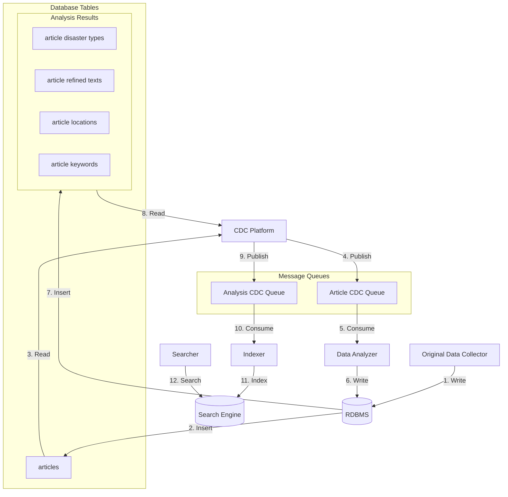

# 우리동네 사건 사고 (Local Incident Tracker)

연합뉴스 재난 API로부터 실시간 사건사고 데이터를 수집, 처리, 색인하여 사용자가 관심 지역의 사건사고를 검색할 수 있는 서비스입니다.

## 개요

우리동네 사건 사고는 실시간 사건사고 데이터를 수집하고 처리하여 사용자에게 제공하는 이벤트 기반 데이터 파이프라인 애플리케이션입니다. 여러 전문화된 서비스가 통합되어 빠르고 정확한 위치 기반 사건사고 검색 기능을 제공합니다.

### 핵심 목표

- 실시간 사건사고 데이터 수집, 분석 및 색인
- 텍스트, 위치, 카테고리 기반 다층적 검색 지원
- Polyglot persistence와 이벤트 기반 데이터 동기화를 기반으로한 CQRS 패턴 구현

## 시스템 아키텍처

이벤트 기반 아키텍처로 구성된 데이터 파이프라인:

**데이터 흐름:**



### 주요 컴포넌트

- **RDBMS (PostgreSQL)**: 사건사고 원본 데이터 저장 및 분석 결과 저장을 위한 저장소
- **Search Engine (Opensearch)**: 사건사고 데이터를 검색에 맞게 구조화한 데이터를 색인하여 효율적으로 쿼리할 수 있도록 검색 기능 제공
- **Message Queues (Kafka)**: 데이터 수집 이벤트 전달 및 분석 결과 전달을 위한 매개체 
- **CDC Platform (Debezium)**: 데이터베이스 내 데이터 변경 사항을 캡처하여 이벤트 큐로 전달
- **데이터 수집기 (Collector)**: 연합뉴스 API에서 사건사고 데이터를 수집하여 정규화하여 데이터베이스에 저장
- **데이터 분석기 (Analyzer)**: 데이터 수집 이벤트를 수신하여 사건사고 판단, 주소 지오코딩, 재해 유형 분류 수행하여 데이터베이스에 저장
- **인덱서 (Indexer)**: 분석된 데이터를 검색엔진으로 색인
- **검색 서비스 (Searcher)**: 사용자의 사건사고 쿼리 처리


## 기술 스택

| 구성 요소 | 버전 | 역할 |
|---------|------|------|
| JDK | 21 | 런타임 |
| Kotlin | 2.21 | 프로그래밍 언어 |
| Spring Boot | 4.0 | 프레임워크 |
| Gradle | 9.2.1 | 빌드 도구 |
| PostgreSQL | 18 | RDBMS (프로덕션은 Aurora) |
| Kafka | 3.8 | 이벤트 큐 |
| Debezium | 3.4 | CDC 플랫폼 |
| OpenSearch | 3.3 | 검색 엔진 |

## 프로젝트 구조

```
local-incident-tracker/
├── build.gradle.kts              # Gradle 루트 설정
├── settings.gradle.kts           # Gradle 설정
├── README.md
├── REQUIREMENTS.md               # 프로젝트 요구사항
│
├── collector/                    # 데이터 수집기 서비스
│   ├── build.gradle.kts
│   └── src/
│
├── analyzer/                     # 데이터 분석기 서비스
│   ├── build.gradle.kts
│   └── src/
│
├── indexer/                      # 인덱서 서비스
│   ├── build.gradle.kts
│   └── src/
│
├── searcher/                     # 검색 서비스
│   ├── build.gradle.kts
│   └── src/
│
└── infrastructure/               # 인프라 및 설정
    ├── docker-compose.yml        # 로컬 개발 스택
    └── debezium/                 # Debezium 설정
        └── connectors/
```

## 서브모듈

### collector (데이터 수집기 - 데이터 파이프라인)
연합뉴스 재난 API에서 지정된 날짜로부터 실시간 사건사고 데이터를 수집하여 정규화하고 PostgreSQL에 저장합니다.

### analyzer (데이터 분석기 - 데이터 파이프라인)
Kafka로부터 데이터 수집 이벤트를 수신하여 다음의 분석을 수행합니다:
- 사건사고 판단 (실제 사건사고만 대상, 캠페인/안내 제외)
- 주소 분석 및 카카오 로컬 API를 통한 지오코딩
- 재해 유형 분류 및 카테고리화
- 텍스트 추출 및 데이터 정제
분석 결과를 다시 PostgreSQL에 저장합니다.

### indexer (인덱서 - 데이터 파이프라인)
Kafka로 전달된 분석 결과를 수신하여 OpenSearch로 색인합니다.

### searcher (검색 서비스)
사용자를 위한 REST API 인터페이스를 제공합니다. OpenSearch에서 사건사고를 검색, 필터링, 순위 결정하는 로직을 처리합니다.

## 제공 기능

### 1. 텍스트 검색
사건사고 설명 및 관련 정보에 대한 전문 검색

### 2. 법정구역 기반 검색
- **행정구역 필터링**: 법정동코드 기반 필터링
  - 광역시/특별시 + 구 단위
  - 도 + 시 단위
  - 전국 검색
- **위치 부스팅**: 동일 법정구역 사건사고에 더 높은 관련성 부여
- **거리 기반 필터링**: 특정 거리 범위(~10km, ~25km 등) 내 사건사고 검색
- **거리 기반 순위**: 거리에 따른 검색 결과 순위 결정

### 3. 표준 필터
- **날짜**: 발생 날짜 기반 필터링
- **지역**: 법정동코드를 이용한 행정구역 필터링
- **재난유형**: 35개 이상의 재난 카테고리
  - 긴급문자 재해구분: AI, 가뭄, 가축질병, 강풍, 건조, 교통, 교통사고, 교통통제, 금융, 기타, 대설, 미세먼지, 민방공, 붕괴, 산불, 산사태, 수도, 안개, 에너지, 전염병, 정전, 지진, 지진해일, 태풍, 테러, 통신, 폭발, 폭염, 풍랑, 한파, 호우, 홍수, 화재, 환경오염사고, 황사
  - 해양선박사고
  - 사망

## 시작하기

### 필수 요구사항

- **JDK 21** 이상
- **Docker & Docker Compose**: 로컬 인프라 실행용

### 로컬 개발 환경 설정

1. **인프라 스택 시작**
   ```bash
   cd infrastructure
   docker-compose up -d
   ```

   이 명령으로 다음이 실행됩니다:
   - PostgreSQL 18
   - Kafka 3.8
   - OpenSearch 3.3
   - Debezium 3.4 (PostgreSQL 커넥터 포함)

2. **데이터 수집 파이프라인 실행**

3. **검색 서비스 실행**

## 빌드 및 실행

**전체 프로젝트 빌드**
```bash
./gradlew build
```

**개별 서비스 실행** (별도의 터미널에서 각각 실행)

데이터 수집기 서비스:
```bash
./gradlew collector:bootRun
```

데이터 분석기 서비스:
```bash
./gradlew analyzer:bootRun
```

인덱서 서비스:
```bash
./gradlew indexer:bootRun
```

검색 서비스:
```bash
./gradlew searcher:bootRun
```

**모든 테스트 실행**
```bash
./gradlew test
```

**특정 모듈 테스트 실행**
```bash
./gradlew collector:test
./gradlew analyzer:test
./gradlew indexer:test
./gradlew searcher:test
```