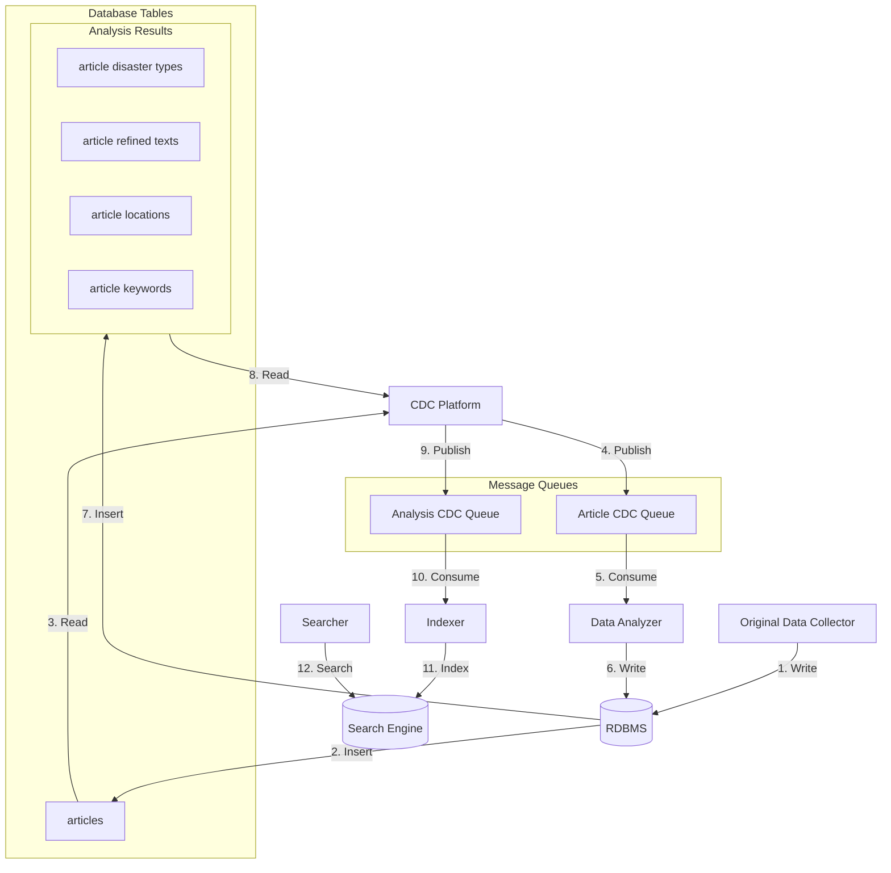

# 우리동네 사건 사고 (Local Incident Tracker)

연합뉴스 재난 API로부터 실시간 사건사고 데이터를 수집, 처리, 색인하여 사용자가 관심 지역의 사건사고를 검색할 수 있는 서비스입니다.

## 개요

**우리동네 사건 사고**는 연합뉴스 재난 API에서 실시간으로 수집한 사건사고 데이터를 분석하고 색인하여, 사용자가 관심 지역의 사건사고를 빠르고 정확하게 검색할 수 있도록 하는 서비스입니다.

### 핵심 기능

- 실시간 사건사고 데이터 자동 수집 및 분석
- 텍스트, 위치, 카테고리 기반 다층적 검색
- 거리 기반 검색 및 관심 지역 알림

## 아키텍처 설계 철학

이 프로젝트는 **CQRS(Command Query Responsibility Segregation)**와 **이벤트 기반 아키텍처**를 기반으로 설계되었습니다:

- **CQRS 패턴**: 데이터 쓰기(Write)와 조회(Read)를 분리하여 각각 최적화
  - Write Model: PostgreSQL (트랜잭션 일관성, 데이터 무결성)
  - Read Model: OpenSearch (전문 검색, 지리공간 쿼리, 빠른 조회)
  - CDC를 통한 자동 동기화로 일관성 보장

- **이벤트 기반 아키텍처**: 서비스 간 느슨한 결합을 통한 독립적 확장
  - 각 서비스는 데이터베이스 변경 이벤트를 통해 통신
  - 서비스 추가/수정시 기존 서비스에 영향 없음
  - 각 단계의 실패가 다른 단계에 영향을 주지 않음

- **Polyglot Persistence**: 용도에 맞는 최적의 저장소 활용
  - 트랜잭션이 중요한 데이터 → PostgreSQL
  - 검색 성능이 중요한 데이터 → OpenSearch

## 시스템 아키텍처

이벤트 기반 데이터 파이프라인:

**데이터 흐름:**



### 주요 컴포넌트

- **RDBMS (PostgreSQL)**: 사건사고 원본 데이터 저장 및 분석 결과 저장을 위한 저장소
- **Search Engine (Opensearch)**: 사건사고 데이터를 검색에 맞게 구조화한 데이터를 색인하여 효율적으로 쿼리할 수 있도록 검색 기능 제공
- **Message Queues (Kafka)**: 데이터 수집 이벤트 전달 및 분석 결과 전달을 위한 매개체 
- **CDC Platform (Debezium)**: 데이터베이스 내 데이터 변경 사항을 캡처하여 이벤트 큐로 전달
- **데이터 수집기 (Collector)**: 연합뉴스 API에서 사건사고 데이터를 수집하여 정규화하여 데이터베이스에 저장
- **데이터 분석기 (Analyzer)**: AI 기반 분석으로 사건사고 판정, 재해 유형 분류, 위치 추출, 위급도 평가를 수행하여 데이터베이스에 저장
- **인덱서 (Indexer)**: 분석된 데이터를 검색엔진으로 색인
- **검색 서비스 (Searcher)**: 사용자의 사건사고 쿼리 처리


## 기술 스택

| 구성 요소 | 버전 | 역할 |
|---------|------|------|
| JDK | 21 | 런타임 |
| Kotlin | 2.21 | 프로그래밍 언어 |
| Spring Boot | 4.0 | 프레임워크 |
| Spring AI | 2.0 | LLM 통합 프레임워크 |
| Gradle | 9.2.1 | 빌드 도구 |
| PostgreSQL | 18 | RDBMS (프로덕션은 Aurora) |
| Kafka | 3.8 | 이벤트 큐 |
| Debezium | 3.4 | CDC 플랫폼 |
| Flyway | 11.20.2 | 데이터베이스 마이그레이션 |
| OpenSearch | 3.3 | 검색 엔진 |

## 프로젝트 구조

```
local-incident-tracker/
├── build.gradle.kts              # Gradle 루트 설정
├── settings.gradle.kts           # Gradle 설정
├── README.md
├── REQUIREMENTS.md               # 프로젝트 요구사항
│
├── shared/                       # 공유 데이터 모델 (모든 서비스에서 사용)
│   ├── build.gradle.kts
│   └── src/
│
├── ai-core/                      # LLM 프롬프트 실행 라이브러리 (analyzer가 사용)
│   ├── build.gradle.kts
│   ├── README.md
│   └── src/
│
├── collector/                    # 데이터 수집기 서비스
│   ├── build.gradle.kts
│   └── src/
│
├── analyzer/                     # 데이터 분석기 서비스
│   ├── build.gradle.kts
│   └── src/
│
├── indexer/                      # 인덱서 서비스
│   ├── build.gradle.kts
│   └── src/
│
├── searcher/                     # 검색 서비스
│   ├── build.gradle.kts
│   └── src/
│
├── persistence/                  # 영속성 계층 (JPA Entity + Flyway 마이그레이션)
│   ├── build.gradle.kts
│   └── src/
│
└── infrastructure/               # 인프라 및 설정
    ├── docker-compose.yml        # 로컬 개발 스택
    └── debezium/                 # Debezium 설정
        └── connectors/
```

## 공유 데이터 모델

각 서비스 간의 통신과 데이터 공유를 위해 다음과 같은 POJO 클래스들이 `shared` 모듈에서 정의되며, 모든 서비스에서 공통으로 사용됩니다.

### Article (기사 데이터)

**데이터 흐름**: Collector → RDBMS → Analyzer

사건사고 원본 기사 정보를 표현하는 클래스입니다. Collector가 연합뉴스 API에서 수집한 데이터를 정규화하여 생성하고, RDBMS에 저장된 후 Analyzer에서 분석을 위해 소비됩니다.

**주요 필드**:
- 기본 정보: articleId, originId, sourceId, title, content, writtenAt, modifiedAt
- 선택 정보: sourceUrl (기본값: null)

### AnalysisResult (분석 결과)

**데이터 흐름**: Analyzer → RDBMS → Indexer

Article에 대해 분석을 수행한 결과를 표현하는 클래스입니다. Analyzer가 생성하여 RDBMS에 저장하고, Indexer에서 수신하여 Search Engine으로 색인합니다.

**주요 필드**:
- 기본 정보: articleId
- 분석 결과: incidentTypes (여러 재난 유형 가능), urgency (긴급도)
- 위치 정보: locations (List<Location>)
  - Location: coordinate (Coordinate: lat, lon) + address (Address)
  - Address: regionType, code, addressName, depth1~3Name (optional)
- 정제 데이터: keywords (List<Keyword>)
  - Keyword: keyword (String), priority (Int, 높을수록 높은 중요도)

### ArticleIndexDocument (검색 인덱스 문서)

**데이터 흐름**: Indexer → OpenSearch ← Searcher

OpenSearch에서 효율적인 검색과 필터링을 위해 최적화된 구조로 변환한 문서입니다. Indexer에서 생성하여 Search Engine으로 색인되고, Searcher가 검색 쿼리 처리 시 활용합니다.

**주요 필드**:
- 문서 식별자: articleId, sourceId, originId
- 검색 필드: title, content, keywords (Full-text indexed), contentEmbedding (ByteArray[128], semantic search)
- 지리 정보:
  - geoPoints: List<Coordinate> (평탄화된 geo-point, OpenSearch geo_point 형식)
  - addresses: List<Address> (nested docs, 계층 구조 유지)
  - jurisdictionCodes: Set<String> (법정동코드)
- 순위 필드: writtenAt, modifiedAt (ZonedDateTime, zone 정보 포함)

## 서브모듈

### shared (공유 데이터 모델)
모든 서비스에서 공통으로 사용하는 POJO 데이터 모델을 정의합니다. 각 서비스는 이 모듈에 의존하여 타입 안전성과 일관성을 보장받습니다.

정의되는 클래스:
- **Article**: 원본 기사 데이터 (Collector → RDBMS → Analyzer)
- **AnalysisResult**: 분석 결과 데이터 (Analyzer → RDBMS → Indexer)
- **ArticleIndexDocument**: 검색 인덱스 최적화 문서 (Indexer → OpenSearch ← Searcher)

### ai-core (LLM 프롬프트 실행 라이브러리)
Spring AI 기반의 타입 안전한 LLM 프롬프트 관리 및 실행 엔진을 제공하는 독립 라이브러리 모듈입니다. analyzer 서비스가 AI 기반 분석을 수행하는데 사용합니다.

핵심 특징:
- **Provider 독립성**: OpenAI, Anthropic 등 다양한 LLM 제공자를 동일 인터페이스로 사용
- **프롬프트 외부화**: YAML 파일로 프롬프트 관리, 코드 변경 없이 수정 가능
- **타입 안전성**: 제네릭 `Prompt<Input, Output>`로 컴파일 타임 타입 검증
- **비동기/병렬 실행**: Kotlin Coroutines 기반으로 효율적인 I/O 처리 및 병렬 실행

자세한 내용은 [`ai-core/README.md`](ai-core/README.md)를 참조하세요.

### collector (데이터 수집기 - 데이터 파이프라인)
연합뉴스 재난 API에서 지정된 날짜로부터 실시간 사건사고 데이터를 수집하여 정규화하고 PostgreSQL에 저장합니다.

### analyzer (데이터 분석기 - 데이터 파이프라인)
Kafka로부터 데이터 수집 이벤트를 수신하여 다음의 **AI 기반 분석**을 수행합니다:
- **사건사고 판정**: 실제 사건사고 여부 판단 (캠페인/안내 제외)
- **재해 유형 분류**: 사건사고를 35개 이상의 재난 카테고리로 자동 분류
- **위치 추출 및 지오코딩**: 텍스트에서 위치 정보 추출 후 좌표(위도/경도) 변환
- **위급도 평가**: 사건사고의 심각도 및 긴급도 계산
- **핵심 정보 추출**: 키워드 및 정제된 텍스트 생성

분석 결과는 트랜잭션 보장과 함께 PostgreSQL에 저장되어 Indexer로 전달됩니다.

### indexer (인덱서 - 데이터 파이프라인)
Kafka로 전달된 분석 결과를 수신하여 OpenSearch로 색인합니다.

### searcher (검색 서비스)
사용자를 위한 REST API 인터페이스를 제공합니다. OpenSearch에서 사건사고를 검색, 필터링, 순위 결정하는 로직을 처리합니다.

### persistence (영속성 계층)
JPA Entity와 Flyway 데이터베이스 마이그레이션을 관리합니다. DB 스키마와 매핑되는 Entity들을 정의하고 버전 관리합니다.

## 제공 기능

### 1. 텍스트 검색
사건사고 설명 및 관련 정보에 대한 전문 검색

### 2. 법정구역 기반 검색
- **행정구역 필터링**: 법정동코드 기반 필터링
  - 광역시/특별시 + 구 단위
  - 도 + 시 단위
  - 전국 검색
- **위치 부스팅**: 동일 법정구역 사건사고에 더 높은 관련성 부여
- **거리 기반 필터링**: 특정 거리 범위(~10km, ~25km 등) 내 사건사고 검색
- **거리 기반 순위**: 거리에 따른 검색 결과 순위 결정

### 3. 표준 필터
- **날짜**: 발생 날짜 기반 필터링
- **지역**: 법정동코드를 이용한 행정구역 필터링
- **재난유형**: 35개 이상의 재난 카테고리
  - 긴급문자 재해구분: AI, 가뭄, 가축질병, 강풍, 건조, 교통, 교통사고, 교통통제, 금융, 기타, 대설, 미세먼지, 민방공, 붕괴, 산불, 산사태, 수도, 안개, 에너지, 전염병, 정전, 지진, 지진해일, 태풍, 테러, 통신, 폭발, 폭염, 풍랑, 한파, 호우, 홍수, 화재, 환경오염사고, 황사
  - 해양선박사고
  - 사망

## 시작하기

### 필수 요구사항

- **JDK 21** 이상
- **Docker & Docker Compose**: 로컬 인프라 실행용

### 로컬 개발 환경 설정

1. **인프라 스택 시작**
   ```bash
   cd infrastructure
   docker-compose up -d
   ```

   이 명령으로 다음이 실행됩니다:
   - PostgreSQL 18
   - Kafka 3.8
   - OpenSearch 3.3
   - Debezium 3.4 (PostgreSQL 커넥터 포함)

2. **데이터 수집 파이프라인 실행**

3. **검색 서비스 실행**

## 빌드 및 실행

**전체 프로젝트 빌드**
```bash
./gradlew build
```

**개별 서비스 실행** (별도의 터미널에서 각각 실행)

데이터 수집기 서비스:
```bash
./gradlew collector:bootRun
```

데이터 분석기 서비스:
```bash
./gradlew analyzer:bootRun
```

인덱서 서비스:
```bash
./gradlew indexer:bootRun
```

검색 서비스:
```bash
./gradlew searcher:bootRun
```

**모든 테스트 실행**
```bash
./gradlew test
```

**특정 모듈 테스트 실행**
```bash
./gradlew ai-core:test                    # ai-core Unit Test
./gradlew ai-core:integrationTest         # ai-core Integration Test (OpenAI API 호출)
./gradlew collector:test
./gradlew analyzer:test
./gradlew indexer:test
./gradlew searcher:test
```