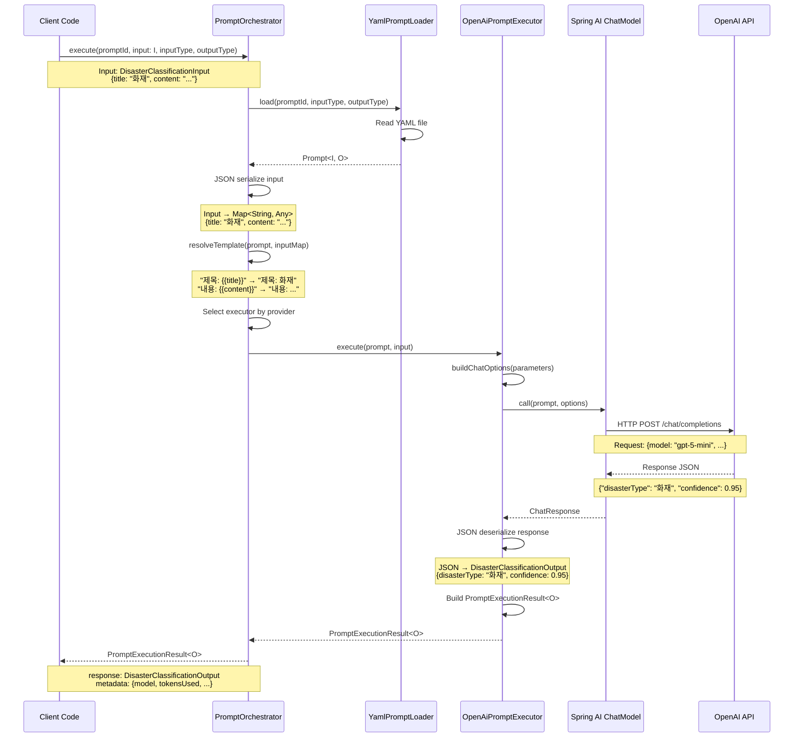
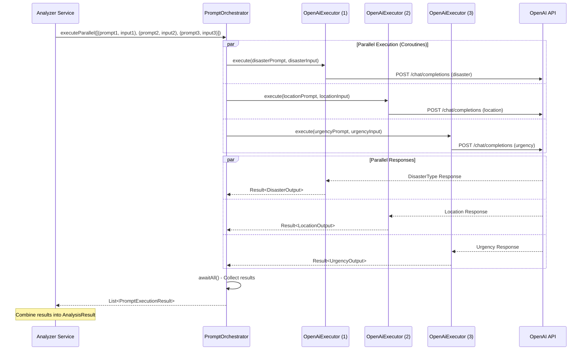

# ai-core Module Architecture

## Overview

`ai-core` 모듈은 LLM(Large Language Model) 호출 기능을 제공하는 독립적인 모듈입니다. Hexagonal Architecture를 따라 도메인 로직과 외부 의존성(Spring AI)을 명확히 분리하여 설계합니다.

**핵심 원칙**:
- 프롬프트는 YAML 파일로 관리하여 코드 변경 없이 수정 가능
- Provider(OpenAI, Anthropic 등)별 LLM 호출 구현을 추상화
- 코루틴 기반 비동기 실행으로 병렬 프롬프트 실행 지원
- 타입 안전성: 프롬프트별 응답 타입을 제네릭으로 지원

---

## Core Components

### 1. Prompt (프롬프트 정의)

**역할**: YAML 파일로 정의된 프롬프트를 객체화

**위치**: `domain/model/Prompt.kt`

**구조**:
```kotlin
data class Prompt<I, O>(
    val id: String,                          // 프롬프트 식별자 (resources/prompts 하위 경로)
    val model: LlmModel,                     // 실행할 LLM 모델
    val template: String,                    // 프롬프트 템플릿 (변수 치환 가능)
    val parameters: PromptParameters,        // LLM 실행 파라미터
    val inputType: Class<I>,                 // 입력 타입 정보
    val outputType: Class<O>                 // 응답 타입 정보
)

data class PromptParameters(
    // 공통 파라미터 (모든 Provider 지원)
    val temperature: Float = 0.7f,
    val maxTokens: Int? = null,
    val topP: Float? = null,
    val frequencyPenalty: Float? = null,
    val presencePenalty: Float? = null,
    val stopSequences: List<String>? = null,

    // Provider 전용 설정 (각 Provider에서 필요한 설정만 참조)
    val providerSpecificOptions: Map<String, Any>? = null
)
```

**promptId 규칙**:
- `resources/prompts/` 하위의 상대 경로를 사용 (확장자 제외)
- 예시:
  - `disaster-classification` → `resources/prompts/disaster-classification.yml`
  - `analysis/location-extraction` → `resources/prompts/analysis/location-extraction.yml`

**YAML 파일 예시** (`resources/prompts/disaster-classification.yml`):
```yaml
id: disaster-classification
model: GPT_5_MINI
template: |
  다음 뉴스 기사의 재난 유형을 분류하세요.

  기사 제목: {{title}}
  기사 내용: {{content}}

  재난 유형 목록: 화재, 교통사고, 자연재해, 폭발, 건물붕괴

  응답 형식: JSON
  {
    "disasterType": "재난유형",
    "confidence": 0.95
  }

parameters:
  # 공통 파라미터
  temperature: 0.3
  maxTokens: 500

  # OpenAI 전용 설정
  providerSpecificOptions:
    responseFormat: "json_object"  # JSON 응답 강제
    seed: 42                       # 결정적 샘플링
    n: 1                           # 생성할 완성 개수
    user: "analyzer-service"       # 사용자 식별자

inputType: com.vonkernel.lit.ai.domain.model.DisasterClassificationInput
outputType: com.vonkernel.lit.ai.domain.model.DisasterClassificationOutput
```

**Provider 전용 설정 예시**:

OpenAI 전용:
```yaml
providerSpecificOptions:
  responseFormat: "json_object"       # JSON 모드 활성화
  seed: 42                            # 결정적 샘플링 (재현 가능한 결과)
  n: 1                                # 생성할 완성 개수
  user: "service-identifier"          # 최종 사용자 식별자
  streamUsage: true                   # 스트리밍 시 토큰 사용량 포함
  # Function calling (필요 시)
  tools: [...]                        # 사용 가능한 함수 목록
  toolChoice: "auto"                  # 함수 호출 방식
```

Anthropic 전용 (향후 지원):
```yaml
providerSpecificOptions:
  topK: 40                            # Top-K 샘플링
  thinking: true                      # Extended Thinking 활성화
```

**입력/출력 타입 예시**:
```kotlin
// 입력 타입
data class DisasterClassificationInput(
    val title: String,
    val content: String
)

// 출력 타입
data class DisasterClassificationOutput(
    val disasterType: String,
    val confidence: Double
)
```

---

### 2. Provider & Model Enums

**역할**: 지원하는 LLM Provider와 Model을 타입 안전하게 관리

**위치**: `domain/model/LlmProvider.kt`, `domain/model/LlmModel.kt`

```kotlin
enum class LlmProvider {
    OPENAI,
    // 향후 확장: ANTHROPIC, GOOGLE, etc.
}

enum class LlmModel(
    val provider: LlmProvider,
    val modelId: String
) {
    // OpenAI Models
    GPT_5_MINI(LlmProvider.OPENAI, "gpt-5-mini"),

    // 향후 확장 예시:
    // GPT_5(LlmProvider.OPENAI, "gpt-5"),
    // GPT_4O(LlmProvider.OPENAI, "gpt-4o"),
    // CLAUDE_3_5_SONNET(LlmProvider.ANTHROPIC, "claude-3-5-sonnet-latest"),
    ;

    companion object {
        fun fromModelId(modelId: String): LlmModel {
            return entries.first { it.modelId == modelId }
        }
    }
}
```

**검증 규칙**:
- Prompt YAML에 지정된 `model`은 반드시 `LlmModel` enum에 정의되어 있어야 함
- 정의되지 않은 모델 사용 시 애플리케이션 시작 시점에 예외 발생

---

### 3. PromptExecutor (실행 인터페이스)

**역할**: Provider별 LLM 호출 구현체의 추상화 인터페이스

**위치**: `domain/port/PromptExecutor.kt` (Port)

```kotlin
interface PromptExecutor {
    /**
     * 이 Executor가 지원하는 Provider 반환
     */
    fun supports(provider: LlmProvider): Boolean

    /**
     * 프롬프트를 실행하고 타입 안전한 응답 반환
     *
     * @param I 입력 타입 (템플릿 변수 치환에 사용)
     * @param O 출력 타입 (LLM 응답을 파싱한 결과)
     * @param prompt 실행할 프롬프트 (템플릿 변수 치환 완료된 상태)
     * @param input 입력 객체 (이미 템플릿에 치환 완료)
     * @return LLM 응답 (metadata 포함)
     */
    suspend fun <I, O> execute(
        prompt: Prompt<I, O>,
        input: I
    ): PromptExecutionResult<O>
}
```

**구현체** (`infrastructure/adapter/OpenAiPromptExecutor.kt`):
```kotlin
@Component
class OpenAiPromptExecutor(
    private val chatModel: ChatModel,  // Spring AI 주입
    private val objectMapper: ObjectMapper
) : PromptExecutor {

    override fun supports(provider: LlmProvider): Boolean {
        return provider == LlmProvider.OPENAI
    }

    override suspend fun <I, O> execute(
        prompt: Prompt<I, O>,
        input: I
    ): PromptExecutionResult<O> = withContext(Dispatchers.IO) {
        // Spring AI를 사용한 실제 LLM 호출
        val chatOptions = buildChatOptions(prompt.parameters)
        val response = chatModel.call(
            org.springframework.ai.chat.prompt.Prompt(
                prompt.template,  // 이미 템플릿 변수 치환 완료된 상태
                chatOptions
            )
        )

        // Spring AI 응답 JSON → Output 타입으로 deserialize
        val content = response.result.output.content
        val parsedResponse = objectMapper.readValue(content, prompt.outputType)

        PromptExecutionResult(
            response = parsedResponse,
            metadata = PromptExecutionMetadata(
                model = prompt.model.modelId,
                tokensUsed = response.metadata?.usage?.totalTokens ?: 0,
                finishReason = response.result.metadata.finishReason
            )
        )
    }

    private fun buildChatOptions(params: PromptParameters): OpenAiChatOptions {
        // OpenAI 전용 옵션을 타입 안전한 data class로 변환
        val openAiOptions = OpenAiSpecificOptions.fromMap(params.providerSpecificOptions)

        return OpenAiChatOptions.builder()
            .apply {
                // 공통 파라미터 설정
                temperature(params.temperature)
                params.maxTokens?.let { maxTokens(it) }
                params.topP?.let { topP(it) }
                params.frequencyPenalty?.let { frequencyPenalty(it) }
                params.presencePenalty?.let { presencePenalty(it) }
                params.stopSequences?.let { stop(it) }

                // OpenAI 전용 설정 적용 (타입 안전)
                openAiOptions?.let { opts ->
                    opts.responseFormat?.let { format ->
                        responseFormat(ResponseFormat(format))
                    }
                    opts.seed?.let { seed ->
                        seed(seed)
                    }
                    opts.n?.let { n ->
                        n(n)
                    }
                    opts.user?.let { user ->
                        user(user)
                    }
                    opts.streamUsage?.let { streamUsage ->
                        streamUsage(streamUsage)
                    }
                    // Function calling 관련 설정도 필요 시 추가
                    opts.toolChoice?.let { toolChoice ->
                        // toolChoice 설정 로직
                    }
                }
            }
            .build()
    }
}
```

---

### 4. PromptOrchestrator (프롬프트 실행 오케스트레이터)

**역할**:
- Prompt 객체를 받아 적절한 PromptExecutor 선택
- Input 객체를 JSON serialize하여 템플릿 변수 치환
- 프롬프트 실행 및 결과 반환

**위치**: `application/service/PromptOrchestrator.kt`

```kotlin
@Service
class PromptOrchestrator(
    private val executors: List<PromptExecutor>,
    private val promptLoader: PromptLoader,  // YAML 로딩 담당
    private val objectMapper: ObjectMapper   // JSON serialization/deserialization
) {
    /**
     * 프롬프트 ID로 로드하여 실행
     */
    suspend fun <I, O> execute(
        promptId: String,
        input: I,
        inputType: Class<I>,
        outputType: Class<O>
    ): PromptExecutionResult<O> {
        val prompt = promptLoader.load(promptId, inputType, outputType)
        return execute(prompt, input)
    }

    /**
     * Prompt 객체를 직접 받아 실행
     */
    suspend fun <I, O> execute(
        prompt: Prompt<I, O>,
        input: I
    ): PromptExecutionResult<O> {
        // 1. Input 객체를 JSON serialize하여 필드 추출
        val inputMap = extractInputFields(input)

        // 2. 템플릿 변수 치환
        val resolvedPrompt = resolveTemplate(prompt, inputMap)

        // 3. Provider에 맞는 Executor 선택
        val provider = prompt.model.provider
        val executor = executors.firstOrNull { it.supports(provider) }
            ?: throw UnsupportedProviderException("No executor found for provider: $provider")

        // 4. 실행
        return executor.execute(resolvedPrompt, input)
    }

    /**
     * 여러 프롬프트를 병렬로 실행 (코루틴 활용)
     */
    suspend fun <I, O> executeParallel(
        prompts: List<Pair<Prompt<I, O>, I>>
    ): List<PromptExecutionResult<O>> = coroutineScope {
        prompts.map { (prompt, input) ->
            async { execute(prompt, input) }
        }.awaitAll()
    }

    /**
     * Input 객체를 JSON serialize하여 필드를 Map으로 추출
     * 예: DisasterClassificationInput(title="...", content="...")
     *     -> {"title": "...", "content": "..."}
     */
    private fun <I> extractInputFields(input: I): Map<String, Any> {
        val jsonNode = objectMapper.valueToTree<com.fasterxml.jackson.databind.JsonNode>(input)
        val fieldsMap = mutableMapOf<String, Any>()

        jsonNode.fields().forEach { (key, value) ->
            fieldsMap[key] = when {
                value.isTextual -> value.asText()
                value.isNumber -> value.numberValue()
                value.isBoolean -> value.asBoolean()
                value.isArray || value.isObject -> value.toString()
                else -> value.asText()
            }
        }

        return fieldsMap
    }

    /**
     * 템플릿 변수 치환
     * 예: "제목: {{title}}" + {"title": "화재 발생"} -> "제목: 화재 발생"
     */
    private fun <I, O> resolveTemplate(
        prompt: Prompt<I, O>,
        inputMap: Map<String, Any>
    ): Prompt<I, O> {
        var resolved = prompt.template
        inputMap.forEach { (key, value) ->
            resolved = resolved.replace("{{$key}}", value.toString())
        }
        return prompt.copy(template = resolved)
    }
}
```

---

### 5. Input/Output DTO (JSON Serialization/Deserialization)

**역할**:
- Input: 프롬프트 템플릿 변수 치환을 위한 입력 데이터
- Output: LLM 응답 JSON을 파싱한 결과

**위치**: `domain/model/`

#### Input/Output DTO 규칙

1. **Input DTO**:
   - 필드명이 템플릿의 `{{variable}}` 이름과 일치해야 함
   - JSON serialize 결과가 템플릿 변수 치환에 사용됨
   - Jackson `@JsonProperty`로 필드명 커스터마이징 가능

2. **Output DTO**:
   - LLM 응답 JSON 구조와 일치해야 함
   - Jackson annotation으로 deserialize 제어 가능

**예시**:
```kotlin
// 재난 분류 Input
data class DisasterClassificationInput(
    val title: String,      // {{title}}에 매핑
    val content: String     // {{content}}에 매핑
)

// 재난 분류 Output
data class DisasterClassificationOutput(
    val disasterType: String,
    val confidence: Double
)

// 위치 추출 Input
data class LocationExtractionInput(
    val content: String,
    @JsonProperty("max_locations")
    val maxLocations: Int = 10  // {{max_locations}}에 매핑
)

// 위치 추출 Output
data class LocationExtractionOutput(
    val locations: List<String>,
    val coordinates: List<Coordinate>?
)

data class Coordinate(
    val latitude: Double,
    val longitude: Double
)
```

#### PromptExecutionResult

**위치**: `domain/model/PromptExecutionResult.kt`

```kotlin
/**
 * 프롬프트 실행 결과
 * @param O 프롬프트별 출력 타입 (LLM 응답 JSON 파싱 결과)
 */
data class PromptExecutionResult<O>(
    val response: O,                        // 실제 응답 데이터
    val metadata: PromptExecutionMetadata   // 실행 메타데이터
)

data class PromptExecutionMetadata(
    val model: String,                  // 실제 사용된 모델 ID
    val tokensUsed: Int,                // 토큰 사용량
    val finishReason: String,           // 완료 이유 (stop, length, etc.)
    val executionTimeMs: Long? = null   // 실행 시간 (선택)
)
```

---

## Architecture Layers

### Hexagonal Architecture 적용

```
┌─────────────────────────────────────────────────────────────┐
│                    Application Layer                        │
│  (PromptOrchestrator, PromptLoader)                        │
└─────────────────────────────────────────────────────────────┘
                            ↓ uses
┌─────────────────────────────────────────────────────────────┐
│                      Domain Layer                           │
│                                                             │
│  ┌─────────────────┐      ┌──────────────────┐            │
│  │  Prompt<T>      │      │  LlmModel        │            │
│  │  (Model)        │      │  LlmProvider     │            │
│  └─────────────────┘      │  (Enums)         │            │
│                           └──────────────────┘            │
│                                                             │
│  ┌─────────────────────────────────────────┐              │
│  │  PromptExecutor (Port/Interface)         │              │
│  │  - supports(provider): Boolean           │              │
│  │  - execute<T>(...): Result<T>            │              │
│  └─────────────────────────────────────────┘              │
└─────────────────────────────────────────────────────────────┘
                            ↑ implements
┌─────────────────────────────────────────────────────────────┐
│                  Infrastructure Layer                       │
│                                                             │
│  ┌──────────────────────────────────────┐                 │
│  │  OpenAiPromptExecutor (Adapter)      │                 │
│  │  - Spring AI ChatModel 사용           │                 │
│  │  - Spring AI 응답 → Domain DTO 변환   │                 │
│  └──────────────────────────────────────┘                 │
│                                                             │
│  ┌──────────────────────────────────────┐                 │
│  │  YamlPromptLoader (Adapter)          │                 │
│  │  - resources/prompts/*.yml 로딩       │                 │
│  │  - YAML → Prompt<T> 변환             │                 │
│  └──────────────────────────────────────┘                 │
└─────────────────────────────────────────────────────────────┘
```

**계층별 책임**:

1. **Domain Layer** (도메인 영역):
   - `Prompt<T>`: 프롬프트 정의
   - `LlmModel`, `LlmProvider`: 지원 모델 관리
   - `PromptExecutor`: LLM 실행 추상화 (Port)
   - `PromptExecutionResult<T>`: 응답 DTO

2. **Application Layer** (애플리케이션 영역):
   - `PromptOrchestrator`: 프롬프트 실행 오케스트레이션
   - `PromptLoader`: 프롬프트 로딩 인터페이스 (Port)

3. **Infrastructure Layer** (인프라 영역):
   - `OpenAiPromptExecutor`: Spring AI 기반 OpenAI 구현 (Adapter)
   - `YamlPromptLoader`: YAML 파일 로딩 구현 (Adapter)

**의존성 방향**: Infrastructure → Application → Domain (단방향)

---

## Data Flow

### 프롬프트 실행 흐름 (Mermaid Diagram)



### 프롬프트 실행 흐름 (JSON Serialization/Deserialization)

```
1. Client 코드
    ↓ execute(promptId, input: I, inputType, outputType)
    ↓ 예: execute("disaster-classification",
              DisasterClassificationInput(title="...", content="..."),
              DisasterClassificationInput::class.java,
              DisasterClassificationOutput::class.java)

2. PromptOrchestrator
    ↓ load prompt from YAML

3. YamlPromptLoader (Infrastructure)
    ↓ return Prompt<I, O>

4. PromptOrchestrator
    ↓ JSON serialize input object
    ↓ DisasterClassificationInput → {"title": "...", "content": "..."}
    ↓
    ↓ extract fields as Map<String, Any>
    ↓ {"title": "...", "content": "..."}
    ↓
    ↓ resolve template variables
    ↓ "제목: {{title}}" → "제목: ..."
    ↓ "내용: {{content}}" → "내용: ..."
    ↓
    ↓ select executor by model.provider

5. OpenAiPromptExecutor (Infrastructure)
    ↓ build Spring AI ChatOptions
    ↓ call Spring AI ChatModel with resolved template

6. Spring AI → OpenAI API
    ↓ HTTP Request/Response
    ↓ Response JSON: {"disasterType": "화재", "confidence": 0.95}

7. OpenAiPromptExecutor
    ↓ parse response JSON → Output DTO
    ↓ JSON deserialize: {"disasterType": "화재", "confidence": 0.95}
    ↓                   → DisasterClassificationOutput(disasterType="화재", confidence=0.95)
    ↓
    ↓ build PromptExecutionResult<O>

8. PromptOrchestrator
    ↓ return PromptExecutionResult<O>

9. Client 코드
    ↓ result.response: DisasterClassificationOutput
```

### 병렬 실행 흐름 (Mermaid Diagram)



### 병렬 실행 예시 (타입 안전성)

```kotlin
// analyzer 모듈에서 사용 예시
suspend fun analyzeArticle(article: Article): AnalysisResult {
    // Input 객체 생성 (타입 안전)
    val disasterInput = DisasterClassificationInput(
        title = article.title,
        content = article.content
    )
    val locationInput = LocationExtractionInput(
        content = article.content
    )
    val urgencyInput = UrgencyAssessmentInput(
        content = article.content
    )

    // 병렬 실행 (코루틴으로 동시 실행)
    val results = promptOrchestrator.executeParallel(
        listOf(
            Pair(disasterPrompt, disasterInput),
            Pair(locationPrompt, locationInput),
            Pair(urgencyPrompt, urgencyInput)
        )
    )

    // 타입 안전한 응답 사용
    return AnalysisResult(
        disasterType = results[0].response.disasterType,  // DisasterClassificationOutput
        locations = results[1].response.locations,        // LocationExtractionOutput
        urgency = results[2].response.urgency             // UrgencyAssessmentOutput
    )
}
```

### Input/Output 매핑 예시

**템플릿** (`disaster-classification.yml`):
```yaml
template: |
  다음 뉴스 기사의 재난 유형을 분류하세요.

  기사 제목: {{title}}
  기사 내용: {{content}}

  재난 유형 목록: {{disaster_types}}
```

**Input DTO**:
```kotlin
data class DisasterClassificationInput(
    val title: String,              // {{title}}에 매핑
    val content: String,            // {{content}}에 매핑
    @JsonProperty("disaster_types")
    val disasterTypes: String       // {{disaster_types}}에 매핑
)
```

**실행**:
```kotlin
val input = DisasterClassificationInput(
    title = "서울 강남구 건물 화재 발생",
    content = "오늘 오전 10시경 강남구 역삼동...",
    disasterTypes = "화재, 교통사고, 자연재해"
)

// JSON serialize: {"title": "서울 강남구...", "content": "오늘 오전...", "disaster_types": "화재, ..."}
// 템플릿 치환: "기사 제목: 서울 강남구..." "기사 내용: 오늘 오전..." "재난 유형 목록: 화재, ..."
```

**LLM 응답**:
```json
{
  "disasterType": "화재",
  "confidence": 0.95
}
```

**Output DTO** (자동 deserialize):
```kotlin
data class DisasterClassificationOutput(
    val disasterType: String,   // "화재"
    val confidence: Double      // 0.95
)
```

---

## Prompt Management Strategy

### 도메인별 프롬프트 관리 (Recommended)

**설계 원칙**:
- **Input/Output data class**와 **프롬프트 YAML 파일**을 같은 모듈(analyzer 등)에 배치
- 도메인 로직과 프롬프트를 함께 관리하여 높은 응집도 유지
- ai-core 모듈은 실행 엔진만 제공, 실제 프롬프트는 각 도메인 모듈에서 관리

**디렉토리 구조**:
```
analyzer/
├── src/main/kotlin/.../domain/
│   ├── DisasterClassificationInput.kt
│   ├── DisasterClassificationOutput.kt
│   ├── LocationExtractionInput.kt
│   ├── LocationExtractionOutput.kt
│   └── ...
└── src/main/resources/
    └── prompts/
        ├── disaster-classification.yml
        ├── location-extraction.yml
        └── urgency-assessment.yml
```

**장점**:
- 도메인 전문가가 비즈니스 로직과 프롬프트를 함께 관리
- analyzer 모듈만 보면 전체 분석 파이프라인 파악 가능
- 프롬프트 수정 시 analyzer만 재배포 (ai-core는 불변)
- 모듈 독립성 및 응집도 향상

**ResourceLoader 동작 방식**:
Spring의 `ResourceLoader`는 전체 classpath를 스캔하므로, analyzer/resources도 자동으로 인식됩니다.

```kotlin
// YamlPromptLoader (ai-core 모듈)
@Component
class YamlPromptLoader(
    private val resourceLoader: ResourceLoader,
    private val yamlMapper: ObjectMapper
) : PromptLoader {

    override fun <I, O> load(
        promptId: String,
        inputType: Class<I>,
        outputType: Class<O>
    ): Prompt<I, O> {
        // classpath 전체에서 프롬프트 검색
        // ai-core/resources/prompts + analyzer/resources/prompts 모두 포함
        val resource = resourceLoader.getResource("classpath:prompts/$promptId.yml")

        if (!resource.exists()) {
            throw PromptLoadException(
                promptId = promptId,
                message = "Prompt file not found: prompts/$promptId.yml"
            )
        }

        // ... YAML 파싱 및 Prompt 객체 생성
    }
}
```

### 사용 예시 (analyzer 모듈)

**Input/Output 정의** (`analyzer/src/main/kotlin/.../domain/DisasterClassification.kt`):
```kotlin
package com.vonkernel.lit.analyzer.domain

data class DisasterClassificationInput(
    val title: String,
    val content: String
)

data class DisasterClassificationOutput(
    val disasterType: String,
    val confidence: Double
)
```

**프롬프트 정의** (`analyzer/src/main/resources/prompts/disaster-classification.yml`):
```yaml
id: disaster-classification
model: GPT_5_MINI
template: |
  다음 뉴스 기사의 재난 유형을 분류하세요.

  기사 제목: {{title}}
  기사 내용: {{content}}

  재난 유형 목록: 화재, 교통사고, 자연재해, 폭발, 건물붕괴

  응답 형식: JSON
  {
    "disasterType": "재난유형",
    "confidence": 0.95
  }

parameters:
  temperature: 0.3
  maxTokens: 500

inputType: com.vonkernel.lit.analyzer.domain.DisasterClassificationInput
outputType: com.vonkernel.lit.analyzer.domain.DisasterClassificationOutput
```

**서비스 레이어에서 사용** (`analyzer/src/main/kotlin/.../service/ArticleAnalyzer.kt`):
```kotlin
@Service
class ArticleAnalyzer(
    private val promptOrchestrator: PromptOrchestrator  // ai-core 의존
) {
    suspend fun classifyDisaster(article: Article): DisasterClassificationOutput {
        val input = DisasterClassificationInput(
            title = article.title,
            content = article.content
        )

        val result = promptOrchestrator.execute(
            promptId = "disaster-classification",
            input = input,
            inputType = DisasterClassificationInput::class.java,
            outputType = DisasterClassificationOutput::class.java
        )

        return result.response
    }
}
```

---

## Configuration Management

### Application Configuration (`application.yml`)

```yaml
spring:
  ai:
    openai:
      api-key: ${OPENAI_API_KEY}  # 환경변수에서 주입
      base-url: https://api.openai.com
      chat:
        options:
          model: gpt-5-mini  # 기본 모델 (프롬프트에서 override 가능)

# 프롬프트 로딩 설정 (선택적)
prompts:
  cache-enabled: true  # 프롬프트 캐싱 여부
```

**참고**: `prompts.base-path` 설정은 불필요합니다. Spring의 ResourceLoader가 전체 classpath(`ai-core/resources` + `analyzer/resources`)를 자동으로 스캔합니다.

### Provider별 Configuration Bean

```kotlin
@Configuration
class OpenAiConfiguration {

    @Bean
    fun openAiChatModel(
        @Value("\${spring.ai.openai.api-key}") apiKey: String,
        @Value("\${spring.ai.openai.base-url}") baseUrl: String
    ): ChatModel {
        val openAiApi = OpenAiApi.builder()
            .apiKey(apiKey)
            .baseUrl(baseUrl)
            .build()

        return OpenAiChatModel(openAiApi)
    }
}
```

---

## Provider-Specific Options

### 설계 원칙

- `PromptParameters`는 공통 파라미터 + `providerSpecificOptions: Map<String, Any>?`로 유연하게 관리
- 각 Provider Executor는 Map을 자신의 전용 data class로 변환하여 타입 안전하게 사용
- YAML 파싱은 유연하게 Map으로 받되, 실행 시점에 타입 검증

### OpenAI 전용 설정

**Data Class** (`infrastructure/adapter/openai/OpenAiSpecificOptions.kt`):
```kotlin
/**
 * OpenAI 전용 설정
 * providerSpecificOptions Map을 타입 안전하게 변환
 */
data class OpenAiSpecificOptions(
    val responseFormat: String? = null,        // "json_object" 등
    val seed: Int? = null,                     // 결정적 샘플링 시드
    val n: Int? = null,                        // 생성할 완성 개수
    val user: String? = null,                  // 사용자 식별자
    val streamUsage: Boolean? = null,          // 스트리밍 시 토큰 사용량 포함
    val tools: List<Any>? = null,              // Function calling 도구 (향후 구현)
    val toolChoice: String? = null             // "none", "auto" 등
) {
    companion object {
        /**
         * Map을 OpenAiSpecificOptions로 변환
         * 타입 불일치 시 예외 발생
         */
        fun fromMap(map: Map<String, Any>?): OpenAiSpecificOptions? {
            if (map == null) return null

            return OpenAiSpecificOptions(
                responseFormat = map["responseFormat"]?.toString(),
                seed = (map["seed"] as? Number)?.toInt(),
                n = (map["n"] as? Number)?.toInt(),
                user = map["user"]?.toString(),
                streamUsage = map["streamUsage"] as? Boolean,
                tools = map["tools"] as? List<Any>,
                toolChoice = map["toolChoice"]?.toString()
            )
        }
    }
}
```

**지원하는 옵션**:

| Key | Type | Default | Description |
|-----|------|---------|-------------|
| **responseFormat** | String | - | JSON 응답 강제. 값: `"json_object"` |
| **seed** | Integer | - | 결정적 샘플링을 위한 시드 값 (베타) |
| **n** | Integer | 1 | 생성할 완성(completion) 개수 |
| **user** | String | - | 최종 사용자 식별자 (남용 모니터링용) |
| **streamUsage** | Boolean | false | 스트리밍 시 토큰 사용량 통계 포함 |
| **tools** | Array | - | Function calling 도구 목록 |
| **toolChoice** | String/Object | "auto" | 함수 호출 방식 (`"none"`, `"auto"`, 특정 함수) |

**사용 예시**:
```yaml
parameters:
  temperature: 0.3
  maxTokens: 500
  providerSpecificOptions:
    responseFormat: "json_object"  # JSON 응답 보장
    seed: 42                       # 재현 가능한 결과
    user: "analyzer-service"       # 서비스 식별
```

**주의사항**:
- `responseFormat: "json_object"` 사용 시 프롬프트에 JSON 응답을 요청하는 내용이 포함되어야 함
- `seed`는 베타 기능이며, 완전한 결정성을 보장하지 않을 수 있음
- `n > 1`이면 모든 완성에 대해 토큰 요금이 부과됨

### Anthropic 전용 설정 (향후 지원)

| Key | Type | Default | Description |
|-----|------|---------|-------------|
| **topK** | Integer | - | Top-K 샘플링 |
| **thinking** | Boolean | false | Extended Thinking 활성화 |

---

## Extension Points

### 새로운 Provider 추가 (예: Anthropic Claude)

1. **LlmProvider enum에 추가**:
```kotlin
enum class LlmProvider {
    OPENAI,
    ANTHROPIC  // 추가
}
```

2. **LlmModel enum에 모델 추가**:
```kotlin
enum class LlmModel(val provider: LlmProvider, val modelId: String) {
    GPT_5_MINI(LlmProvider.OPENAI, "gpt-5-mini"),
    CLAUDE_3_5_SONNET(LlmProvider.ANTHROPIC, "claude-3-5-sonnet-latest")  // 추가
}
```

3. **PromptExecutor 구현체 작성**:
```kotlin
@Component
class AnthropicPromptExecutor(
    // Anthropic SDK 또는 Spring AI Anthropic 모듈 주입
) : PromptExecutor {
    override fun supports(provider: LlmProvider) = provider == LlmProvider.ANTHROPIC
    override suspend fun <T> execute(...): PromptExecutionResult<T> { ... }
}
```

4. **Configuration 추가**:
```yaml
spring:
  ai:
    anthropic:
      api-key: ${ANTHROPIC_API_KEY}
```

---

## Directory Structure

```
ai-core/
├── src/main/kotlin/com/vonkernel/lit/ai/
│   ├── domain/
│   │   ├── model/
│   │   │   ├── Prompt.kt
│   │   │   ├── PromptParameters.kt
│   │   │   ├── PromptExecutionResult.kt
│   │   │   ├── LlmProvider.kt
│   │   │   └── LlmModel.kt
│   │   ├── port/
│   │   │   ├── PromptExecutor.kt
│   │   │   └── PromptLoader.kt
│   │   └── exception/
│   │       ├── AiCoreException.kt                    # 최상위 예외
│   │       ├── PromptLoadException.kt                # 프롬프트 로딩 실패
│   │       ├── PromptValidationException.kt          # 프롬프트 검증 실패
│   │       ├── TemplateResolutionException.kt        # 템플릿 변수 치환 실패
│   │       ├── UnsupportedProviderException.kt       # Provider 미지원
│   │       ├── ProviderOptionsException.kt           # Provider 옵션 변환 실패
│   │       ├── LlmExecutionException.kt              # LLM 호출 실패 (최상위)
│   │       │   ├── LlmApiException.kt                # API 에러 (4xx, 5xx)
│   │       │   ├── LlmTimeoutException.kt            # 타임아웃
│   │       │   ├── LlmRateLimitException.kt          # Rate limit 초과
│   │       │   └── LlmAuthenticationException.kt     # 인증 실패
│   │       └── ResponseParsingException.kt           # 응답 파싱 실패
│   ├── application/
│   │   └── service/
│   │       └── PromptOrchestrator.kt
│   └── infrastructure/
│       ├── adapter/
│       │   ├── openai/
│       │   │   ├── OpenAiPromptExecutor.kt
│       │   │   └── OpenAiSpecificOptions.kt          # OpenAI 전용 옵션
│       │   └── YamlPromptLoader.kt
│       └── config/
│           └── OpenAiConfiguration.kt
├── src/main/resources/
│   └── (프롬프트는 여기에 두지 않음 - analyzer 등에서 관리)
└── src/test/
    ├── kotlin/com/vonkernel/lit/ai/
    │   ├── domain/model/
    │   │   ├── SummarizeInput.kt                     # 테스트용 Input
    │   │   └── SummarizeOutput.kt                    # 테스트용 Output
    │   ├── application/service/
    │   │   └── PromptOrchestratorTest.kt
    │   └── infrastructure/adapter/
    │       ├── YamlPromptLoaderTest.kt
    │       ├── OpenAiPromptExecutorIntegrationTest.kt
    │       └── OpenAiRealApiTest.kt                  # Manual test (@Disabled)
    └── resources/
        └── prompts/
            └── summarize.yml                          # 테스트용 프롬프트
```

**참고**:
- **ai-core/src/main/resources/prompts**: 비어 있음 (실제 프롬프트는 analyzer 등 도메인 모듈에서 관리)
- **ai-core/src/test/resources/prompts**: 테스트용 프롬프트 (`summarize.yml`)만 포함
- **analyzer/src/main/resources/prompts**: 실제 비즈니스 프롬프트 (disaster-classification, location-extraction 등)

---

## Exception Handling

### Exception Hierarchy

```kotlin
/**
 * ai-core 모듈의 최상위 예외
 * 모든 도메인 예외는 이 클래스를 상속
 */
sealed class AiCoreException(
    message: String,
    cause: Throwable? = null
) : RuntimeException(message, cause)

// ============================================
// 1. 프롬프트 로딩 단계
// ============================================

/**
 * 프롬프트 파일 로딩 실패
 * 발생 시점: YamlPromptLoader에서 파일을 읽을 때
 */
class PromptLoadException(
    val promptId: String,
    message: String,
    cause: Throwable? = null
) : AiCoreException("Failed to load prompt '$promptId': $message", cause)

/**
 * 프롬프트 검증 실패
 * 발생 시점: 프롬프트 로딩 후 validation 시
 */
class PromptValidationException(
    val promptId: String,
    val validationErrors: List<String>
) : AiCoreException("Prompt '$promptId' validation failed: ${validationErrors.joinToString(", ")}")

// ============================================
// 2. 템플릿 변수 치환 단계
// ============================================

/**
 * 템플릿 변수 치환 실패
 * 발생 시점: PromptOrchestrator에서 {{variable}} 치환 시
 */
class TemplateResolutionException(
    val promptId: String,
    val missingVariables: List<String>,
    message: String
) : AiCoreException("Template resolution failed for prompt '$promptId': $message")

// ============================================
// 3. Executor 선택 단계
// ============================================

/**
 * 지원하지 않는 Provider
 * 발생 시점: PromptOrchestrator에서 Executor 선택 시
 */
class UnsupportedProviderException(
    val provider: LlmProvider
) : AiCoreException("No executor found for provider: $provider")

/**
 * Provider 전용 옵션 변환 실패
 * 발생 시점: OpenAiSpecificOptions.fromMap() 등에서 타입 변환 시
 */
class ProviderOptionsException(
    val provider: LlmProvider,
    val optionKey: String,
    val expectedType: String,
    val actualValue: Any?
) : AiCoreException(
    "Invalid provider option for $provider: '$optionKey' expected $expectedType but got ${actualValue?.javaClass?.simpleName}"
)

// ============================================
// 4. LLM 호출 단계
// ============================================

/**
 * LLM 실행 실패 (최상위)
 * 발생 시점: PromptExecutor에서 LLM API 호출 시
 */
sealed class LlmExecutionException(
    message: String,
    cause: Throwable? = null
) : AiCoreException(message, cause)

/**
 * LLM API 에러 (4xx, 5xx)
 */
class LlmApiException(
    val statusCode: Int,
    val errorBody: String?,
    message: String,
    cause: Throwable? = null
) : LlmExecutionException("LLM API error [$statusCode]: $message", cause)

/**
 * LLM API 타임아웃
 */
class LlmTimeoutException(
    val timeoutMillis: Long,
    message: String = "LLM API call timed out after ${timeoutMillis}ms"
) : LlmExecutionException(message)

/**
 * Rate limit 초과
 */
class LlmRateLimitException(
    val retryAfterSeconds: Int?,
    message: String = "LLM API rate limit exceeded${retryAfterSeconds?.let { " (retry after ${it}s)" } ?: ""}"
) : LlmExecutionException(message)

/**
 * 인증 실패 (API 키 문제)
 */
class LlmAuthenticationException(
    message: String = "LLM API authentication failed. Check API key.",
    cause: Throwable? = null
) : LlmExecutionException(message, cause)

// ============================================
// 5. 응답 파싱 단계
// ============================================

/**
 * LLM 응답 JSON 파싱 실패
 * 발생 시점: PromptExecutor에서 응답을 Output 타입으로 deserialize 시
 */
class ResponseParsingException(
    val promptId: String,
    val responseContent: String,
    val targetType: String,
    message: String,
    cause: Throwable? = null
) : AiCoreException(
    "Failed to parse LLM response for prompt '$promptId' into $targetType: $message\nResponse: $responseContent",
    cause
)
```

### Exception Handling Strategy

#### 1. 프롬프트 로딩 단계

**PromptLoadException**:
- **발생 원인**:
  - YAML 파일이 존재하지 않음
  - YAML 파싱 실패 (문법 오류)
  - 필수 필드 누락 (id, model, template, inputType, outputType)
  - inputType/outputType 클래스를 찾을 수 없음

- **처리 방법**:
  - 애플리케이션 시작 시 모든 프롬프트 검증 (fail-fast)
  - 운영 중에는 로깅 후 fallback 프롬프트 사용 또는 에러 응답

**PromptValidationException**:
- **발생 원인**:
  - 잘못된 모델명 (LlmModel enum에 없음)
  - 파라미터 범위 초과 (temperature < 0 또는 > 2.0)
  - 템플릿에 변수 선언 없음 (빈 템플릿)

- **처리 방법**:
  - 애플리케이션 시작 시 검증 실패 시 즉시 종료
  - validation 에러 목록을 로그에 명확히 출력

```kotlin
// YamlPromptLoader 예시
override fun <I, O> load(
    promptId: String,
    inputType: Class<I>,
    outputType: Class<O>
): Prompt<I, O> {
    val yamlPath = "prompts/$promptId.yml"
    val resource = resourceLoader.getResource("classpath:$yamlPath")

    if (!resource.exists()) {
        throw PromptLoadException(
            promptId = promptId,
            message = "Prompt file not found at $yamlPath"
        )
    }

    val promptData = try {
        yamlMapper.readValue(resource.inputStream, PromptData::class.java)
    } catch (e: Exception) {
        throw PromptLoadException(
            promptId = promptId,
            message = "Failed to parse YAML",
            cause = e
        )
    }

    // 검증
    val errors = validatePrompt(promptData)
    if (errors.isNotEmpty()) {
        throw PromptValidationException(promptId, errors)
    }

    return promptData.toPrompt(inputType, outputType)
}

private fun validatePrompt(data: PromptData): List<String> {
    val errors = mutableListOf<String>()

    if (data.model !in LlmModel.entries.map { it.name }) {
        errors.add("Invalid model: ${data.model}")
    }

    if (data.template.isBlank()) {
        errors.add("Template is empty")
    }

    data.parameters?.let { params ->
        if (params.temperature < 0f || params.temperature > 2f) {
            errors.add("Temperature must be between 0.0 and 2.0")
        }
        params.topP?.let { topP ->
            if (topP < 0f || topP > 1f) {
                errors.add("TopP must be between 0.0 and 1.0")
            }
        }
    }

    return errors
}
```

#### 2. 템플릿 변수 치환 단계

**TemplateResolutionException**:
- **발생 원인**:
  - 템플릿의 `{{variable}}`에 대응하는 input 필드가 없음
  - Input 객체 JSON serialize 실패

- **처리 방법**:
  - 템플릿에 선언된 모든 변수 추출
  - Input 객체의 필드와 비교하여 누락 변수 검증
  - 누락 시 명확한 에러 메시지와 함께 예외 발생

```kotlin
// PromptOrchestrator 예시
private fun <I, O> resolveTemplate(
    prompt: Prompt<I, O>,
    inputMap: Map<String, Any>
): Prompt<I, O> {
    // 템플릿에서 변수 추출
    val templateVariables = extractTemplateVariables(prompt.template)
    val missingVariables = templateVariables.filter { it !in inputMap.keys }

    if (missingVariables.isNotEmpty()) {
        throw TemplateResolutionException(
            promptId = prompt.id,
            missingVariables = missingVariables,
            message = "Missing template variables: ${missingVariables.joinToString(", ")}"
        )
    }

    var resolved = prompt.template
    inputMap.forEach { (key, value) ->
        resolved = resolved.replace("{{$key}}", value.toString())
    }
    return prompt.copy(template = resolved)
}

private fun extractTemplateVariables(template: String): List<String> {
    val regex = "\\{\\{(\\w+)\\}\\}".toRegex()
    return regex.findAll(template).map { it.groupValues[1] }.toList()
}
```

#### 3. Provider 옵션 변환 단계

**ProviderOptionsException**:
- **발생 원인**:
  - providerSpecificOptions의 값 타입이 예상과 다름
  - 예: `seed: "not-a-number"` (String 대신 Int 필요)

- **처리 방법**:
  - `OpenAiSpecificOptions.fromMap()`에서 타입 캐스팅 실패 시 예외
  - 어떤 옵션의 어떤 타입이 잘못되었는지 명확히 표시

```kotlin
// OpenAiSpecificOptions.fromMap() 예시
companion object {
    fun fromMap(map: Map<String, Any>?): OpenAiSpecificOptions? {
        if (map == null) return null

        try {
            return OpenAiSpecificOptions(
                responseFormat = map["responseFormat"]?.toString(),
                seed = map["seed"]?.let {
                    (it as? Number)?.toInt()
                        ?: throw ProviderOptionsException(
                            provider = LlmProvider.OPENAI,
                            optionKey = "seed",
                            expectedType = "Number",
                            actualValue = it
                        )
                },
                n = map["n"]?.let {
                    (it as? Number)?.toInt()
                        ?: throw ProviderOptionsException(
                            provider = LlmProvider.OPENAI,
                            optionKey = "n",
                            expectedType = "Number",
                            actualValue = it
                        )
                },
                streamUsage = map["streamUsage"]?.let {
                    it as? Boolean
                        ?: throw ProviderOptionsException(
                            provider = LlmProvider.OPENAI,
                            optionKey = "streamUsage",
                            expectedType = "Boolean",
                            actualValue = it
                        )
                },
                user = map["user"]?.toString()
            )
        } catch (e: ProviderOptionsException) {
            throw e
        } catch (e: Exception) {
            throw ProviderOptionsException(
                provider = LlmProvider.OPENAI,
                optionKey = "unknown",
                expectedType = "unknown",
                actualValue = null
            ).initCause(e)
        }
    }
}
```

#### 4. LLM 호출 단계

**LlmApiException** (4xx, 5xx):
- **발생 원인**:
  - 400 Bad Request: 잘못된 요청 파라미터
  - 401 Unauthorized: API 키 오류 → LlmAuthenticationException으로 래핑
  - 404 Not Found: 모델을 찾을 수 없음
  - 429 Too Many Requests: Rate limit → LlmRateLimitException으로 래핑
  - 500/503 Server Error: OpenAI 서버 문제

- **처리 방법**:
  - 4xx: 로깅 후 즉시 실패 (재시도 불가)
  - 5xx: 지수 백오프로 재시도 (최대 3회)
  - 상태 코드와 에러 응답 본문 포함

**LlmTimeoutException**:
- **발생 원인**:
  - LLM API 호출이 설정된 타임아웃 내에 완료되지 않음

- **처리 방법**:
  - 타임아웃 시간 증가 또는 재시도
  - 긴급도가 높은 요청은 타임아웃 짧게 설정

**LlmRateLimitException**:
- **발생 원인**:
  - API 호출 빈도가 너무 높음
  - OpenAI의 `Retry-After` 헤더 포함

- **처리 방법**:
  - `retryAfterSeconds` 만큼 대기 후 재시도
  - 큐잉 시스템으로 요청 조절

**LlmAuthenticationException**:
- **발생 원인**:
  - API 키가 누락되거나 잘못됨
  - 환경 변수 `OPENAI_API_KEY` 미설정

- **처리 방법**:
  - 애플리케이션 시작 시 API 키 검증
  - 명확한 에러 메시지로 설정 방법 안내

```kotlin
// OpenAiPromptExecutor 예시
override suspend fun <I, O> execute(
    prompt: Prompt<I, O>,
    input: I
): PromptExecutionResult<O> = withContext(Dispatchers.IO) {
    val chatOptions = buildChatOptions(prompt.parameters)

    try {
        val response = withTimeout(30000L) {  // 30초 타임아웃
            chatModel.call(
                org.springframework.ai.chat.prompt.Prompt(
                    prompt.template,
                    chatOptions
                )
            )
        }

        // 응답 파싱
        parseResponse(prompt, response)

    } catch (e: TimeoutCancellationException) {
        throw LlmTimeoutException(timeoutMillis = 30000L)
    } catch (e: HttpClientErrorException) {
        when (e.statusCode.value()) {
            401 -> throw LlmAuthenticationException(
                message = "OpenAI API authentication failed",
                cause = e
            )
            429 -> {
                val retryAfter = e.responseHeaders?.get("Retry-After")?.firstOrNull()?.toIntOrNull()
                throw LlmRateLimitException(retryAfterSeconds = retryAfter)
            }
            else -> throw LlmApiException(
                statusCode = e.statusCode.value(),
                errorBody = e.responseBodyAsString,
                message = "OpenAI API client error",
                cause = e
            )
        }
    } catch (e: HttpServerErrorException) {
        throw LlmApiException(
            statusCode = e.statusCode.value(),
            errorBody = e.responseBodyAsString,
            message = "OpenAI API server error",
            cause = e
        )
    } catch (e: Exception) {
        throw LlmExecutionException(
            message = "Unexpected error during LLM execution",
            cause = e
        )
    }
}
```

#### 5. 응답 파싱 단계

**ResponseParsingException**:
- **발생 원인**:
  - LLM 응답이 JSON 형식이 아님
  - JSON 구조가 Output 타입과 맞지 않음
  - 필수 필드 누락

- **처리 방법**:
  - 응답 내용 전체를 로깅 (디버깅용)
  - 프롬프트 개선 필요 (JSON 형식 명시)
  - Fallback: 응답을 String으로 반환하는 옵션 제공

```kotlin
private fun <I, O> parseResponse(
    prompt: Prompt<I, O>,
    response: ChatResponse
): PromptExecutionResult<O> {
    val content = response.result.output.content

    try {
        val parsedResponse = objectMapper.readValue(content, prompt.outputType)

        return PromptExecutionResult(
            response = parsedResponse,
            metadata = PromptExecutionMetadata(
                model = prompt.model.modelId,
                tokensUsed = response.metadata?.usage?.totalTokens ?: 0,
                finishReason = response.result.metadata.finishReason
            )
        )
    } catch (e: JsonProcessingException) {
        throw ResponseParsingException(
            promptId = prompt.id,
            responseContent = content,
            targetType = prompt.outputType.simpleName,
            message = "JSON parsing failed: ${e.message}",
            cause = e
        )
    }
}
```

### Exception Handling Best Practices

1. **Fail-Fast at Startup**:
   - 애플리케이션 시작 시 모든 프롬프트 검증
   - 잘못된 설정은 즉시 종료

2. **Structured Logging**:
   - 예외 발생 시 promptId, model, input 등 컨텍스트 정보 로깅
   - 민감한 정보(API 키, 개인정보)는 마스킹

3. **Retry Strategy**:
   - Transient error (5xx, timeout, rate limit): 재시도
   - Permanent error (4xx, validation): 즉시 실패

4. **User-Friendly Messages**:
   - 기술적 세부사항은 로그에, 사용자에게는 간결한 메시지
   - 해결 방법 제시 (예: "API 키 확인 필요")

5. **Circuit Breaker Pattern**:
   - LLM API 장애 시 Circuit Open하여 빠른 실패
   - 일정 시간 후 재시도 (Half-Open)

---

## Validation Rules

### 프롬프트 검증 (애플리케이션 시작 시)

1. **모델 검증**: YAML의 `model` 필드가 `LlmModel` enum에 정의되어 있는지 확인
2. **응답 타입 검증**: `responseType`에 지정된 클래스가 존재하고 역직렬화 가능한지 확인
3. **파라미터 범위 검증**: `temperature`, `topP` 등이 허용 범위 내에 있는지 확인

### 런타임 검증

1. **템플릿 변수 검증**: 프롬프트 템플릿의 모든 `{{variable}}`에 대응하는 값이 제공되었는지 확인
2. **Provider 지원 검증**: 선택된 모델의 Provider에 대한 Executor가 등록되어 있는지 확인

---

## Testing Strategy

### ai-core 모듈 테스트 구조

ai-core 모듈은 프롬프트 실행 엔진을 제공하므로, 실제 프롬프트 예시를 **test 코드**에 포함하여 테스트합니다.

**테스트용 프롬프트**: `summarize` (텍스트 요약)

#### 테스트 디렉토리 구조

```
ai-core/
└── src/test/
    ├── kotlin/com/vonkernel/lit/ai/
    │   ├── domain/model/
    │   │   ├── SummarizeInput.kt
    │   │   └── SummarizeOutput.kt
    │   ├── application/service/
    │   │   └── PromptOrchestratorTest.kt
    │   └── infrastructure/adapter/
    │       ├── YamlPromptLoaderTest.kt
    │       └── OpenAiPromptExecutorIntegrationTest.kt
    └── resources/
        └── prompts/
            └── summarize.yml
```

#### 테스트용 Input/Output 정의

**SummarizeInput.kt**:
```kotlin
package com.vonkernel.lit.ai.domain.model

data class SummarizeInput(
    val text: String,
    val maxLength: Int = 100
)
```

**SummarizeOutput.kt**:
```kotlin
package com.vonkernel.lit.ai.domain.model

data class SummarizeOutput(
    val summary: String,
    val keyPoints: List<String>
)
```

#### 테스트용 프롬프트 정의

**src/test/resources/prompts/summarize.yml**:
```yaml
id: summarize
model: GPT_5_MINI
template: |
  다음 텍스트를 {{maxLength}}자 이내로 요약하세요.

  텍스트:
  {{text}}

  응답 형식: JSON
  {
    "summary": "요약된 텍스트",
    "keyPoints": ["핵심 포인트 1", "핵심 포인트 2"]
  }

parameters:
  temperature: 0.5
  maxTokens: 300
  providerSpecificOptions:
    responseFormat: "json_object"

inputType: com.vonkernel.lit.ai.domain.model.SummarizeInput
outputType: com.vonkernel.lit.ai.domain.model.SummarizeOutput
```

### 테스트 케이스

#### 1. Unit Tests

**YamlPromptLoaderTest.kt**:
```kotlin
@SpringBootTest
class YamlPromptLoaderTest {

    @Autowired
    private lateinit var promptLoader: PromptLoader

    @Test
    fun `should load summarize prompt from YAML`() {
        // given
        val promptId = "summarize"

        // when
        val prompt = promptLoader.load(
            promptId = promptId,
            inputType = SummarizeInput::class.java,
            outputType = SummarizeOutput::class.java
        )

        // then
        assertThat(prompt.id).isEqualTo("summarize")
        assertThat(prompt.model).isEqualTo(LlmModel.GPT_5_MINI)
        assertThat(prompt.template).contains("{{text}}")
        assertThat(prompt.template).contains("{{maxLength}}")
        assertThat(prompt.parameters.temperature).isEqualTo(0.5f)
    }

    @Test
    fun `should throw PromptLoadException when prompt not found`() {
        // given
        val invalidPromptId = "non-existent"

        // when & then
        assertThrows<PromptLoadException> {
            promptLoader.load(
                promptId = invalidPromptId,
                inputType = SummarizeInput::class.java,
                outputType = SummarizeOutput::class.java
            )
        }
    }
}
```

**PromptOrchestratorTest.kt**:
```kotlin
@SpringBootTest
class PromptOrchestratorTest {

    @Autowired
    private lateinit var promptOrchestrator: PromptOrchestrator

    @Autowired
    private lateinit var promptLoader: PromptLoader

    @Test
    fun `should resolve template variables correctly`() {
        // given
        val prompt = promptLoader.load(
            promptId = "summarize",
            inputType = SummarizeInput::class.java,
            outputType = SummarizeOutput::class.java
        )

        val input = SummarizeInput(
            text = "This is a test article about AI technology.",
            maxLength = 50
        )

        // when
        val resolvedTemplate = extractResolvedTemplate(prompt, input)

        // then
        assertThat(resolvedTemplate).contains("This is a test article")
        assertThat(resolvedTemplate).contains("50")
        assertThat(resolvedTemplate).doesNotContain("{{text}}")
        assertThat(resolvedTemplate).doesNotContain("{{maxLength}}")
    }

    @Test
    fun `should throw TemplateResolutionException when variable missing`() {
        // given
        val prompt = promptLoader.load(
            promptId = "summarize",
            inputType = SummarizeInput::class.java,
            outputType = SummarizeOutput::class.java
        )

        // Input 객체에서 필드를 제거한 Map 생성 (강제로 누락 시뮬레이션)
        val incompleteInputMap = mapOf("text" to "Some text")  // maxLength 누락

        // when & then
        assertThrows<TemplateResolutionException> {
            // 템플릿 변수 치환 시 누락 감지
        }
    }

    // Helper method to access private resolveTemplate
    private fun extractResolvedTemplate(
        prompt: Prompt<SummarizeInput, SummarizeOutput>,
        input: SummarizeInput
    ): String {
        // Use reflection or make resolveTemplate package-private for testing
        // 또는 실제 execute 호출 후 로그/응답으로 검증
        return ""  // 실제 구현 시 채워넣기
    }
}
```

#### 2. Integration Tests (OpenAI API Mock)

**OpenAiPromptExecutorIntegrationTest.kt**:
```kotlin
@SpringBootTest
@TestPropertySource(properties = [
    "spring.ai.openai.api-key=test-key"
])
class OpenAiPromptExecutorIntegrationTest {

    @Autowired
    private lateinit var promptOrchestrator: PromptOrchestrator

    @MockBean
    private lateinit var chatModel: ChatModel  // Spring AI ChatModel을 Mock

    @Test
    fun `should execute summarize prompt and parse response`() = runBlocking {
        // given
        val input = SummarizeInput(
            text = "Artificial Intelligence is transforming the world with innovative technologies.",
            maxLength = 50
        )

        // Mock LLM 응답
        val mockResponse = """
        {
            "summary": "AI is transforming the world.",
            "keyPoints": ["Innovation", "Transformation"]
        }
        """.trimIndent()

        val chatResponse = mockChatResponse(mockResponse)
        `when`(chatModel.call(any())).thenReturn(chatResponse)

        // when
        val result = promptOrchestrator.execute(
            promptId = "summarize",
            input = input,
            inputType = SummarizeInput::class.java,
            outputType = SummarizeOutput::class.java
        )

        // then
        assertThat(result.response.summary).isEqualTo("AI is transforming the world.")
        assertThat(result.response.keyPoints).containsExactly("Innovation", "Transformation")
        assertThat(result.metadata.model).isEqualTo("gpt-5-mini")
        assertThat(result.metadata.tokensUsed).isGreaterThan(0)
    }

    @Test
    fun `should throw ResponseParsingException when LLM returns invalid JSON`() = runBlocking {
        // given
        val input = SummarizeInput(text = "Test", maxLength = 50)

        // Mock 잘못된 JSON 응답
        val invalidJson = "This is not a JSON response"
        val chatResponse = mockChatResponse(invalidJson)
        `when`(chatModel.call(any())).thenReturn(chatResponse)

        // when & then
        assertThrows<ResponseParsingException> {
            promptOrchestrator.execute(
                promptId = "summarize",
                input = input,
                inputType = SummarizeInput::class.java,
                outputType = SummarizeOutput::class.java
            )
        }
    }

    private fun mockChatResponse(content: String): ChatResponse {
        val generation = Generation(
            AssistantMessage(content),
            ChatGenerationMetadata.from("stop", null)
        )
        return ChatResponse(
            listOf(generation),
            ChatResponseMetadata(mapOf("usage" to mapOf("total_tokens" to 42)))
        )
    }
}
```

#### 3. 실제 OpenAI API 호출 테스트 (Manual)

실제 OpenAI API를 호출하는 테스트는 `@Disabled` 처리하고, 수동으로만 실행:

```kotlin
@SpringBootTest
@Disabled("Requires actual OpenAI API key and incurs costs")
class OpenAiRealApiTest {

    @Autowired
    private lateinit var promptOrchestrator: PromptOrchestrator

    @Test
    fun `should call real OpenAI API and get summarization`() = runBlocking {
        // given
        val input = SummarizeInput(
            text = """
                Spring AI is a framework that simplifies the development of AI applications
                by providing abstractions for various AI models and services. It supports
                OpenAI, Anthropic, and other providers with a unified interface.
            """.trimIndent(),
            maxLength = 100
        )

        // when
        val result = promptOrchestrator.execute(
            promptId = "summarize",
            input = input,
            inputType = SummarizeInput::class.java,
            outputType = SummarizeOutput::class.java
        )

        // then
        println("Summary: ${result.response.summary}")
        println("Key Points: ${result.response.keyPoints}")
        println("Tokens Used: ${result.metadata.tokensUsed}")

        assertThat(result.response.summary).isNotBlank()
        assertThat(result.response.keyPoints).isNotEmpty()
    }
}
```

### Contract Tests

LLM 응답 JSON 스키마와 Output DTO 클래스 호환성 검증:

```kotlin
@Test
fun `should deserialize all expected OpenAI response fields`() {
    // given
    val sampleResponse = """
    {
        "summary": "Test summary",
        "keyPoints": ["Point 1", "Point 2", "Point 3"]
    }
    """

    // when
    val output = objectMapper.readValue(sampleResponse, SummarizeOutput::class.java)

    // then
    assertThat(output.summary).isEqualTo("Test summary")
    assertThat(output.keyPoints).hasSize(3)
}
```

### 테스트 전략 요약

1. **Unit Tests**: 로직 검증 (YAML 로딩, 템플릿 치환, 예외 처리)
2. **Integration Tests (Mock)**: Spring AI ChatModel을 Mock하여 전체 플로우 테스트
3. **Real API Tests (Manual)**: 실제 OpenAI API 호출 (`@Disabled`, 수동 실행)
4. **Contract Tests**: JSON 스키마 호환성 검증

**ai-core 모듈 테스트 철학**:
- 실제 도메인 프롬프트는 analyzer 등에서 관리
- ai-core는 **테스트용 summarize 프롬프트**로 엔진 기능 검증
- Mock을 활용하여 빠르고 안정적인 CI/CD 파이프라인 구축

---

## Performance Considerations

### 캐싱 전략
- **프롬프트 로딩 캐싱**: YAML 파일은 한 번 로드 후 메모리 캐싱
- **LLM 응답 캐싱**: 동일한 입력에 대해서는 응답 캐싱 (선택적)

### 병렬 실행
- `PromptOrchestrator.executeParallel()`을 사용하여 여러 프롬프트 동시 실행
- 코루틴의 `async/await`로 효율적인 병렬 처리

### 타임아웃 관리
- LLM API 호출 시 적절한 타임아웃 설정 (예: 30초)
- 타임아웃 시 재시도 로직 (선택적)

---

## Next Steps

1. **Phase 1**: 기본 구조 구현
   - `Prompt`, `LlmModel`, `LlmProvider` 클래스 작성
   - `PromptExecutor` 인터페이스 정의
   - `OpenAiPromptExecutor` 구현 (Spring AI 연동)

2. **Phase 2**: 오케스트레이션 구현
   - `PromptOrchestrator` 구현
   - `YamlPromptLoader` 구현
   - 템플릿 변수 치환 로직 구현

3. **Phase 3**: 통합 및 테스트
   - analyzer 모듈에서 ai-core 사용
   - 실제 OpenAI API 호출 테스트
   - 에러 핸들링 및 재시도 로직 추가

4. **Phase 4**: 확장
   - Anthropic Claude 지원 추가
   - 프롬프트 캐싱 최적화
   - 모니터링 및 로깅 강화
