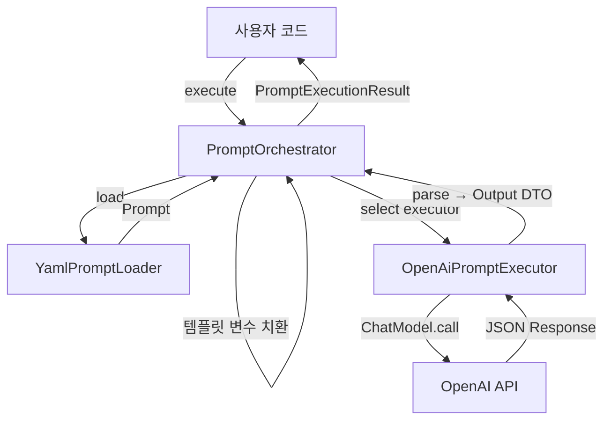

# ai-core

LLM 프롬프트 실행을 위한 라이브러리 모듈로, Provider 독립적인 프롬프트 관리 및 실행 엔진을 제공한다.

## 핵심 컨셉

### Provider 추상화 (Hexagonal Architecture)

도메인 로직과 외부 LLM Provider(OpenAI, Anthropic 등)를 분리하여 Provider 변경 시 Adapter만 교체하면 된다.

```kotlin
// Port (도메인 계층)
interface PromptExecutor {
    fun supports(provider: LlmProvider): Boolean
    suspend fun <I, O> execute(prompt: Prompt<I, O>, input: I): PromptExecutionResult<O>
}

// Adapter (인프라 계층)
@Component
class OpenAiPromptExecutor(
    private val chatModel: ChatModel
) : PromptExecutor {
    override fun supports(provider: LlmProvider) = provider == LlmProvider.OPENAI
    // ...
}
```

**이점**:
- 새 Provider 추가 시 `PromptExecutor` 구현만 추가
- 도메인 계층은 Spring AI나 특정 LLM API에 의존하지 않음
- Mock Executor로 테스트 용이

### YAML 프롬프트 관리

프롬프트를 YAML 파일로 외부화하여 코드 수정 없이 프롬프트 관리가 가능하다. 프롬프트는 각 도메인 모듈(analyzer 등)의 `resources/prompts/` 디렉토리에 배치된다.

```yaml
# analyzer/resources/prompts/disaster-classification.yml
id: disaster-classification
model: GPT_5_MINI
template: |
  다음 뉴스 기사의 재난 유형을 분류하세요.

  기사 제목: {{title}}
  기사 내용: {{content}}

  응답 형식: JSON
  { "disasterType": "재난유형", "confidence": 0.95 }

parameters:
  temperature: 0.3
  maxCompletionTokens: 500
  providerSpecificOptions:
    responseFormat: "json_object"
```

**이점**:
- 프롬프트 엔지니어가 코드 수정 없이 프롬프트 개선 가능
- Git으로 프롬프트 버전 관리 및 롤백 용이
- 도메인 모듈에서 프롬프트를 직접 관리하여 응집도 향상

### 타입 안전한 입출력

프롬프트는 제네릭 타입 `Prompt<I, O>`로 정의되며, 입력과 출력의 타입이 컴파일 타임에 검증된다.

```kotlin
// Input DTO: 템플릿의 {{variable}}과 필드명 일치
data class DisasterInput(
    val title: String,   // {{title}}에 매핑
    val content: String  // {{content}}에 매핑
)

// Output DTO: LLM 응답 JSON 구조와 일치
data class DisasterOutput(
    val disasterType: String,
    val confidence: Double
)

// 실행 (컴파일 타임 타입 검증)
val result = promptOrchestrator.execute(
    promptId = "disaster-classification",
    input = DisasterInput(title = "...", content = "..."),
    inputType = DisasterInput::class.java,
    outputType = DisasterOutput::class.java
)
// result.response: DisasterOutput (타입 안전)
```

**이점**:
- Input/Output 타입 불일치를 컴파일 시점에 발견
- IDE 자동완성으로 개발 생산성 향상
- 리팩토링 시 타입 변경이 전체 코드에 즉시 반영

### 임베딩 처리

`EmbeddingExecutor`를 통해 텍스트를 벡터(FloatArray)로 변환한다. 단건(`embed`)과 배치(`embedAll`) 모두 지원한다.

```kotlin
interface EmbeddingExecutor {
    fun supports(provider: LlmProvider): Boolean
    suspend fun embed(text: String, model: EmbeddingModel, dimensions: Int?): FloatArray
    suspend fun embedAll(texts: List<String>, model: EmbeddingModel, dimensions: Int?): List<FloatArray>
}

// 사용 예시
val embedding = embeddingExecutor.embed(
    text = "서울에서 화재가 발생했습니다.",
    model = EmbeddingModel.TEXT_EMBEDDING_3_SMALL,
    dimensions = 128
)
// embedding: FloatArray[128]
```

**이점**:
- 프롬프트 실행과 동일한 Port-Adapter 패턴으로 일관성 유지
- 배치 임베딩으로 API 호출 횟수 최소화
- 차원 수 지정으로 저장 공간 및 검색 성능 최적화

## 모듈 구조

```
ai-core/
├── src/main/kotlin/com/vonkernel/lit/ai/
│   ├── adapter/                          # 어댑터 계층 (외부 연동)
│   │   ├── executor/openai/
│   │   │   ├── OpenAiPromptExecutor.kt   # OpenAI Chat 구현체
│   │   │   ├── OpenAiEmbeddingExecutor.kt # OpenAI Embedding 구현체
│   │   │   └── OpenAiSpecificOptions.kt  # OpenAI 전용 옵션
│   │   └── prompt/
│   │       ├── YamlPromptLoader.kt       # YAML 로더
│   │       └── YamlPromptData.kt         # YAML 파싱용 DTO
│   ├── config/
│   │   └── AiCoreConfiguration.kt        # Spring 설정
│   └── domain/                           # 도메인 계층
│       ├── model/                        # Prompt, LlmModel, EmbeddingModel 등
│       ├── port/                         # PromptExecutor, EmbeddingExecutor, PromptLoader
│       ├── service/                      # PromptOrchestrator
│       └── exception/                    # AiCoreException (sealed class)
└── src/test/kotlin/...
```

## 데이터 흐름



**프롬프트 실행 5단계**:
1. **로드**: `PromptLoader`로 YAML 파일에서 `Prompt<I, O>` 로드
2. **직렬화**: Input 객체를 JSON serialize하여 필드 추출
3. **치환**: 템플릿 변수(`{{variable}}`) 치환 및 누락 변수 검증
4. **선택**: `Prompt.model.provider`에 맞는 `PromptExecutor` 선택
5. **실행**: Executor를 통해 LLM 호출 및 결과 반환

## 핵심 컴포넌트

### Port Interfaces

| 인터페이스 | 역할 |
|-----------|------|
| `PromptExecutor` | LLM 프롬프트 실행 추상화 (Provider별 구현) |
| `EmbeddingExecutor` | 텍스트 임베딩 실행 추상화 (단건/배치) |
| `PromptLoader` | 프롬프트 로딩 추상화 (YAML 파일) |

### Domain Service

| 컴포넌트 | 역할 |
|---------|------|
| `PromptOrchestrator` | 프롬프트 실행 전체 워크플로우 조율. 로드 → 치환 → Executor 선택 → 실행 |

### Adapter Layer

| 컴포넌트 | 역할 |
|---------|------|
| `OpenAiPromptExecutor` | OpenAI Chat API 호출 (Spring AI 통합) |
| `OpenAiEmbeddingExecutor` | OpenAI Embedding API 호출 (단건/배치 지원) |
| `YamlPromptLoader` | YAML 파일 파싱 및 검증, 캐싱 |

### 예외 계층

```
AiCoreException (sealed class)
├─ PromptLoadException (YAML 로딩 실패)
├─ PromptValidationException (프롬프트 검증 실패)
├─ TemplateResolutionException (템플릿 변수 누락)
├─ UnsupportedProviderException (Provider 미지원)
├─ LlmExecutionException (LLM 호출 실패)
│  ├─ LlmApiException (4xx, 5xx)
│  ├─ LlmTimeoutException
│  ├─ LlmRateLimitException
│  └─ LlmAuthenticationException
└─ ResponseParsingException (응답 파싱 실패)
```

## 사용 시나리오

### 프롬프트 실행

```kotlin
@Service
class ArticleAnalyzer(
    private val promptOrchestrator: PromptOrchestrator
) {
    suspend fun classifyDisaster(article: Article): DisasterOutput {
        val result = promptOrchestrator.execute(
            promptId = "disaster-classification",
            input = DisasterInput(article.title, article.content),
            inputType = DisasterInput::class.java,
            outputType = DisasterOutput::class.java
        )
        return result.response
    }
}
```

### 병렬 실행

여러 프롬프트를 동시에 실행하여 전체 처리 시간을 단축한다.

```kotlin
val results = promptOrchestrator.executeParallel(
    listOf(
        PromptRequest("disaster-type", disasterInput, ...),
        PromptRequest("location", locationInput, ...),
        PromptRequest("urgency", urgencyInput, ...)
    )
)
// 3개 프롬프트가 병렬로 실행됨
```

### 텍스트 임베딩

```kotlin
@Service
class ArticleEmbedder(
    private val embeddingExecutor: EmbeddingExecutor
) {
    // 단건
    suspend fun embed(text: String): FloatArray =
        embeddingExecutor.embed(text, EmbeddingModel.TEXT_EMBEDDING_3_SMALL, 128)

    // 배치 (한 번의 API 호출로 여러 텍스트 처리)
    suspend fun embedAll(texts: List<String>): List<FloatArray> =
        embeddingExecutor.embedAll(texts, EmbeddingModel.TEXT_EMBEDDING_3_SMALL, 128)
}
```

## 환경 설정

### 필수 환경변수

| 변수 | 필수 | 설명 |
|------|:----:|------|
| `SPRING_AI_OPENAI_API_KEY` | O | OpenAI API 인증 키 |

### 설정 파일

```bash
cp .env.local.example .env.local
# SPRING_AI_OPENAI_API_KEY=sk-실제-API-키 설정
```

Spring AI 2.0부터는 환경 변수만 설정하면 AutoConfiguration이 자동으로 처리한다.

## 빌드 및 실행

```bash
# 빌드
./gradlew ai-core:build

# 라이브러리 모듈이므로 단독 실행 없음
# analyzer, indexer 등 다른 모듈에서 의존성으로 사용
```

## 테스트

```bash
# 전체 단위 테스트
./gradlew ai-core:test

# 통합 테스트 (실제 OpenAI API 호출)
./gradlew ai-core:integrationTest

# 특정 테스트 클래스
./gradlew ai-core:test --tests YamlPromptLoaderTest
```

테스트 상세 내용은 [TEST.md](./TEST.md) 참조.

## 관련 문서

- [ARCHITECTURE.md](../ARCHITECTURE.md) - 시스템 아키텍처
- [TEST.md](./TEST.md) - 테스트 가이드
- [EXTERNAL_API.md](./EXTERNAL_API.md) - OpenAI API 스펙
