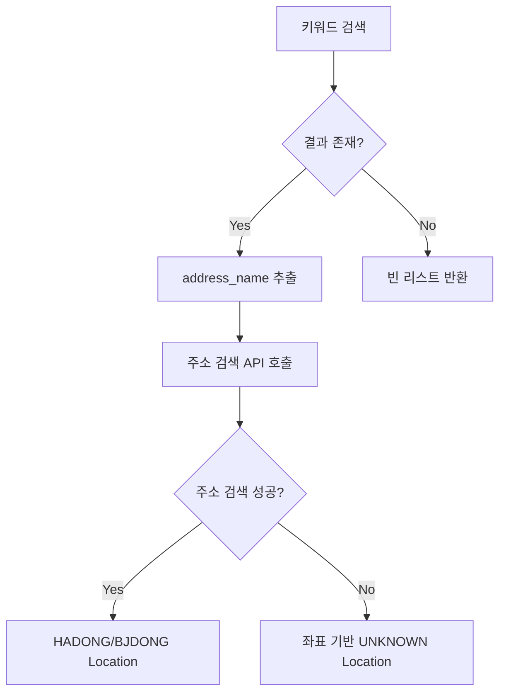

# Analyzer External APIs

이 모듈이 호출하는 외부 API 레퍼런스.

## 목차

- [API 1: Kakao Local API - 주소 검색](#api-1-kakao-local-api---주소-검색)
- [API 2: Kakao Local API - 키워드 검색](#api-2-kakao-local-api---키워드-검색)

---

## API 1: Kakao Local API - 주소 검색

### 개요

| 항목 | 값 |
|------|------|
| 공식 문서 | [Kakao Developers - 주소 검색](https://developers.kakao.com/docs/latest/ko/local/dev-guide#address-coord) |
| Base URL | `https://dapi.kakao.com` |
| 인증 방식 | REST API Key (Header) |
| 환경변수 | `KAKAO_REST_API_KEY` |

### 인증

```
Authorization: KakaoAK {REST_API_KEY}
```

### 엔드포인트

#### 주소 → 좌표 변환

**요청**

```
GET /v2/local/search/address.json
```

| 파라미터 | 타입 | 필수 | 설명 |
|---------|------|:----:|------|
| `query` | string | O | 검색할 주소 (예: "서울 강남구 역삼동") |
| `analyze_type` | string | - | 검색 분석 방식 (`similar`: 유사 검색, `exact`: 정확 검색) |
| `page` | integer | - | 페이지 번호 (1~45, 기본: 1) |
| `size` | integer | - | 페이지당 결과 수 (1~30, 기본: 10) |

**응답**

```json
{
  "meta": {
    "total_count": 1,
    "pageable_count": 1,
    "is_end": true
  },
  "documents": [
    {
      "address_name": "서울 강남구 역삼동",
      "address_type": "REGION_ADDR",
      "x": "127.0365",
      "y": "37.4994",
      "address": {
        "address_name": "서울 강남구 역삼동",
        "region_1depth_name": "서울특별시",
        "region_2depth_name": "강남구",
        "region_3depth_name": "역삼동",
        "region_3depth_h_name": "역삼1동",
        "h_code": "1168010100",
        "b_code": "1168010600",
        "x": "127.0365",
        "y": "37.4994"
      },
      "road_address": null
    }
  ]
}
```

| 필드 | 타입 | 설명 |
|------|------|------|
| `meta.total_count` | integer | 전체 검색 결과 수 |
| `meta.pageable_count` | integer | 노출 가능한 검색 결과 수 |
| `meta.is_end` | boolean | 마지막 페이지 여부 |
| `documents` | array | 검색 결과 목록 |

#### documents 배열 항목

| 필드 | 타입 | 설명 | 매핑 |
|------|------|------|------|
| `address_name` | string | 전체 주소 | `Location.address.addressName` (원본 쿼리 사용) |
| `address_type` | string | 주소 유형 (`REGION`, `ROAD`, `REGION_ADDR`, `ROAD_ADDR`) | (사용 안함) |
| `x` | string | 경도 (longitude) | `Location.coordinate.lon` |
| `y` | string | 위도 (latitude) | `Location.coordinate.lat` |
| `address` | object | 지번 주소 상세 | 아래 참조 |
| `road_address` | object | 도로명 주소 상세 | (사용 안함) |

#### address 객체

| 필드 | 타입 | 설명 | 매핑 |
|------|------|------|------|
| `region_1depth_name` | string | 시/도 | `Location.address.depth1Name` |
| `region_2depth_name` | string | 시/군/구 | `Location.address.depth2Name` |
| `region_3depth_name` | string | 법정동 | `Location.address.depth3Name` (BJDONG) |
| `region_3depth_h_name` | string | 행정동 | `Location.address.depth3Name` (HADONG) |
| `h_code` | string | 행정동 코드 | `Location.address.code` (HADONG) |
| `b_code` | string | 법정동 코드 | `Location.address.code` (BJDONG) |

**요청 예시**

```bash
curl -X GET "https://dapi.kakao.com/v2/local/search/address.json" \
  -H "Authorization: KakaoAK {REST_API_KEY}" \
  -G \
  --data-urlencode "query=서울 강남구 역삼동" \
  --data-urlencode "analyze_type=similar"
```

### 에러 처리

| 상태 코드 | 원인 | 대응 |
|:---------:|------|------|
| 400 | 잘못된 요청 파라미터 | 쿼리 문자열 확인 |
| 401 | 잘못된 API 키 | API 키 확인 |
| 429 | Rate Limit 초과 | 재시도 (지수 백오프) |
| 500 | Kakao 서버 에러 | 재시도 |

### 모듈 내 사용

| 컴포넌트 | 호출 엔드포인트 | 용도 |
|---------|---------------|------|
| `KakaoGeocodingClient.geocodeByAddress()` | `/v2/local/search/address.json` | 주소 → 좌표/행정구역 코드 변환 |

### 응답 매핑 로직

1. **h_code + b_code 둘 다 존재**: HADONG 우선, 1개 Location 생성
2. **h_code만 존재**: HADONG으로 1개 Location 생성
3. **b_code만 존재**: BJDONG으로 1개 Location 생성
4. **address가 null**: 좌표만 사용하여 UNKNOWN Location 생성
5. **documents 빈 배열 + 다중 토큰 쿼리**: 마지막 토큰 제거 후 broader 검색 재시도

---

## API 2: Kakao Local API - 키워드 검색

### 개요

| 항목 | 값 |
|------|------|
| 공식 문서 | [Kakao Developers - 키워드로 장소 검색](https://developers.kakao.com/docs/latest/ko/local/dev-guide#search-by-keyword) |
| Base URL | `https://dapi.kakao.com` |
| 인증 방식 | REST API Key (Header) |
| 환경변수 | `KAKAO_REST_API_KEY` |

### 인증

```
Authorization: KakaoAK {REST_API_KEY}
```

### 엔드포인트

#### 키워드로 장소 검색

**요청**

```
GET /v2/local/search/keyword.json
```

| 파라미터 | 타입 | 필수 | 설명 |
|---------|------|:----:|------|
| `query` | string | O | 검색할 키워드 (예: "강남역", "롯데타워") |
| `category_group_code` | string | - | 카테고리 그룹 코드 |
| `x` | string | - | 중심 경도 (정렬 기준) |
| `y` | string | - | 중심 위도 (정렬 기준) |
| `radius` | integer | - | 중심 반경 (미터, 0~20000) |
| `page` | integer | - | 페이지 번호 (1~45, 기본: 1) |
| `size` | integer | - | 페이지당 결과 수 (1~15, 기본: 15) |
| `sort` | string | - | 정렬 기준 (`distance` 또는 `accuracy`) |

**응답**

```json
{
  "meta": {
    "total_count": 1,
    "pageable_count": 1,
    "is_end": true
  },
  "documents": [
    {
      "id": "12345",
      "place_name": "강남역",
      "address_name": "서울 강남구 역삼동",
      "road_address_name": "서울 강남구 테헤란로 지하 156",
      "x": "127.0284",
      "y": "37.4979"
    }
  ]
}
```

| 필드 | 타입 | 설명 |
|------|------|------|
| `meta.total_count` | integer | 전체 검색 결과 수 |
| `meta.pageable_count` | integer | 노출 가능한 검색 결과 수 |
| `meta.is_end` | boolean | 마지막 페이지 여부 |
| `documents` | array | 검색 결과 목록 |

#### documents 배열 항목

| 필드 | 타입 | 설명 | 매핑 |
|------|------|------|------|
| `id` | string | 장소 ID | (사용 안함) |
| `place_name` | string | 장소명 | (사용 안함) |
| `address_name` | string | 지번 주소 | 주소 검색 API 재호출에 사용 |
| `road_address_name` | string | 도로명 주소 | (사용 안함) |
| `x` | string | 경도 (longitude) | `Location.coordinate.lon` (fallback) |
| `y` | string | 위도 (latitude) | `Location.coordinate.lat` (fallback) |

**요청 예시**

```bash
curl -X GET "https://dapi.kakao.com/v2/local/search/keyword.json" \
  -H "Authorization: KakaoAK {REST_API_KEY}" \
  -G \
  --data-urlencode "query=강남역"
```

### 에러 처리

| 상태 코드 | 원인 | 대응 |
|:---------:|------|------|
| 400 | 잘못된 요청 파라미터 | 쿼리 문자열 확인 |
| 401 | 잘못된 API 키 | API 키 확인 |
| 429 | Rate Limit 초과 | 재시도 (지수 백오프) |
| 500 | Kakao 서버 에러 | 재시도 |

### 모듈 내 사용

| 컴포넌트 | 호출 엔드포인트 | 용도 |
|---------|---------------|------|
| `KakaoGeocodingClient.geocodeByKeyword()` | `/v2/local/search/keyword.json` | 랜드마크/장소명 → 좌표 변환 |

### 2단계 검색 로직

키워드 검색은 행정구역 코드를 제공하지 않으므로, 다음과 같은 2단계 검색을 수행한다:



1. **키워드 검색 → 주소 검색 성공**: 주소 검색 결과의 h_code/b_code로 Location 생성
2. **키워드 검색 → 주소 검색 실패**: 키워드 검색 결과의 x, y 좌표로 UNKNOWN Location 생성
3. **키워드 검색 실패**: 빈 리스트 반환

---

## 공통 사항

### Rate Limiting

Kakao Local API는 요청 제한이 있다. 현재 모듈은 별도의 Rate Limiting 로직을 구현하지 않으나, 429 응답 시 예외가 전파된다.

### 캐싱

`CachedGeocoder` 데코레이터를 통해 동일 쿼리에 대한 결과를 캐싱한다.

```kotlin
// CachedGeocoder
class CachedGeocoder(
    private val delegate: GeocodingClient,
    private val cache: Cache<String, List<Location>>
) : GeocodingClient {
    override suspend fun geocodeByAddress(query: String): List<Location> =
        cache.get(query) { delegate.geocodeByAddress(query) }
}
```

### WebClient 설정

```kotlin
@Bean("kakaoWebClient")
fun kakaoWebClient(): WebClient =
    WebClient.builder()
        .baseUrl("https://dapi.kakao.com")
        .defaultHeader("Authorization", "KakaoAK $apiKey")
        .build()
```

### 데이터 매핑 모델

#### KakaoAddressResponse

```kotlin
data class KakaoAddressResponse(
    val meta: KakaoMeta,
    val documents: List<KakaoAddressDocument>
)

data class KakaoAddressDocument(
    val addressName: String,
    val addressType: String,
    val x: String,
    val y: String,
    val address: KakaoAddress?,
    val roadAddress: KakaoRoadAddress?
)

data class KakaoAddress(
    val addressName: String,
    val region1DepthName: String,  // 시/도
    val region2DepthName: String,  // 시/군/구
    val region3DepthName: String,  // 법정동
    val region3DepthHName: String, // 행정동
    val hCode: String,             // 행정동 코드
    val bCode: String,             // 법정동 코드
    val x: String,
    val y: String
)
```

#### KakaoKeywordResponse

```kotlin
data class KakaoKeywordResponse(
    val meta: KakaoMeta,
    val documents: List<KakaoKeywordDocument>
)

data class KakaoKeywordDocument(
    val id: String?,
    val placeName: String?,
    val addressName: String?,
    val roadAddressName: String?,
    val x: String?,
    val y: String?
)
```
