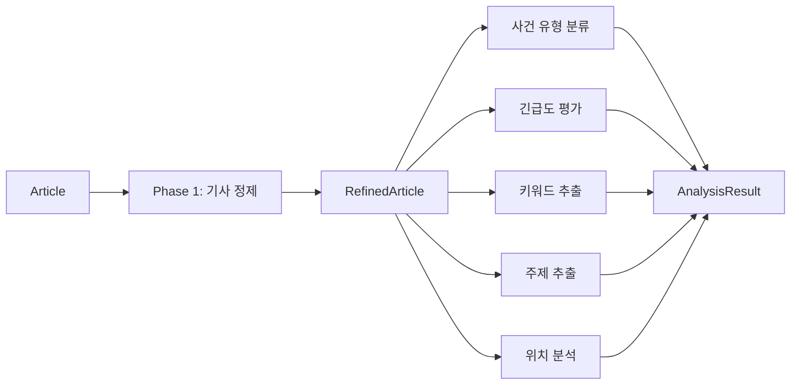
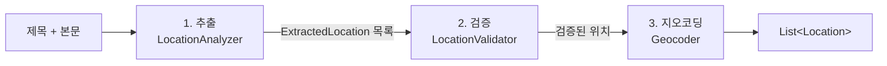
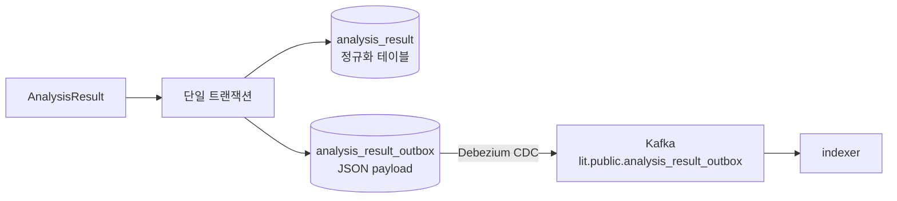
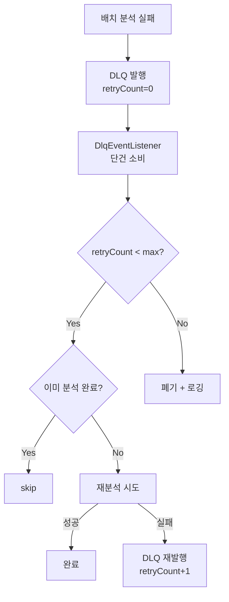
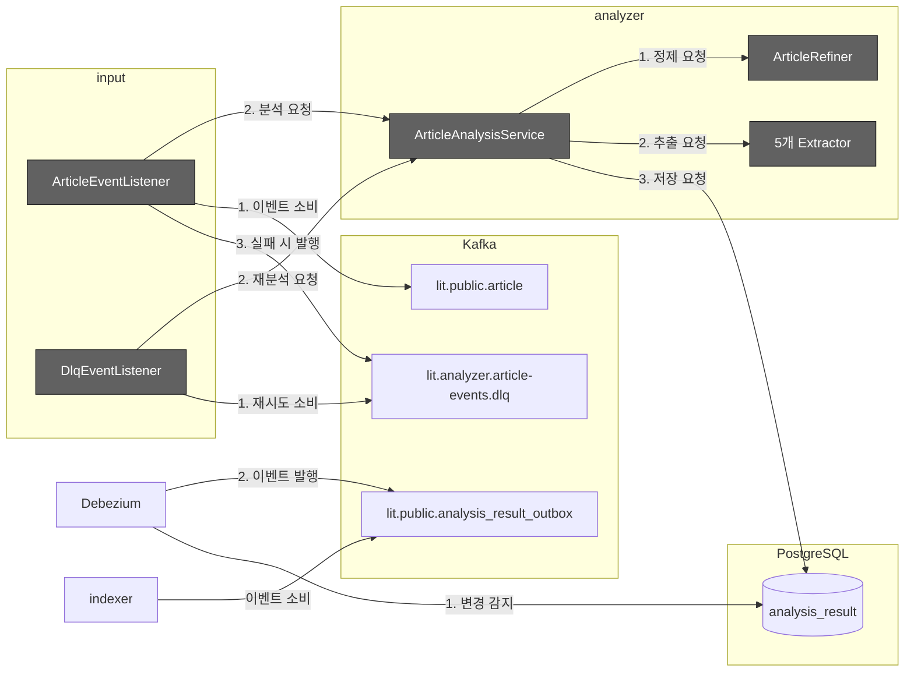

# Analyzer Service

Kafka를 통해 수신한 기사 이벤트를 LLM 기반으로 분석하여, 사건 유형·긴급도·위치·키워드 등의 분석 결과를 PostgreSQL에 저장하는 서비스.

## 핵심 컨셉

### 2-Phase 분석 파이프라인

원본 기사를 먼저 정제한 후, 5개의 분석 작업을 병렬로 실행하여 처리 시간을 단축한다.



```kotlin
// ArticleAnalysisService
suspend fun analyze(article: Article) {
    // Phase 1: 순차 정제
    val refined = articleRefiner.refine(article)

    // Phase 2: 5개 병렬 분석 (coroutine async)
    val (incidentTypes, urgency, locations, keywords, topic) = coroutineScope {
        val incidentTypesDeferred = async { incidentTypeExtractor.extract(refined) }
        val urgencyDeferred = async { urgencyExtractor.extract(refined) }
        val locationsDeferred = async { locationsExtractor.extract(refined) }
        val keywordsDeferred = async { keywordsExtractor.extract(refined) }
        val topicDeferred = async { topicExtractor.extract(refined) }
        awaitAll(...)
    }

    // 집계 및 저장
    analysisResultRepository.save(AnalysisResult(...))
}
```

**이점**:
- Phase 1의 정제된 기사(요약 포함)가 Phase 2의 분석 품질 향상
- 5개 독립 분석이 병렬 실행되어 전체 처리 시간 단축
- 단일 트랜잭션으로 모든 분석 결과 원자적 저장

### 위치 분석 3단계 파이프라인

LLM의 위치 추출 결과는 노이즈를 포함할 수 있어 검증 단계를 거친 후 지오코딩한다.



```kotlin
// LocationsExtractor
suspend fun extract(refined: RefinedArticle): List<Location> {
    // 1. LLM으로 위치 엔티티 추출 (ADDRESS, LANDMARK, UNRESOLVABLE 분류)
    val extracted = locationAnalyzer.analyze(refined.title, refined.content)

    // 2. LLM으로 필터링·정규화 (노이즈 제거)
    val validated = locationValidator.validate(extracted)

    // 3. 유형별 지오코딩 (병렬)
    return validated.map { location ->
        when (location.type) {
            ADDRESS -> geocoder.geocodeByAddress(location.value)
            LANDMARK -> geocoder.geocodeByKeyword(location.value)
            UNRESOLVABLE -> listOf(Location.unknown(location.value))
        }
    }.flatten()
}
```

**이점**:
- 검증 단계에서 "해외", "전국" 등 지오코딩 불가 표현을 사전 필터링
- 불필요한 Kakao API 호출 방지
- 위치 유형에 따른 적절한 지오코딩 전략 선택

### Outbox 패턴

분석 결과를 정규화된 테이블과 별도의 Outbox 테이블에 동시에 저장하여 이벤트 발행의 원자성을 보장한다.



```kotlin
// AnalysisResultRepositoryAdapter
@Transactional
override fun save(analysisResult: AnalysisResult, articleUpdatedAt: Instant?): AnalysisResult {
    // 1. 정규화된 분석 결과 테이블에 저장 (FK 매핑 포함)
    val entity = buildAnalysisResultEntity(analysisResult, articleUpdatedAt)
    jpaAnalysisResultRepository.save(entity)

    // 2. Outbox 테이블에 JSON payload로 저장 (CDC 대상)
    val outbox = AnalysisResultOutboxEntity(
        articleId = analysisResult.articleId,
        payload = objectMapper.writeValueAsString(analysisResult)  // 전체 데이터 JSON
    )
    jpaAnalysisResultOutboxRepository.save(outbox)
    // → Debezium이 outbox INSERT 감지 → Kafka 이벤트 발행
}
```

**이점**:
- 트랜잭션 보장: 정규화 테이블과 Outbox가 함께 커밋되거나 롤백
- At-least-once 전달: Outbox 커밋 시 반드시 Kafka 이벤트 발행
- 완전한 데이터: Outbox payload에 `AnalysisResult` 전체가 JSON으로 포함되어 indexer가 별도 DB 조회 불필요

### DLQ 전략

분석 실패 시 Dead Letter Queue로 발행하여 재처리하고, 최대 재시도 초과 시 폐기한다.



```kotlin
// DlqEventListener
@KafkaListener(topics = ["\${kafka.dlq.topic}"])
suspend fun onDlqEvent(record: ConsumerRecord<String, ByteArray>) {
    val retryCount = record.headers().lastHeader("dlq-retry-count")?.toInt() ?: 0

    if (retryCount >= maxRetries) {
        log.warn("Max retries exceeded, discarding: ${record.key()}")
        return
    }

    try {
        articleAnalysisService.analyze(parseArticle(record))
    } catch (e: Exception) {
        dlqPublisher.publish(record, retryCount + 1)
    }
}
```

**이점**:
- 일시적 장애(API timeout 등)로 인한 분석 실패 자동 재처리
- Outdated 체크로 이미 분석된 기사는 재분석하지 않음
- 최대 재시도 초과 시 명시적 폐기로 무한 루프 방지

## 모듈 구조

```
analyzer/
├── src/main/kotlin/com/vonkernel/lit/analyzer/
│   ├── adapter/
│   │   ├── inbound/consumer/              # Kafka Consumer
│   │   │   ├── ArticleEventListener.kt    # 배치 Consumer
│   │   │   ├── DlqEventListener.kt        # DLQ 단건 Consumer
│   │   │   └── model/DebeziumArticleEvent.kt
│   │   └── outbound/
│   │       ├── analyzer/                  # LLM Analyzer 구현체 7개
│   │       ├── dlq/KafkaDlqPublisher.kt   # DLQ Publisher
│   │       └── geocoding/                 # Kakao 지오코딩 Adapter
│   │           ├── KakaoGeocodingAdapter.kt
│   │           └── model/                 # Kakao API 응답 모델
│   └── domain/
│       ├── port/
│       │   ├── analyzer/                  # 7개 Analyzer 인터페이스
│       │   ├── geocoding/Geocoder.kt      # 지오코딩 포트
│       │   └── DlqPublisher.kt            # DLQ 발행 포트
│       └── service/
│           ├── ArticleAnalysisService.kt  # 파이프라인 오케스트레이션
│           ├── ArticleRefiner.kt          # Phase 1: 기사 정제
│           └── *Extractor.kt              # Phase 2: 5개 Extractor
├── src/main/resources/
│   └── prompts/                           # 7개 YAML 프롬프트
└── src/test/kotlin/...
```

## 데이터 흐름



**정상 흐름**:
1. **이벤트 소비**: `ArticleEventListener`가 `lit.public.article` 토픽에서 기사 이벤트 배치 소비
2. **분석 요청**: Listener가 `ArticleAnalysisService`에 분석 요청
3. **기사 정제**: Service가 `ArticleRefiner`에 정제 요청 → LLM으로 제목·본문 정제 및 요약 생성
4. **병렬 추출**: Service가 `5개 Extractor`에 추출 요청 → 사건유형, 긴급도, 위치, 키워드, 주제 동시 분석
5. **결과 저장**: Service가 `analysis_result` 테이블에 저장 요청 (정규화 + Outbox 단일 트랜잭션)
6. **CDC 발행**: `Debezium`이 Outbox 테이블 변경 감지 → `lit.public.analysis_result_outbox` 토픽에 이벤트 발행
7. **indexer 소비**: `indexer`가 분석 결과 이벤트 소비 → OpenSearch 색인

**실패 흐름 (DLQ)**:
1. **실패 발행**: 분석 실패 시 `ArticleEventListener`가 `lit.analyzer.article-events.dlq` 토픽에 발행
2. **재시도 소비**: `DlqEventListener`가 DLQ 토픽에서 단건 소비
3. **재분석 요청**: DlqEventListener가 `ArticleAnalysisService`에 재분석 요청 (최대 3회)

## 핵심 컴포넌트

### Port Interfaces

| 인터페이스 | 역할 |
|-----------|------|
| `RefineArticleAnalyzer` | 기사 정제 계약 (제목·본문 정제, 요약 생성) |
| `IncidentTypeAnalyzer` | 사건 유형 분류 계약 (35+ 유형 다중 분류) |
| `UrgencyAnalyzer` | 긴급도 평가 계약 (단일 레이블) |
| `LocationAnalyzer` | 위치 엔티티 추출 계약 |
| `LocationValidator` | 위치 검증·필터링·정규화 계약 |
| `KeywordAnalyzer` | 키워드 추출 계약 |
| `TopicAnalyzer` | 주제 추출 계약 |
| `Geocoder` | 지오코딩 계약 (`geocodeByAddress`, `geocodeByKeyword`) |
| `DlqPublisher` | DLQ 발행 계약 |

### Domain Service

| 컴포넌트 | 역할 |
|---------|------|
| `ArticleAnalysisService` | 2-Phase 파이프라인 오케스트레이션. 정제 → 병렬 분석 → 결과 저장 |
| `ArticleRefiner` | Phase 1: LLM 기사 정제 |
| `IncidentTypeExtractor` | Phase 2: 사건 유형 추출 (DB 참조 + LLM) |
| `UrgencyExtractor` | Phase 2: 긴급도 추출 (DB 참조 + LLM) |
| `LocationsExtractor` | Phase 2: 위치 3단계 파이프라인 (추출→검증→지오코딩) |
| `KeywordsExtractor` | Phase 2: 키워드 추출 |
| `TopicExtractor` | Phase 2: 주제 추출 |

### Adapter Layer

| 컴포넌트 | 역할 |
|---------|------|
| `ArticleEventListener` | Kafka 배치 Consumer. CDC 이벤트 수신 → 분석 시작 |
| `DlqEventListener` | DLQ 단건 Consumer. 재시도 로직 처리 |
| `Default*Analyzer` (7개) | LLM 기반 분석기 구현체 (ai-core 사용) |
| `KakaoGeocodingAdapter` | Kakao Local API 지오코딩 구현체 |
| `KafkaDlqPublisher` | DLQ Kafka 발행 구현체 |

## 환경 설정

### 필수 환경변수

| 변수 | 필수 | 기본값 | 설명 |
|------|:----:|--------|------|
| `SPRING_AI_OPENAI_API_KEY` | O | - | OpenAI API 인증 키 |
| `KAKAO_REST_API_KEY` | O | - | Kakao Local API 인증 키 |
| `DB_URL` | - | `jdbc:postgresql://localhost:5432/lit_maindb` | PostgreSQL URL |
| `DB_USERNAME` | - | `postgres` | DB 사용자 |
| `DB_PASSWORD` | - | `postgres` | DB 비밀번호 |
| `KAFKA_BOOTSTRAP_SERVERS` | - | `localhost:9092` | Kafka 브로커 |
| `DLQ_MAX_RETRIES` | - | `3` | 최대 재시도 횟수 |

### 설정 파일

```bash
cp .env.local.example .env.local
# SPRING_AI_OPENAI_API_KEY=sk-... 설정
# KAKAO_REST_API_KEY=... 설정
```

## 빌드 및 실행

```bash
# 사전 요구사항: PostgreSQL, Kafka, Debezium 실행
cd infrastructure && docker-compose up -d

# 빌드
./gradlew analyzer:build

# 실행
./gradlew analyzer:bootRun

# 또는 환경변수 로드 후 실행
set -a && source analyzer/.env.local && set +a
./gradlew analyzer:bootRun
```

## 테스트

```bash
# 전체 단위 테스트
./gradlew analyzer:test

# 통합 테스트 (실제 OpenAI/Kakao API 호출)
./gradlew analyzer:integrationTest

# 특정 테스트 클래스
./gradlew analyzer:test --tests ArticleAnalysisServiceTest
```

테스트 상세 내용은 [TEST.md](./TEST.md) 참조.

## 관련 문서

- [ARCHITECTURE.md](../ARCHITECTURE.md) - 시스템 아키텍처
- [TEST.md](./TEST.md) - 테스트 가이드
- [EXTERNAL_API.md](./EXTERNAL_API.md) - Kakao Local API 스펙
