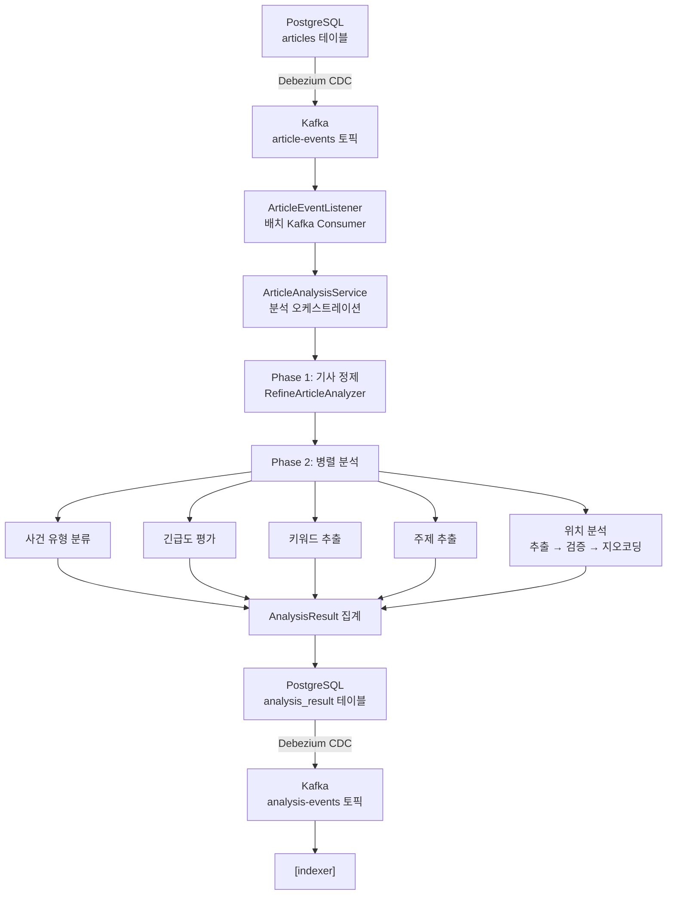
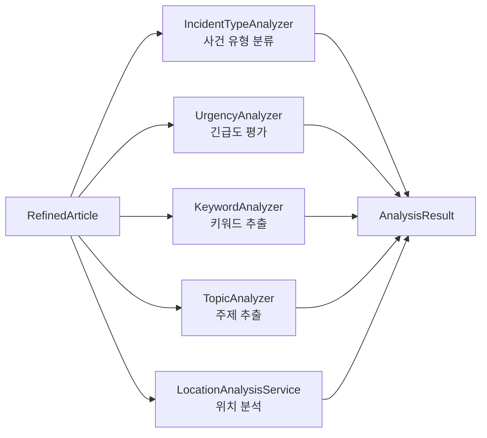
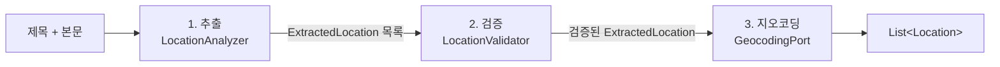
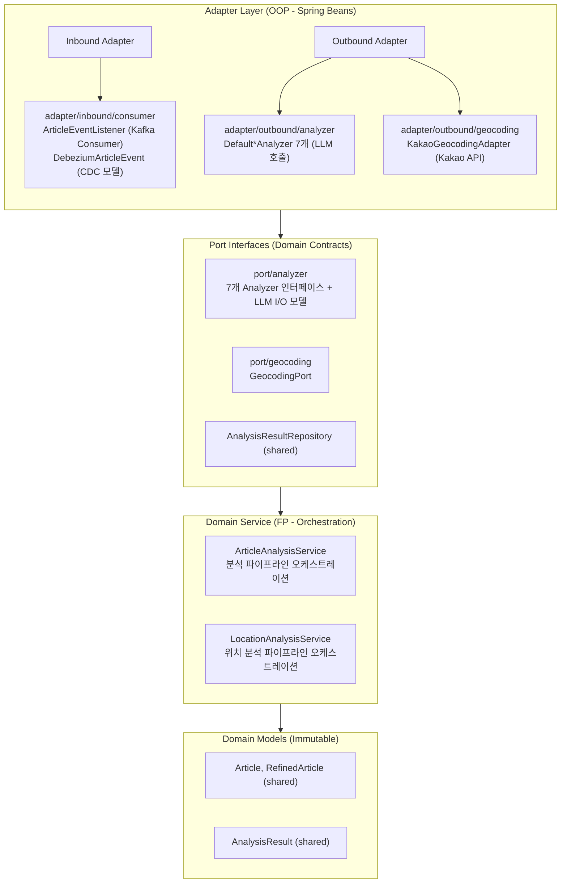

# Analyzer Service

Kafka를 통해 수신한 기사 이벤트를 LLM 기반 분석 파이프라인으로 처리하여, 사건 유형·긴급도·위치·키워드·주제 등의 분석 결과를 생성하고 PostgreSQL에 저장하는 분석 서비스입니다.

---

## 목차

- [역할 및 책임](#역할-및-책임)
- [데이터 흐름](#데이터-흐름)
- [분석 파이프라인](#분석-파이프라인)
- [아키텍처](#아키텍처)
- [주요 컴포넌트](#주요-컴포넌트)
- [프로젝트 구조](#프로젝트-구조)
- [환경 설정](#환경-설정)
- [애플리케이션 실행](#애플리케이션-실행)
- [테스트](#테스트)
- [주요 설계 결정](#주요-설계-결정)
- [의존성](#의존성)

---

## 역할 및 책임

analyzer는 collector가 수집한 기사를 AI(LLM)와 외부 API(Kakao 지오코딩)를 활용하여 다차원으로 분석하고, 그 결과를 PostgreSQL에 저장하는 두 번째 파이프라인 단계입니다.

### 핵심 책임
- Kafka CDC 이벤트를 통해 신규 기사 수신
- LLM 기반 다차원 분석 수행 (사건 유형, 긴급도, 키워드, 주제, 위치)
- 기사 본문 정제 및 요약 생성
- 위치 정보 추출, 검증, 지오코딩 (Kakao Local API)
- 분석 결과를 `AnalysisResult`로 집계하여 PostgreSQL에 저장 (Outbox 패턴)

---

## 데이터 흐름



---

## 분석 파이프라인

analyzer의 분석 파이프라인은 2-Phase 구조로 동작합니다.

### Phase 1: 기사 정제 (순차)

원본 기사를 LLM으로 정제하여 이후 분석의 품질을 높입니다.

| 단계 | 입력 | 출력 |
|------|------|------|
| RefineArticleAnalyzer | `Article` (원본 제목, 본문) | `RefinedArticle` (정제된 제목, 본문, 요약) |

정제된 결과는 Phase 2의 모든 분석기에 공통 입력으로 제공됩니다.

### Phase 2: 5개 병렬 분석

정제된 기사를 기반으로 5개의 분석 작업이 코루틴 `async`를 통해 병렬로 실행됩니다.



| 분석기 | 입력 | 출력 | 설명 |
|--------|------|------|------|
| `IncidentTypeAnalyzer` | 제목, 본문 | `Set<IncidentType>` | 사건 유형 다중 분류 (35+ 유형) |
| `UrgencyAnalyzer` | 제목, 본문 | `Urgency` | 긴급도 단일 레이블 평가 |
| `KeywordAnalyzer` | 요약 | `List<Keyword>` | 핵심 키워드 추출 |
| `TopicAnalyzer` | 요약 | `Topic` | 주제 단일 추출 |
| `LocationAnalysisService` | 제목, 본문 | `List<Location>` | 위치 추출 + 검증 + 지오코딩 |

### 위치 분석 3단계 파이프라인

위치 분석은 다른 분석기와 달리 3단계 파이프라인으로 구성됩니다.



| 단계 | 컴포넌트 | 역할 |
|------|---------|------|
| 1. 추출 | `LocationAnalyzer` | LLM으로 기사에서 위치 엔티티 추출 (`ADDRESS`, `LANDMARK`, `UNRESOLVABLE` 분류) |
| 2. 검증 | `LocationValidator` | LLM으로 추출 결과 필터링, 정규화, 정제 |
| 3. 지오코딩 | `GeocodingPort` | Kakao Local API로 좌표 변환 및 행정구역 정보 매핑 |

---

## 아키텍처

analyzer는 **Hexagonal Architecture (Ports & Adapters)** 패턴을 따르며, 프로젝트 전체의 **OOP + FP Hybrid** 전략을 사용합니다.

### 계층 구조



**계층별 책임**:
- **Adapter Layer (Inbound)**: Kafka CDC 이벤트 수신, Debezium 이벤트 역직렬화
- **Adapter Layer (Outbound/Analyzer)**: ai-core의 `PromptOrchestrator`를 사용한 LLM 기반 분석기 구현체
- **Adapter Layer (Outbound/Geocoding)**: Kakao Local API 호출을 통한 지오코딩
- **Port Interfaces**: 도메인 계약 (분석기 인터페이스 7개, 지오코딩 포트, LLM 입출력 모델)
- **Domain Service**: 분석 파이프라인 오케스트레이션, 코루틴 병렬 실행 관리 (Port 인터페이스에만 의존)
- **Domain Models**: 불변 데이터 클래스 (shared 모듈 참조)

---

## 주요 컴포넌트

### Adapter Layer

| 컴포넌트 | 패키지 | 역할 | 입출력 |
|---------|--------|------|--------|
| `ArticleEventListener` | `adapter/inbound/consumer` | Kafka 배치 Consumer. Debezium CDC 이벤트를 수신하여 분석 시작 | `ConsumerRecord` → `ArticleAnalysisService.analyze()` 호출 |
| `DebeziumArticleEvent` | `adapter/inbound/consumer/model` | CDC 이벤트 역직렬화 모델. `op=c`(create), `op=r`(read) 이벤트만 처리 | JSON → `Article` 변환 |
| `DefaultRefineArticleAnalyzer` | `adapter/outbound/analyzer` | `RefineArticleAnalyzer` 구현체. LLM으로 기사 정제 및 요약 생성 | `RefineArticleInput` → `RefineArticleOutput` |
| `DefaultIncidentTypeAnalyzer` | `adapter/outbound/analyzer` | `IncidentTypeAnalyzer` 구현체. LLM으로 사건 유형 다중 분류 | `IncidentTypeClassificationInput` → `IncidentTypeClassificationOutput` |
| `DefaultUrgencyAnalyzer` | `adapter/outbound/analyzer` | `UrgencyAnalyzer` 구현체. LLM으로 긴급도 평가 | `UrgencyAssessmentInput` → `UrgencyAssessmentOutput` |
| `DefaultKeywordAnalyzer` | `adapter/outbound/analyzer` | `KeywordAnalyzer` 구현체. LLM으로 키워드 추출 | `KeywordExtractionInput` → `KeywordExtractionOutput` |
| `DefaultTopicAnalyzer` | `adapter/outbound/analyzer` | `TopicAnalyzer` 구현체. LLM으로 주제 추출 | `TopicExtractionInput` → `TopicExtractionOutput` |
| `DefaultLocationAnalyzer` | `adapter/outbound/analyzer` | `LocationAnalyzer` 구현체. LLM으로 위치 엔티티 추출 | `LocationExtractionInput` → `LocationExtractionOutput` |
| `DefaultLocationValidator` | `adapter/outbound/analyzer` | `LocationValidator` 구현체. LLM으로 위치 검증·정규화 | `LocationValidationInput` → `LocationExtractionOutput` |
| `KakaoGeocodingAdapter` | `adapter/outbound/geocoding` | `GeocodingPort` 구현체. Kakao Local API를 호출하여 주소/키워드 지오코딩 수행 | 주소 문자열 → `List<Location>` (좌표 + 행정구역) |

### Domain Service

| 컴포넌트 | 역할 | 입출력 |
|---------|------|--------|
| `ArticleAnalysisService` | 전체 분석 파이프라인 오케스트레이션. Phase 1(정제) → Phase 2(5개 병렬 분석) → 결과 집계 및 저장 | `Article` → `AnalysisResult` (PostgreSQL 저장) |
| `LocationAnalysisService` | 위치 분석 3단계 파이프라인 오케스트레이션. 추출 → 검증 → 지오코딩 | 제목, 본문 → `List<Location>` |

### Port Interface

| 인터페이스 | 패키지 | 역할 |
|-----------|--------|------|
| `RefineArticleAnalyzer` | `domain/port/analyzer` | 기사 정제 계약 (제목·본문 정제, 요약 생성) |
| `IncidentTypeAnalyzer` | `domain/port/analyzer` | 사건 유형 분류 계약 (35+ 유형 다중 분류) |
| `UrgencyAnalyzer` | `domain/port/analyzer` | 긴급도 평가 계약 (단일 레이블) |
| `KeywordAnalyzer` | `domain/port/analyzer` | 키워드 추출 계약 |
| `TopicAnalyzer` | `domain/port/analyzer` | 주제 추출 계약 |
| `LocationAnalyzer` | `domain/port/analyzer` | 위치 엔티티 추출 계약 (ADDRESS/LANDMARK/UNRESOLVABLE 분류) |
| `LocationValidator` | `domain/port/analyzer` | 위치 검증·필터링·정규화 계약 |
| `GeocodingPort` | `domain/port/geocoding` | 지오코딩 외부 서비스 계약 (`geocodeByAddress`, `geocodeByKeyword`) |

---

## 프로젝트 구조

```
analyzer/src/main/kotlin/com/vonkernel/lit/analyzer/
├── AnalyzerApplication.kt
├── adapter/
│   ├── inbound/
│   │   └── consumer/
│   │       ├── ArticleEventListener.kt
│   │       ├── config/
│   │       │   └── DebeziumObjectMapperConfig.kt
│   │       └── model/
│   │           └── DebeziumArticleEvent.kt
│   └── outbound/
│       ├── analyzer/
│       │   ├── DefaultRefineArticleAnalyzer.kt
│       │   ├── DefaultIncidentTypeAnalyzer.kt
│       │   ├── DefaultUrgencyAnalyzer.kt
│       │   ├── DefaultKeywordAnalyzer.kt
│       │   ├── DefaultTopicAnalyzer.kt
│       │   ├── DefaultLocationAnalyzer.kt
│       │   └── DefaultLocationValidator.kt
│       └── geocoding/
│           ├── KakaoGeocodingAdapter.kt
│           ├── config/
│           │   └── KakaoWebClientConfig.kt
│           └── model/
│               ├── KakaoAddressResponse.kt
│               ├── KakaoKeywordResponse.kt
│               └── KakaoMeta.kt
└── domain/
    ├── exception/
    │   └── ArticleAnalysisException.kt
    ├── port/
    │   ├── analyzer/
    │   │   ├── RefineArticleAnalyzer.kt
    │   │   ├── IncidentTypeAnalyzer.kt
    │   │   ├── UrgencyAnalyzer.kt
    │   │   ├── KeywordAnalyzer.kt
    │   │   ├── TopicAnalyzer.kt
    │   │   ├── LocationAnalyzer.kt
    │   │   ├── LocationValidator.kt
    │   │   └── model/
    │   │       ├── RefineArticleInput.kt / RefineArticleOutput.kt
    │   │       ├── IncidentTypeClassificationInput.kt / IncidentTypeClassificationOutput.kt
    │   │       ├── UrgencyAssessmentInput.kt / UrgencyAssessmentOutput.kt
    │   │       ├── KeywordExtractionInput.kt / KeywordExtractionOutput.kt
    │   │       ├── TopicExtractionInput.kt / TopicExtractionOutput.kt
    │   │       ├── LocationExtractionInput.kt / LocationExtractionOutput.kt
    │   │       ├── LocationValidationInput.kt
    │   │       └── IncidentTypeItem.kt / UrgencyItem.kt
    │   └── geocoding/
    │       └── GeocodingPort.kt
    └── service/
        ├── ArticleAnalysisService.kt
        └── LocationAnalysisService.kt

analyzer/src/main/resources/
├── application.yml
└── prompts/
    ├── refine-article.yml
    ├── incident-type-classification.yml
    ├── urgency-assessment.yml
    ├── keyword-extraction.yml
    ├── topic-extraction.yml
    ├── location-extraction.yml
    └── location-validation.yml
```

---

## 환경 설정

### 1. 로컬 환경 파일 생성

템플릿 파일을 복사하여 로컬 설정 파일을 만듭니다:

```bash
cp .env.local.example .env.local
```

### 2. 필수 환경변수 설정

`.env.local` 파일을 열어 실제 값으로 수정합니다:

```bash
# OpenAI API Key (LLM 분석용)
SPRING_AI_OPENAI_API_KEY=sk-your-api-key-here

# 데이터베이스 설정
DB_URL=jdbc:postgresql://localhost:5432/lit_maindb
DB_USERNAME=postgres
DB_PASSWORD=postgres

# Kafka 설정
KAFKA_BOOTSTRAP_SERVERS=localhost:9092
KAFKA_ARTICLE_EVENTS_TOPIC=lit.public.article
KAFKA_CONSUMER_GROUP_ID=analyzer-group

# Kakao REST API Key (지오코딩용)
KAKAO_REST_API_KEY=your-kakao-rest-api-key-here
```

### 3. 설정 확인

| 환경변수 | 기본값 | 필수 여부 | 용도 |
|----------|--------|-----------|------|
| `SPRING_AI_OPENAI_API_KEY` | (없음) | **예** | LLM 분석 (OpenAI API) |
| `KAKAO_REST_API_KEY` | (없음) | **예** | 위치 지오코딩 (Kakao Local API) |
| `DB_URL` | `jdbc:postgresql://localhost:5432/lit_maindb` | 아니오 | PostgreSQL 연결 |
| `DB_USERNAME` | `postgres` | 아니오 | DB 사용자 |
| `DB_PASSWORD` | `postgres` | 아니오 | DB 비밀번호 |
| `KAFKA_BOOTSTRAP_SERVERS` | `localhost:9092` | 아니오 | Kafka 브로커 주소 |
| `KAFKA_ARTICLE_EVENTS_TOPIC` | `lit.public.article` | 아니오 | 기사 이벤트 토픽 |
| `KAFKA_CONSUMER_GROUP_ID` | `analyzer-group` | 아니오 | Kafka Consumer 그룹 ID |

---

## 애플리케이션 실행

### 사전 요구사항

1. **PostgreSQL 실행**
   ```bash
   cd infrastructure && docker-compose up -d postgres
   ```

2. **Kafka + Debezium 실행**
   ```bash
   cd infrastructure && docker-compose up -d kafka connect
   ```

3. **환경변수 설정** (위 [환경 설정](#환경-설정) 섹션 참조)

### 실행 방법

#### 방법 A: Gradle을 통한 실행

```bash
# 프로젝트 루트에서
./gradlew analyzer:bootRun
```

#### 방법 B: 환경변수 로드 후 실행

```bash
# analyzer 디렉토리에서
set -a && source .env.local && set +a
./gradlew bootRun
```

#### 방법 C: IntelliJ IDEA 사용

1. Run/Debug Configurations → Edit Configurations
2. Environment variables → Load from file
3. `.env.local` 파일 선택
4. 실행

### 실행 확인

애플리케이션이 정상적으로 시작되면 다음 로그를 확인할 수 있습니다:

```
Started AnalyzerApplication in X.XXX seconds
```

기사 이벤트가 Kafka에 발행되면 분석이 시작됩니다:

```
Starting analysis for article: 2026-01-27-12345
Analysis completed and saved for article: 2026-01-27-12345
```

---

## 테스트

### 테스트 구조

```
analyzer/src/test/kotlin/com/vonkernel/lit/analyzer/
├── adapter/
│   ├── inbound/
│   │   ├── ArticleEventListenerTest.kt
│   │   └── model/
│   │       └── DebeziumArticleEventTest.kt
│   └── outbound/
│       ├── KakaoGeocodingAdapterTest.kt
│       └── KakaoGeocodingAdapterIntegrationTest.kt
└── domain/
    ├── analyzer/
    │   ├── DefaultIncidentTypeAnalyzerTest.kt
    │   ├── DefaultIncidentTypeAnalyzerIntegrationTest.kt
    │   ├── DefaultUrgencyAnalyzerTest.kt
    │   ├── DefaultUrgencyAnalyzerIntegrationTest.kt
    │   ├── DefaultKeywordAnalyzerIntegrationTest.kt
    │   ├── DefaultLocationAnalyzerIntegrationTest.kt
    │   ├── DefaultLocationValidatorTest.kt
    │   └── DefaultLocationValidatorIntegrationTest.kt
    └── service/
        ├── ArticleAnalysisServiceTest.kt
        └── LocationAnalysisServiceTest.kt
```

### 테스트 종류

#### 단위 테스트

외부 의존성을 MockK로 모킹하여 비즈니스 로직만 검증합니다.

- `ArticleAnalysisServiceTest`: 2-Phase 파이프라인 오케스트레이션, 멱등성, 에러 처리
- `LocationAnalysisServiceTest`: 위치 3단계 파이프라인 흐름, 지오코딩 실패 시 fallback
- `ArticleEventListenerTest`: Kafka 이벤트 처리, CDC 이벤트 필터링
- `DefaultIncidentTypeAnalyzerTest`: 사건 유형 분류 로직
- `DefaultUrgencyAnalyzerTest`: 긴급도 평가 로직
- `DefaultLocationValidatorTest`: 위치 검증 로직

#### 통합 테스트

실제 외부 API (OpenAI, Kakao)를 호출하여 end-to-end 동작을 검증합니다.

- `@Tag("integration")` 태그로 구분
- `.env.local`의 API 키 필요 (`SPRING_AI_OPENAI_API_KEY`, `KAKAO_REST_API_KEY`)

### 테스트 실행

#### 전체 테스트 실행 (단위 테스트만)
```bash
./gradlew analyzer:test
```

#### 통합 테스트 포함 실행
```bash
./gradlew analyzer:integrationTest
```

#### 특정 테스트 클래스 실행
```bash
./gradlew analyzer:test --tests ArticleAnalysisServiceTest
```

#### 단위 테스트만 실행
```bash
./gradlew analyzer:test --tests '*Test'
```

#### 통합 테스트만 실행
```bash
./gradlew analyzer:test --tests '*IntegrationTest'
```

### 테스트 리포트 확인

```bash
open analyzer/build/reports/tests/test/index.html
```

---

## 주요 설계 결정

### 1. 2-Phase 파이프라인 구조

**구조**: Phase 1(기사 정제) → Phase 2(5개 병렬 분석)

**이유**:
- 원본 기사의 노이즈(불필요한 문구, 비정형 포맷)를 제거하면 후속 분석 품질이 향상됨
- 정제된 기사의 요약(summary)은 키워드·주제 분석에 최적화된 입력을 제공
- Phase 2의 5개 분석은 서로 독립적이므로 코루틴 `async`로 병렬 실행하여 처리 시간 단축

### 2. 위치 3단계 파이프라인

**구조**: 추출(LocationAnalyzer) → 검증(LocationValidator) → 지오코딩(GeocodingPort)

**이유**:
- LLM의 위치 추출 결과는 노이즈를 포함할 수 있음 (예: "해외", "전국" 등 지오코딩 불가 표현)
- 검증 단계에서 필터링·정규화하여 불필요한 API 호출을 방지
- 위치 유형(ADDRESS/LANDMARK/UNRESOLVABLE) 분류를 통해 적절한 지오코딩 전략 선택

### 3. Outbox 패턴

**방식**: `AnalysisResult` 테이블이 Outbox 역할 수행

**메커니즘**:
- 모든 분석 결과를 `AnalysisResult`로 집계하여 단일 트랜잭션으로 저장
- Debezium이 `AnalysisResult` INSERT를 감지하여 CDC 이벤트 발행
- indexer가 해당 이벤트를 소비하여 OpenSearch에 인덱싱

**장점**:
- 트랜잭션 보장: 모든 분석 결과가 함께 커밋되거나 롤백
- At-least-once 전달: 커밋되면 반드시 Kafka 이벤트 발행
- 원자적 이벤트: 5개 분석 결과가 하나의 이벤트로 발행

### 4. 에러 핸들링 전략

- **분석기별 재시도**: 각 LLM 호출에 최대 2회 재시도 (지수 백오프)
- **위치 지오코딩 실패 허용**: 개별 위치 지오코딩 실패 시 `UNKNOWN` Location으로 대체 (전체 분석 실패 방지)
- **멱등성**: 동일 기사 재처리 시 기존 분석 결과를 삭제 후 재분석
- **`ArticleAnalysisException`**: 분석 실패 시 `articleId`를 포함한 구조화된 예외 로깅

---

## 의존성

### 모듈 의존성

| 모듈 | 제공 |
|------|------|
| `shared` | 도메인 모델 (`Article`, `AnalysisResult`, `Location`, `Address`, `IncidentType` 등) |
| `ai-core` | `PromptOrchestrator` (LLM 프롬프트 실행), Spring AI OpenAI 통합 |
| `persistence` | JPA Repository 구현체 (`AnalysisResultRepository`, `JpaAddressRepository`) |

### 외부 API

| API | 용도 | 인증 |
|-----|------|------|
| OpenAI API | LLM 분석 (기사 정제, 분류, 추출 등) | `SPRING_AI_OPENAI_API_KEY` |
| Kakao Local API | 주소/키워드 지오코딩 | `KAKAO_REST_API_KEY` (KakaoAK 헤더) |

### 주요 라이브러리

| 라이브러리 | 용도 |
|----------|------|
| Spring Boot 4.0 | 프레임워크 |
| Spring Kafka | Kafka Consumer (배치 리스너) |
| Spring WebClient | Kakao API 비동기 HTTP 클라이언트 |
| Spring Data JPA | 영속성 계층 (persistence 모듈 통해) |
| Kotlin Coroutines | 비동기 병렬 처리 (async/await) |
| PostgreSQL Driver | DB 연결 |
| MockK | 테스트 모킹 |

---

**Tech Stack**: Kotlin 2.21 | Spring Boot 4.0 | Coroutines | Spring Kafka | PostgreSQL 18 | OpenAI API | Kakao Local API
