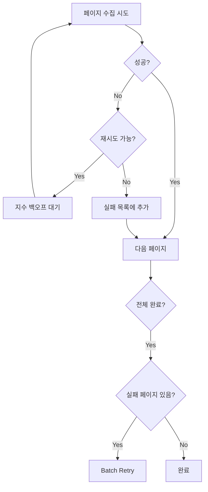
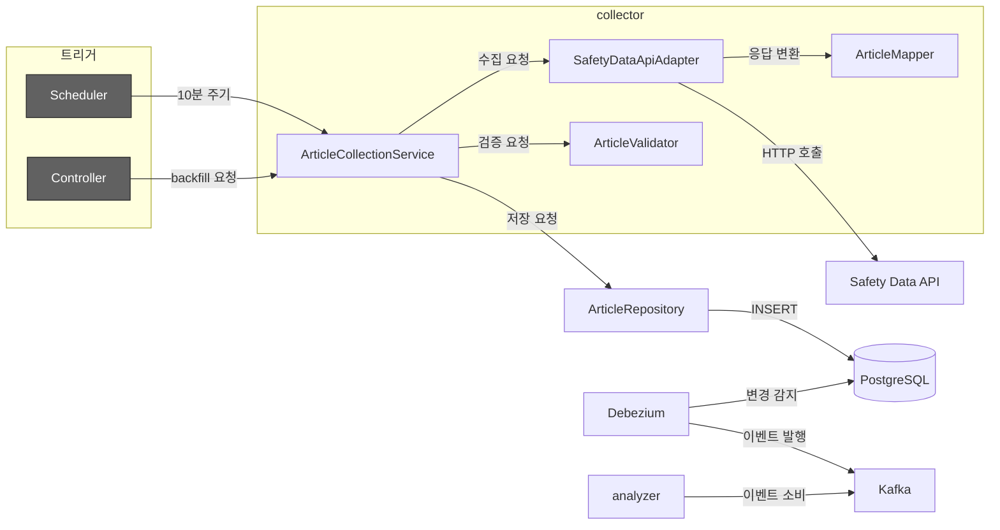

# Collector Service

연합뉴스 재난 API(Safety Data API)로부터 사건사고 기사를 수집하여 PostgreSQL에 저장하는 데이터 수집 파이프라인.

## 핵심 컨셉

### 결정적 ID 생성 (Deterministic ID)

동일한 API 응답은 항상 동일한 Article ID를 생성해야 한다. 이를 위해 `{YYYY-MM-DD}-{YNA_NO}` 형식의 결정적 ID를 사용한다.

```kotlin
// YonhapnewsArticleMapper
fun YonhapnewsArticle.toArticle(): Article {
    val dateStr = YNA_YMD.format(DateTimeFormatter.ISO_LOCAL_DATE)
    val articleId = "$dateStr-$YNA_NO"  // 결정적 ID
    ...
}
```

**이점**:
- UUID와 달리 동일 입력에 동일 ID 보장
- 중복 수집 시 자동으로 동일 ID 생성 → 중복 제거 로직의 일관성 확보
- 날짜 기반 partitioning 지원 가능

### 배치 중복 제거

수집된 기사 중 이미 DB에 존재하는 기사를 효율적으로 필터링해야 한다. 개별 쿼리 대신 단일 IN 절 쿼리로 배치 처리한다.

```kotlin
// ArticleCollectionServiceImpl
private suspend fun saveArticles(rawArticles: List<Article>) {
    val validArticles = rawArticles.mapNotNull { it.validate().getOrNull() }

    // 단일 쿼리로 존재하지 않는 ID만 필터링
    val nonExistingIds = articleRepository.filterNonExisting(
        validArticles.map { it.articleId }
    ).toSet()

    validArticles
        .filter { it.articleId in nonExistingIds }
        .takeIf { it.isNotEmpty() }
        ?.let { articleRepository.saveAll(it) }
}
```

**이점**:
- 1000개 기사 기준 1회 IN 절 쿼리로 처리
- 개별 존재 확인 대비 DB 부하 대폭 감소

### 지수 백오프 재시도

외부 API 호출 실패 시 즉시 재시도하면 서버 부하를 가중시킬 수 있다. 지수 백오프(Exponential Backoff) 전략으로 점진적으로 대기 시간을 늘린다.

**재시도 전략 (2단계)**:

1. **페이지별 Micro-Retry**: 각 페이지 수집 시 최대 3회 재시도 (2초 → 4초 → 8초)
2. **전체 Batch-Retry**: 모든 페이지 순회 후 실패한 페이지만 모아서 일괄 재시도



## 모듈 구조

```
collector/
├── src/main/kotlin/com/vonkernel/lit/collector/
│   ├── adapter/
│   │   ├── inbound/
│   │   │   └── http/                     # REST API (Backfill 엔드포인트)
│   │   └── outbound/
│   │       └── api/                      # Safety Data API 클라이언트
│   │           ├── SafetyDataApiAdapter.kt
│   │           └── model/                # API 응답 모델
│   └── domain/
│       ├── model/                        # ArticlePage 등 도메인 모델
│       ├── port/                         # NewsFetcher 포트
│       └── service/                      # ArticleCollectionService
└── src/test/kotlin/...
```

## 데이터 흐름



**수집 파이프라인 4단계**:
1. **API 호출**: Safety Data API에서 기사 목록 조회 (페이지네이션)
2. **정규화**: YonhapnewsArticle → Article 변환 (시간대 변환, ID 생성)
3. **검증 및 필터링**: 필수 필드 검증 + 중복 제거
4. **저장**: PostgreSQL INSERT → Debezium CDC → Kafka 발행

## 핵심 컴포넌트

### Port Interfaces

| 인터페이스 | 정의 위치 | 역할 |
|-----------|----------|------|
| `NewsFetcher` | collector | 외부 뉴스 API 호출 계약 |
| `ArticleRepository` | shared | Article 영속성 계약 |

### Domain Service

| 컴포넌트 | 역할 |
|---------|------|
| `ArticleCollectionService` | 수집 파이프라인 오케스트레이션. 페이지 순회, 재시도, 저장 조율 |
| `ArticleValidator` | Article 비즈니스 규칙 검증 (title, content, originId, sourceId 필수) |

### Adapter Layer

| 컴포넌트 | 역할 |
|---------|------|
| `SafetyDataApiAdapter` | Safety Data API HTTP 클라이언트 (WebClient + Coroutines) |
| `YonhapnewsArticleMapper` | API 응답 → Article 정규화. KST→UTC 변환, 결정적 ID 생성 |
| `CollectorScheduler` | 10분 주기 정기 수집 스케줄러 |
| `CollectorController` | Backfill REST API 엔드포인트 |

## 수집 시나리오

### 정기 수집 (Scheduled)

```kotlin
@Scheduled(fixedRate = 600000)  // 10분
fun collectTodayArticles() {
    val today = LocalDate.now(ZoneId.of("Asia/Seoul"))
    articleCollectionService.collectArticlesForDate(today, 1000)
}
```

- KST 기준 오늘 날짜 기사 수집
- 중복은 `filterNonExisting()`으로 자동 필터링
- 늦게 등록되는 기사도 반복 수집으로 보완

### Backfill (수동)

```http
POST /api/collector/backfill
Content-Type: application/json

{
  "startDate": "2026-01-10"
}
```

과거 특정 날짜의 데이터를 소급 수집할 때 사용.

## 환경 설정

### 필수 환경변수

| 변수 | 필수 | 기본값 | 설명 |
|------|:----:|--------|------|
| `SAFETY_DATA_API_KEY` | O | - | Safety Data API 인증 키 |
| `DB_URL` | - | `jdbc:postgresql://localhost:5432/lit_maindb` | PostgreSQL URL |
| `DB_USERNAME` | - | `postgres` | DB 사용자 |
| `DB_PASSWORD` | - | `postgres` | DB 비밀번호 |
| `SERVER_PORT` | - | `8081` | 서버 포트 |

### 설정 파일

```bash
cp .env.local.example .env.local
# SAFETY_DATA_API_KEY=실제-API-키 설정
```

## 빌드 및 실행

```bash
# 빌드
./gradlew collector:build

# 실행
./gradlew collector:bootRun

# 또는 환경변수 로드 후 실행
set -a && source collector/.env.local && set +a
./gradlew collector:bootRun
```

## 테스트

```bash
# 전체 테스트
./gradlew collector:test

# 단위 테스트만
./gradlew collector:test --tests '*Test'

# 통합 테스트만 (실제 API 호출)
./gradlew collector:test --tests '*IntegrationTest'
```

테스트 상세 내용은 [TEST.md](./TEST.md) 참조.

## 관련 문서

- [ARCHITECTURE.md](../ARCHITECTURE.md) - 시스템 아키텍처
- [TEST.md](./TEST.md) - 테스트 가이드
- [EXTERNAL_API.md](./EXTERNAL_API.md) - Safety Data API 스펙
