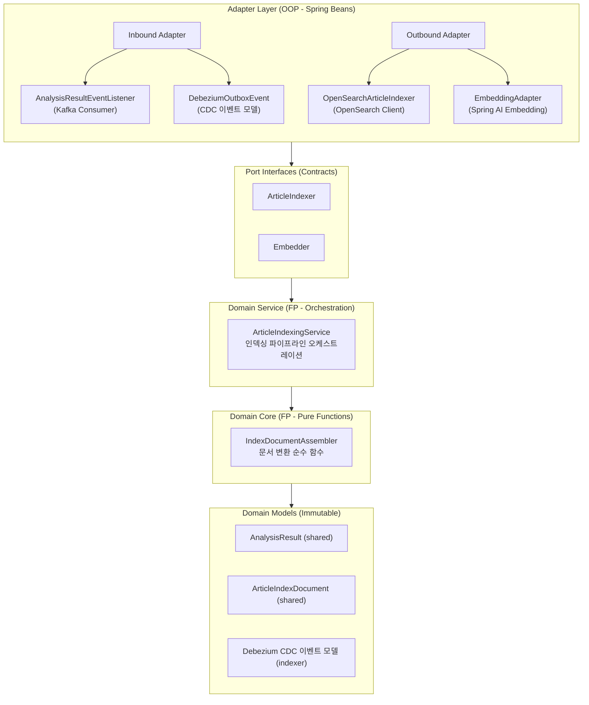

# Indexer Service - Architecture

Kafka를 통해 수신한 분석 결과 CDC 이벤트를 소비하여, `AnalysisResult`를 `ArticleIndexDocument`로 변환하고 OpenSearch에 색인하는 인덱싱 서비스입니다.

---

## 목차

- [역할 및 책임](#역할-및-책임)
- [데이터 흐름](#데이터-흐름)
- [인덱싱 파이프라인](#인덱싱-파이프라인)
- [아키텍처](#아키텍처)
- [주요 컴포넌트](#주요-컴포넌트)
- [데이터 모델 매핑](#데이터-모델-매핑)
- [OpenSearch 인덱스 설계](#opensearch-인덱스-설계)
- [Embedding 처리](#embedding-처리)
- [프로젝트 구조](#프로젝트-구조)
- [환경 설정](#환경-설정)
- [테스트](#테스트)
- [주요 설계 결정](#주요-설계-결정)
- [의존성](#의존성)

---

## 역할 및 책임

indexer는 analyzer가 생성한 분석 결과를 OpenSearch에 검색 최적화된 형태로 색인하는 세 번째 파이프라인 단계입니다.

### 핵심 책임
- Kafka CDC 이벤트를 통해 `analysis_result_outbox` 테이블의 신규 레코드 수신
- CDC 이벤트 페이로드에서 `AnalysisResult` 역직렬화
- `AnalysisResult`를 `ArticleIndexDocument`로 변환
- 정제된 본문(refined content)에 대해 OpenAI `text-embedding-3-small` 모델로 벡터 임베딩 생성
- OpenSearch에 `ArticleIndexDocument` 색인
- 멱등성 보장 (동일 articleId 재처리 시 기존 문서 갱신)

---

## 데이터 흐름


---

## 인덱싱 파이프라인

indexer의 인덱싱 파이프라인은 polling 배치 단위로 일괄 처리하는 3단계 구조로 동작합니다.

### 1단계: 이벤트 수신 및 역직렬화

Kafka 배치로 수신한 CDC 이벤트를 파싱하고, `analysis_result_outbox` 테이블의 `payload` 필드(JSONB)에서 `AnalysisResult`를 역직렬화합니다. 역직렬화 실패 레코드는 로깅 후 skip합니다.

| 단계 | 입력 | 출력 |
|------|------|------|
| AnalysisResultEventListener | `List<ConsumerRecord<String, String>>` (Debezium CDC 배치) | `List<AnalysisResult>` |

### 2단계: 배치 임베딩 생성 및 문서 조립

배치 내 모든 `AnalysisResult`의 content를 추출하여 한 번의 API 호출로 임베딩을 생성합니다. 이후 각 `AnalysisResult`와 대응 임베딩을 조합하여 `ArticleIndexDocument`를 조립합니다.


| 작업 | 입력 | 출력 | 설명 |
|------|------|------|------|
| Embedder.embedAll | `List<String>` (content 목록) | `List<ByteArray?>` | 배치 임베딩 생성, 실패 시 전체 null 리스트 반환 |
| IndexDocumentAssembler | `AnalysisResult` + `ByteArray?` | `ArticleIndexDocument` | 필드 매핑 및 데이터 변환 (순수 함수) |

### 3단계: OpenSearch bulk 색인

조립된 `List<ArticleIndexDocument>`를 OpenSearch bulk API로 일괄 색인합니다. `articleId`를 문서 ID로 사용하여 멱등성을 보장합니다.

| 단계 | 입력 | 출력 |
|------|------|------|
| ArticleIndexer.indexAll | `List<ArticleIndexDocument>` | OpenSearch bulk 색인 결과 |

---

## 아키텍처

indexer는 **Hexagonal Architecture (Ports & Adapters)** 패턴을 따르며, 프로젝트 전체의 **OOP + FP Hybrid** 전략을 사용합니다.

### 계층 구조



**계층별 책임**:
- **Adapter Layer**: Kafka CDC 이벤트 수신, OpenSearch 색인 실행, OpenAI Embedding API 호출
- **Port Interfaces**: 외부 의존성 계약 (검색 색인, 임베딩 생성)
- **Domain Service**: 인덱싱 파이프라인 오케스트레이션, 배치 처리 관리
- **Domain Core**: `AnalysisResult` → `ArticleIndexDocument` 변환 순수 함수
- **Domain Models**: 인덱싱 입출력 데이터 클래스 (불변, shared 모듈 참조)

---

## 주요 컴포넌트

### Port Interfaces

| 인터페이스 | 역할 | 시그니처 |
|-----------|------|----------|
| `ArticleIndexer` | OpenSearch 색인 계약. `articleId`를 문서 ID로 사용하여 upsert 수행 → 멱등성 보장 | `index(document)`, `delete(articleId)`, `indexAll(documents)` |
| `Embedder` | 텍스트 임베딩 생성 계약. indexer 내부에서는 `ByteArray`로 추상화하여 ai-core의 `EmbeddingExecutor`(`FloatArray`) 와 추상화 경계를 분리 | `embed(text): ByteArray`, `embedAll(texts): List<ByteArray?>` |

### Domain Service

| 컴포넌트 | 역할 |
|---------|------|
| `ArticleIndexingService` | 인덱싱 파이프라인 오케스트레이터. 단건 `index`와 배치 `indexAll`을 제공. `indexAll`은 배치 임베딩 → 문서 조립 → bulk 색인 파이프라인을 함수형 스타일로 수행. 임베딩 실패 시 `contentEmbedding = null`로 색인을 계속 진행하는 graceful degradation 전략 적용 |

### Domain Core

| 컴포넌트 | 역할 |
|---------|------|
| `IndexDocumentAssembler` | `AnalysisResult` → `ArticleIndexDocument` 변환 순수 함수. CDC 페이로드의 `AnalysisResult`에 `refinedArticle`, `incidentTypes`, `urgency`, `keywords`, `topic`, `locations` 등 모든 데이터가 포함되어 있으므로 별도 Article 원본 DB 조회 없이 변환 완결 |

### Adapter Layer

**Inbound**:

| 컴포넌트 | 역할 |
|---------|------|
| `AnalysisResultEventListener` | Kafka 배치 Consumer. 배치 내 레코드를 역직렬화/필터링하여 `List<AnalysisResult>`를 수집한 뒤 `articleIndexingService.indexAll()`로 일괄 처리. 역직렬화 실패 레코드는 로깅 후 skip |
| `DebeziumOutboxEvent` | CDC 이벤트 역직렬화 모델. Debezium이 JSONB 컬럼을 문자열로 전달하므로 **이중 역직렬화** 수행 (1차: Debezium Envelope → 2차: `payload` JSON 문자열 → `AnalysisResult`). `op=c`(create), `op=r`(read/snapshot) 이벤트만 처리 |

**Outbound**:

| 컴포넌트 | 구현 Port | 역할 |
|---------|-----------|------|
| `OpenSearchArticleIndexer` | `ArticleIndexer` | OpenSearch Java Client를 사용하여 문서 색인. 단건 `index`와 bulk API 기반 `indexAll` 제공. `articleId`를 문서 ID로 사용하여 동일 ID 재색인 시 기존 문서 갱신 (upsert) |
| `EmbeddingAdapter` | `Embedder` | ai-core의 `EmbeddingExecutor`에 위임하여 OpenAI `text-embedding-3-small` (128차원) 호출 후, 반환된 `FloatArray`를 `ByteArray`로 변환. 단건 `embed`와 배치 `embedAll` 제공. 배치 호출 실패 시 전체 null 리스트 반환 (graceful degradation) |

---

## 데이터 모델 매핑

### AnalysisResult → ArticleIndexDocument 변환 규칙

`IndexDocumentAssembler`에서 수행하는 순수 함수 매핑입니다. CDC 페이로드의 `AnalysisResult`에 `refinedArticle`, `incidentTypes`, `urgency`, `keywords`, `topic`, `locations` 등 모든 데이터가 포함되어 있으므로 별도의 Article 원본 조회 없이 변환이 완결됩니다.

```
ArticleIndexDocument(
    // 문서 식별자
    articleId        ← AnalysisResult.articleId
    sourceId         ← null  (AnalysisResult에 미포함, optional 필드)
    originId         ← null  (AnalysisResult에 미포함, optional 필드)

    // 검색 필드
    title            ← AnalysisResult.refinedArticle.title
    content          ← AnalysisResult.refinedArticle.content
    keywords         ← AnalysisResult.keywords.map { it.keyword }
    contentEmbedding ← Embedder.embed(refinedArticle.content)  // 외부 호출

    // 필터 및 집계
    incidentTypes    ← AnalysisResult.incidentTypes
    urgency          ← AnalysisResult.urgency
    incidentDate     ← AnalysisResult.refinedArticle.writtenAt (ZonedDateTime 변환)

    // 지리 정보
    geoPoints        ← AnalysisResult.locations
                         .mapNotNull { it.coordinate }
    addresses        ← AnalysisResult.locations
                         .map { it.address }
    jurisdictionCodes ← AnalysisResult.locations
                         .map { it.address.code }
                         .filter { it != "UNKNOWN" }
                         .toSet()

    // 시간 정보
    writtenAt        ← AnalysisResult.refinedArticle.writtenAt (ZonedDateTime 변환)
    modifiedAt       ← null  (AnalysisResult에 미포함, optional 필드)
)
```

### CDC 이벤트 페이로드 구조

`analysis_result_outbox` 테이블의 Debezium CDC 이벤트 실제 예시:

```json
{
  "before": null,
  "after": {
    "id": 38,
    "article_id": "2026-01-30-4903",
    "payload": "{\"topic\":{\"topic\":\"경북 청도군 경부선에서 발생한 열차사고로 ...\"},\"urgency\":{\"name\":\"심각\",\"level\":7},\"keywords\":[{\"keyword\":\"열차사고\",\"priority\":10},{\"keyword\":\"사망·사상자\",\"priority\":8},{\"keyword\":\"안전관리 미비\",\"priority\":7}],\"articleId\":\"2026-01-30-4903\",\"locations\":[{\"address\":{\"code\":\"4782000000\",\"depth1Name\":\"경북\",\"depth2Name\":\"청도군\",\"depth3Name\":null,\"regionType\":\"HADONG\",\"addressName\":\"경상북도 청도군\"},\"coordinate\":{\"lat\":35.6473848149498,\"lon\":128.734015262482}},{\"address\":{\"code\":\"4374033500\",\"depth1Name\":\"충북\",\"depth2Name\":\"영동군\",\"depth3Name\":\"추풍령면\",\"regionType\":\"HADONG\",\"addressName\":\"경부선\"},\"coordinate\":{\"lat\":36.2100381886782,\"lon\":127.996573094268}}],\"incidentTypes\":[{\"code\":\"TRAFFIC_ACCIDENT\",\"name\":\"교통사고\"},{\"code\":\"DEATH\",\"name\":\"사망\"}],\"refinedArticle\":{\"title\":\"경부선 열차사고(사상 7명) 첫 재판에서 책임 공방\",\"content\":\"30일 대구지법에서 ...\",\"summary\":\"열차사고(경부선, 경북 청도군)로 하청 근로자 2명 사망 ...\",\"writtenAt\":\"2026-01-30T03:21:55Z\"}}",
    "created_at": "2026-01-30T08:33:30.855654Z"
  },
  "source": {
    "version": "3.4.1.Final",
    "connector": "postgresql",
    "name": "lit",
    "ts_ms": 1769762010854,
    "snapshot": "false",
    "db": "lit_maindb",
    "schema": "public",
    "table": "analysis_result_outbox",
    "txId": 1475,
    "lsn": 53011520
  },
  "transaction": null,
  "op": "c",
  "ts_ms": 1769762011022,
  "ts_us": 1769762011022146,
  "ts_ns": 1769762011022146218
}
```

### CDC → AnalysisResult 변환 흐름

`after.payload` 필드가 `AnalysisResult`의 JSON 직렬화 형태입니다. Debezium이 JSONB 컬럼을 문자열로 전달하므로, **이중 역직렬화**가 필요합니다:

```
ConsumerRecord<String, String>  (Kafka 원본 메시지)
    ↓ (1차 역직렬화: outer JSON)
DebeziumOutboxEvent
    ├─ before: null
    ├─ after: OutboxPayload
    │    ├─ id: 38
    │    ├─ articleId: "2026-01-30-4903"
    │    ├─ payload: String (JSON 문자열)
    │    └─ createdAt: "2026-01-30T08:33:30.855654Z"
    ├─ op: "c"
    └─ source: DebeziumSource
    ↓ (2차 역직렬화: payload JSON 문자열 → 도메인 모델)
AnalysisResult (shared 모듈 데이터 클래스)
    ├─ articleId: "2026-01-30-4903"
    ├─ refinedArticle: RefinedArticle
    │    ├─ title: "경부선 열차사고(사상 7명) 첫 재판에서 책임 공방"
    │    ├─ content: "30일 대구지법에서 ..."
    │    ├─ summary: "열차사고(경부선, 경북 청도군)로 하청 근로자 2명 사망 ..."
    │    └─ writtenAt: Instant
    ├─ incidentTypes: Set<IncidentType>
    │    ├─ IncidentType(code="TRAFFIC_ACCIDENT", name="교통사고")
    │    └─ IncidentType(code="DEATH", name="사망")
    ├─ urgency: Urgency(name="심각", level=7)
    ├─ keywords: List<Keyword>
    │    ├─ Keyword(keyword="열차사고", priority=10)
    │    ├─ Keyword(keyword="사망·사상자", priority=8)
    │    └─ Keyword(keyword="안전관리 미비", priority=7)
    ├─ topic: Topic(topic="경북 청도군 경부선에서 발생한 열차사고로 ...")
    └─ locations: List<Location>
         ├─ Location(coordinate=Coordinate(35.647, 128.734), address=Address(code="4782000000", ...))
         └─ Location(coordinate=Coordinate(36.210, 127.996), address=Address(code="4374033500", ...))
```

### DebeziumOutboxEvent 역직렬화 모델

analyzer의 `DebeziumArticleEvent` 패턴을 참고하여 구현합니다:

```kotlin
@JsonIgnoreProperties(ignoreUnknown = true)
data class DebeziumOutboxEnvelope(
    val before: OutboxPayload?,
    val after: OutboxPayload?,
    val op: String,
    val source: DebeziumSource? = null
)

@JsonIgnoreProperties(ignoreUnknown = true)
data class OutboxPayload(
    val id: Long?,
    @param:JsonProperty("article_id")
    val articleId: String,
    val payload: String,          // AnalysisResult JSON 문자열 (2차 역직렬화 대상)
    @param:JsonProperty("created_at")
    val createdAt: String? = null
)

// OutboxPayload → AnalysisResult 변환 확장 함수
fun OutboxPayload.toAnalysisResult(objectMapper: ObjectMapper): AnalysisResult =
    objectMapper.readValue(payload, AnalysisResult::class.java)
```

**핵심 포인트**:
- `op` 필드가 `"c"` (create) 또는 `"r"` (read/snapshot)인 경우에만 처리
- `payload`는 JSON 문자열이므로 `ObjectMapper`로 2차 역직렬화 필요
- analyzer의 `DebeziumEnvelope` / `ArticlePayload` 패턴과 동일한 구조

---

## OpenSearch 인덱스 설계

### 인덱스 매핑

```json
{
  "mappings": {
    "properties": {
      "articleId":        { "type": "keyword" },
      "sourceId":         { "type": "keyword" },
      "originId":         { "type": "keyword" },

      "title":            { "type": "text", "analyzer": "nori" },
      "content":          { "type": "text", "analyzer": "nori" },
      "keywords":         { "type": "text", "analyzer": "nori", "fields": { "keyword": { "type": "keyword" } } },
      "contentEmbedding": { "type": "knn_vector", "dimension": 128, "method": { "name": "hnsw", "space_type": "cosinesimil", "engine": "lucene" } },

      "incidentTypes": {
        "type": "nested",
        "properties": {
          "code": { "type": "keyword" },
          "name": { "type": "keyword" }
        }
      },
      "urgency": {
        "type": "object",
        "properties": {
          "name":  { "type": "keyword" },
          "level": { "type": "integer" }
        }
      },
      "incidentDate":     { "type": "date" },

      "geoPoints": {
        "type": "nested",
        "properties": {
          "lat": { "type": "double" },
          "lon": { "type": "double" },
          "location": { "type": "geo_point" }
        }
      },
      "addresses": {
        "type": "nested",
        "properties": {
          "regionType":  { "type": "keyword" },
          "code":        { "type": "keyword" },
          "addressName": { "type": "text", "analyzer": "nori" },
          "depth1Name":  { "type": "keyword" },
          "depth2Name":  { "type": "keyword" },
          "depth3Name":  { "type": "keyword" }
        }
      },
      "jurisdictionCodes": { "type": "keyword" },

      "writtenAt":  { "type": "date" },
      "modifiedAt": { "type": "date" }
    }
  },
  "settings": {
    "index": {
      "number_of_shards": 1,
      "number_of_replicas": 0,
      "knn": true
    },
    "analysis": {
      "analyzer": {
        "nori": {
          "type": "custom",
          "tokenizer": "nori_tokenizer",
          "filter": ["lowercase", "nori_readingform"]
        }
      }
    }
  }
}
```

**설계 포인트**:
- `nori` 분석기: 한국어 형태소 분석 기반 전문 검색
- `knn_vector` (128차원): `text-embedding-3-small` 모델의 출력을 128차원으로 축소하여 의미 검색 지원
- `geo_point`: 좌표 기반 거리 검색 및 부스팅
- `nested` 타입: `incidentTypes`, `geoPoints`, `addresses`는 개별 객체 단위 쿼리를 위해 nested 처리
- `keyword` 필드: 법정동코드(`jurisdictionCodes`), 사건유형 코드 등 정확 일치 필터링

### 인덱스 초기화

애플리케이션 시작 시 인덱스가 존재하지 않으면 자동 생성합니다. 매핑 정의는 JSON 파일로 외부화하여 `resources/opensearch/` 디렉토리에서 관리합니다.

---

## Embedding 처리

### 모델 선택

| 항목 | 값 |
|------|------|
| 모델 | OpenAI `text-embedding-3-small` |
| 원본 차원 | 1536 |
| 축소 차원 | 128 (dimensions 파라미터 사용) |
| 인코딩 | `float` → `ByteArray` (128 floats × 4 bytes = 512 bytes, 또는 128차원 binary 인코딩) |

### ai-core 통합

Embedding API 호출은 `ai-core` 모듈의 Spring AI 2.0 인프라를 활용합니다.

**ai-core Port/Adapter**:

```kotlin
// ai-core: domain/port/EmbeddingExecutor.kt (Port)
interface EmbeddingExecutor {
    fun supports(provider: LlmProvider): Boolean
    suspend fun embed(text: String, model: EmbeddingModel, dimensions: Int): FloatArray
    suspend fun embedAll(texts: List<String>, model: EmbeddingModel, dimensions: Int): List<FloatArray>
}

// ai-core: adapter/executor/openai/OpenAiEmbeddingExecutor.kt (Adapter)
@Component
class OpenAiEmbeddingExecutor(
    private val embeddingModel: SpringAiEmbeddingModel
) : EmbeddingExecutor {
    // Spring AI EmbeddingRequest는 List<String>을 받으므로
    // embed: 단건 텍스트를 listOf(text)로 감싸서 호출
    // embedAll: texts 리스트를 그대로 전달하여 배치 처리
}
```

**indexer에서의 사용**:

```kotlin
// indexer: domain/port/Embedder.kt (Port)
interface Embedder {
    suspend fun embed(text: String): ByteArray
    suspend fun embedAll(texts: List<String>): List<ByteArray?>
}

// indexer: adapter/outbound/embedding/EmbeddingAdapter.kt (Adapter)
@Component
class EmbeddingAdapter(
    private val embeddingExecutors: List<EmbeddingExecutor>
) : Embedder {
    // embed: EmbeddingExecutor.embed → FloatArray → ByteArray 변환
    // embedAll: EmbeddingExecutor.embedAll → List<FloatArray> → List<ByteArray?> 변환
    //           전체 API 호출 실패 시 모두 null 리스트 반환 (graceful degradation)
}
```

### FloatArray → ByteArray 변환

OpenSearch `knn_vector` 필드에 저장하기 위해 `FloatArray`를 `ByteArray`로 변환합니다. 이 변환은 `EmbeddingAdapter`에서 `ByteBuffer` (BIG_ENDIAN)을 사용하여 순수 함수로 처리합니다.

---

## 프로젝트 구조

```
indexer/src/main/kotlin/com/vonkernel/lit/indexer/
├── IndexerApplication.kt
├── adapter/
│   ├── inbound/
│   │   └── consumer/
│   │       ├── AnalysisResultEventListener.kt          # Kafka 배치 Consumer
│   │       ├── config/
│   │       │   └── DebeziumObjectMapperConfig.kt       # CDC JSON 역직렬화 설정
│   │       └── model/
│   │           └── DebeziumOutboxEvent.kt              # CDC 이벤트 역직렬화 모델
│   └── outbound/
│       ├── embedding/
│       │   └── EmbeddingAdapter.kt                     # Embedder 구현체
│       └── opensearch/
│           ├── OpenSearchArticleIndexer.kt             # ArticleIndexer 구현체
│           └── config/
│               └── OpenSearchClientConfig.kt           # OpenSearch 클라이언트 설정
├── domain/
│   ├── assembler/
│   │   └── IndexDocumentAssembler.kt                   # 문서 변환 순수 함수
│   ├── port/
│   │   ├── ArticleIndexer.kt                           # OpenSearch 색인 계약
│   │   └── Embedder.kt                                 # 임베딩 생성 계약
│   ├── service/
│   │   └── ArticleIndexingService.kt                   # 인덱싱 오케스트레이션
│   └── exception/
│       └── ArticleIndexingException.kt                 # 인덱싱 예외

indexer/src/main/resources/
└── application.yml

indexer/src/test/kotlin/com/vonkernel/lit/indexer/
├── adapter/
│   ├── inbound/
│   │   └── consumer/
│   │       ├── AnalysisResultEventListenerTest.kt
│   │       └── model/
│   │           └── DebeziumOutboxEventTest.kt
│   └── outbound/
│       └── opensearch/
│           └── OpenSearchArticleIndexerTest.kt
└── domain/
    ├── assembler/
    │   └── IndexDocumentAssemblerTest.kt
    └── service/
        └── ArticleIndexingServiceTest.kt
```

---

## 환경 설정

### 1. 로컬 환경 파일 생성

```bash
cp .env.local.example .env.local
```

### 2. 필수 환경변수

```bash
# OpenAI API Key (임베딩 생성용)
SPRING_AI_OPENAI_API_KEY=sk-your-api-key-here

# Kafka 설정
KAFKA_BOOTSTRAP_SERVERS=localhost:9092
KAFKA_ANALYSIS_EVENTS_TOPIC=lit.public.analysis_result_outbox
KAFKA_CONSUMER_GROUP_ID=indexer-group

# OpenSearch 설정
OPENSEARCH_HOST=localhost
OPENSEARCH_PORT=9200
OPENSEARCH_INDEX_NAME=articles
```

### 3. 설정 확인

| 환경변수 | 기본값 | 필수 여부 | 용도 |
|----------|--------|-----------|------|
| `SPRING_AI_OPENAI_API_KEY` | (없음) | **예** | 임베딩 생성 (OpenAI text-embedding-3-small) |
| `KAFKA_BOOTSTRAP_SERVERS` | `localhost:9092` | 아니오 | Kafka 브로커 주소 |
| `KAFKA_ANALYSIS_EVENTS_TOPIC` | `lit.public.analysis_result_outbox` | 아니오 | 분석 결과 이벤트 토픽 |
| `KAFKA_CONSUMER_GROUP_ID` | `indexer-group` | 아니오 | Kafka Consumer 그룹 ID |
| `OPENSEARCH_HOST` | `localhost` | 아니오 | OpenSearch 호스트 |
| `OPENSEARCH_PORT` | `9200` | 아니오 | OpenSearch 포트 |
| `OPENSEARCH_INDEX_NAME` | `articles` | 아니오 | OpenSearch 인덱스명 |

### 4. 인프라 (docker-compose 추가)

로컬 개발 환경에서 OpenSearch를 실행하기 위해 `infrastructure/docker-compose.yml`에 다음 서비스를 추가합니다:

```yaml
opensearch:
  image: opensearchproject/opensearch:2.19.1
  container_name: lit-opensearch
  environment:
    discovery.type: single-node
    DISABLE_SECURITY_PLUGIN: "true"
    OPENSEARCH_INITIAL_ADMIN_PASSWORD: "${OPENSEARCH_ADMIN_PASSWORD}"
    OPENSEARCH_JAVA_OPTS: "-Xms512m -Xmx512m"
  ports:
    - "9200:9200"
    - "9600:9600"
  volumes:
    - lit_opensearch_data:/usr/share/opensearch/data
  healthcheck:
    test: ["CMD-SHELL", "curl -f http://localhost:9200/_cluster/health || exit 1"]
    interval: 10s
    timeout: 5s
    retries: 10
    start_period: 30s
  networks:
    - lit_network
  restart: unless-stopped

opensearch-dashboards:
  image: opensearchproject/opensearch-dashboards:2.19.1
  container_name: lit-opensearch-dashboards
  environment:
    OPENSEARCH_HOSTS: '["http://opensearch:9200"]'
    DISABLE_SECURITY_DASHBOARDS_PLUGIN: "true"
  ports:
    - "5601:5601"
  depends_on:
    opensearch:
      condition: service_healthy
  networks:
    - lit_network
  restart: unless-stopped
```

volumes에 `lit_opensearch_data` 추가 필요.

---

## 테스트

### 테스트 구조

```
indexer/src/test/kotlin/com/vonkernel/lit/indexer/
├── adapter/
│   ├── inbound/
│   │   └── consumer/
│   │       ├── AnalysisResultEventListenerTest.kt          # Kafka 배치 처리 단위 테스트
│   │       └── model/
│   │           └── DebeziumOutboxEventTest.kt              # CDC 이벤트 역직렬화 테스트
│   └── outbound/
│       └── opensearch/
│           └── OpenSearchArticleIndexerTest.kt             # OpenSearch 색인 단위 테스트
└── domain/
    ├── assembler/
    │   └── IndexDocumentAssemblerTest.kt                   # 문서 변환 순수 함수 테스트
    └── service/
        └── ArticleIndexingServiceTest.kt                   # 파이프라인 오케스트레이션 테스트
```

### 테스트 종류

#### 단위 테스트

외부 의존성을 MockK로 모킹하여 비즈니스 로직만 검증합니다.

- `IndexDocumentAssemblerTest`: `AnalysisResult` → `ArticleIndexDocument` 변환 검증
  - 필드 매핑 정확성 (refinedArticle.title → title, locations → geoPoints 등)
  - optional 필드 null 처리 (sourceId, originId, modifiedAt)
  - 빈 locations 처리 (geoPoints, addresses, jurisdictionCodes가 빈 리스트)
  - `UNKNOWN` 코드 필터링 (jurisdictionCodes에서 제외)
  - 시간 변환 정확성 (Instant → ZonedDateTime)
- `ArticleIndexingServiceTest`: 파이프라인 오케스트레이션, 멱등성, 에러 처리
  - 단건 정상 흐름: 임베딩 생성 → 문서 조립 → 색인
  - 단건 임베딩 실패 시 graceful degradation (embedding null로 색인)
  - 배치 정상 흐름: `indexAll`로 배치 임베딩 → 문서 조립 → bulk 색인
  - 배치 임베딩 실패 시 전체 null embedding으로 색인 계속 진행
  - 배치 색인 실패 시 예외 전파
  - 빈 리스트 입력 시 아무 작업 안 함
- `AnalysisResultEventListenerTest`: Kafka 이벤트 배치 처리, CDC 이벤트 필터링
  - CREATE 이벤트(`op=c`, `op=r`) 배치 수집 후 `indexAll` 호출
  - non-create 이벤트 필터링 (indexAll 호출 안 함)
  - 역직렬화 실패 레코드 skip 후 유효 레코드만 배치 처리
  - 배치 인덱싱 실패 시 예외 전파 없이 로깅
- `DebeziumOutboxEventTest`: CDC 이벤트 역직렬화 정확성
  - Debezium Envelope 파싱
  - `payload` 필드 이중 역직렬화 (JSON 문자열 → AnalysisResult)
- `OpenSearchArticleIndexerTest`: OpenSearch 색인 단위 테스트
  - 단건 `index` 호출 검증 (IndexRequest 파라미터)
  - 단건 `delete` 호출 검증
  - `indexAll` bulk API 호출 검증
  - 빈 리스트 입력 시 bulk 호출 안 함

#### 통합 테스트

실제 외부 API/서비스를 호출하여 end-to-end 동작을 검증합니다.

- `@Tag("integration")` 태그로 구분
- OpenSearch 통합 테스트: Testcontainers 또는 로컬 OpenSearch 인스턴스 사용
- Embedding 통합 테스트: OpenAI API Key 필요

### 테스트 실행

```bash
# 전체 단위 테스트
./gradlew indexer:test

# 통합 테스트 포함
./gradlew indexer:integrationTest

# 특정 테스트 클래스
./gradlew indexer:test --tests IndexDocumentAssemblerTest
```

---

## 주요 설계 결정

### 1. Article 원본 조회 불필요

**방식**: CDC 페이로드의 `AnalysisResult`만으로 `ArticleIndexDocument` 변환을 완결

**이유**:
- `analysis_result_outbox.payload`에 `AnalysisResult` 전체가 JSON으로 포함됨
- `AnalysisResult.refinedArticle`에 정제된 `title`, `content`, `summary`, `writtenAt`이 모두 존재
- `incidentTypes`, `urgency`, `keywords`, `topic`, `locations`도 모두 `AnalysisResult` 내 포함
- `ArticleIndexDocument`의 `sourceId`, `originId`, `modifiedAt`는 optional 필드(`String?`, `ZonedDateTime?`)이므로 null 허용
- DB 조회 없이 CDC 이벤트만으로 동작하여 서비스 간 결합도 최소화

### 2. 임베딩 실패 시 Graceful Degradation

**방식**: 임베딩 생성 실패 시 `contentEmbedding = null`로 색인 진행

**이유**:
- 임베딩은 의미 검색(semantic search)을 위한 부가 기능
- 전문 검색(full-text search)은 `title`, `content`, `keywords` 필드로 충분히 동작
- OpenAI API 장애 시 전체 인덱싱 파이프라인이 중단되는 것을 방지
- 추후 임베딩 누락 문서에 대한 배치 재처리로 보완 가능

### 3. ai-core를 통한 Embedding 호출

**방식**: `ai-core` 모듈에 `EmbeddingExecutor` Port/Adapter를 추가하여 Spring AI 2.0 기반으로 호출

**이유**:
- 프로젝트 전체의 AI API 호출을 `ai-core`로 일원화
- OpenAI API Key 관리, 에러 핸들링, 재시도 로직을 `ai-core`에서 공통으로 처리
- Provider 변경 시 (OpenAI → 다른 임베딩 모델) ai-core Adapter만 수정
- Spring AI 2.0의 `EmbeddingModel` 인터페이스를 통해 Provider 독립적 추상화

### 4. 멱등성 보장

**방식**: `articleId`를 OpenSearch 문서 ID로 사용하여 upsert (index) 수행

**메커니즘**:
- 동일 `articleId`로 재색인 시 기존 문서가 자동으로 갱신됨
- Kafka at-least-once 전달 + OpenSearch upsert = 멱등한 인덱싱
- analyzer에서 기사 재분석 시에도 동일 메커니즘으로 인덱스 갱신

### 5. 배치 처리 전략

**방식**: Kafka polling 배치 단위로 임베딩 API 호출과 OpenSearch 색인을 일괄 처리

**메커니즘**:
- `AnalysisResultEventListener`가 배치 내 레코드를 역직렬화/필터링하여 `List<AnalysisResult>` 수집
- `ArticleIndexingService.indexAll`이 배치 임베딩(`embedAll`) → 문서 조립(`zip` + `assemble`) → bulk 색인(`indexAll`) 파이프라인 실행
- `EmbeddingAdapter.embedAll`: 한 번의 OpenAI API 호출로 배치 내 모든 텍스트 임베딩 생성
- `OpenSearchArticleIndexer.indexAll`: OpenSearch bulk API로 배치 내 모든 문서 일괄 색인
- 배치 임베딩 실패 시 전체 null 리스트로 대체하여 색인 계속 진행 (graceful degradation)

**이유**:
- 단건 API 호출 대비 네트워크 오버헤드 감소
- OpenSearch bulk API는 단건 index 대비 처리량이 높음
- OpenAI Embedding API는 List<String>을 기본 지원하여 배치 호출 자연스러움

### 6. 에러 핸들링 전략

- **역직렬화 실패 격리**: 배치 내 개별 레코드의 파싱 실패는 로깅 후 skip, 유효 레코드만 배치 처리
- **배치 인덱싱 실패**: `runCatching`으로 감싸 예외 전파 없이 로깅
- **임베딩 실패 허용**: 배치 임베딩 전체 실패 시 null로 대체하여 색인 계속 진행
- **`ArticleIndexingException`**: 단건 인덱싱 실패 시 `articleId`를 포함한 구조화된 예외 로깅

### 7. OpenSearch 인덱스 매핑 외부화

**방식**: 인덱스 매핑을 `resources/opensearch/article-index-mapping.json`에 JSON 파일로 관리

**이유**:
- 매핑 변경 시 코드 수정 없이 JSON 파일만 수정
- 매핑 히스토리를 Git으로 추적 가능
- OpenSearch Dashboard 또는 API를 통한 수동 매핑 적용과 동일 형식

---

## 의존성

### 모듈 의존성

| 모듈 | 제공 |
|------|------|
| `shared` | 도메인 모델 (`AnalysisResult`, `ArticleIndexDocument`, `Location`, `Address`, `IncidentType` 등) |
| `ai-core` | `EmbeddingExecutor` (OpenAI Embedding API 실행), Spring AI OpenAI 통합 |

### 외부 API

| API | 용도 | 인증 |
|-----|------|------|
| OpenAI Embedding API | 텍스트 벡터 임베딩 생성 (`text-embedding-3-small`, 128차원) | `SPRING_AI_OPENAI_API_KEY` 환경변수 |

### 주요 라이브러리

| 라이브러리 | 용도 |
|----------|------|
| Spring Boot 4.0 | 프레임워크 |
| Spring Boot Starter Kafka | Kafka Consumer (배치 리스너, auto-configuration) |
| OpenSearch Java Client 3.4 | OpenSearch 색인 및 인덱스 관리 |
| Spring AI 2.0 (OpenAI) | OpenAI Embedding API 호출 (ai-core 모듈 통해) |
| Kotlin Coroutines | 비동기 처리 |
| Jackson | JSON 역직렬화 (CDC 이벤트, AnalysisResult 페이로드) |
| MockK | 테스트 모킹 |

---

**Tech Stack**: Kotlin 2.21 | Spring Boot 4.0 | Coroutines | Spring Boot Starter Kafka | OpenSearch 3.3 | Spring AI 2.0 | OpenAI text-embedding-3-small
