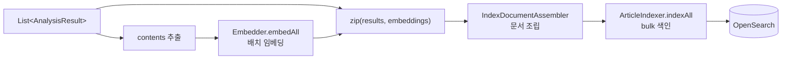
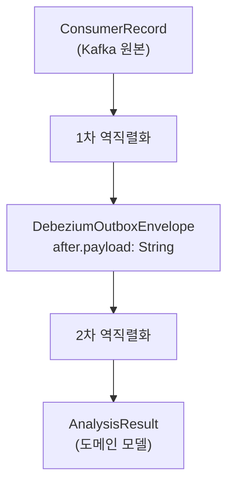
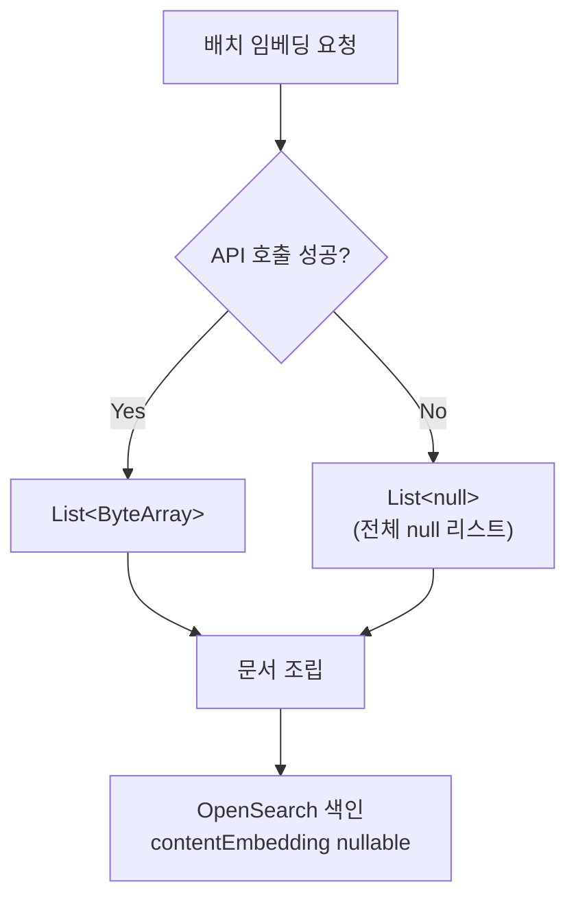
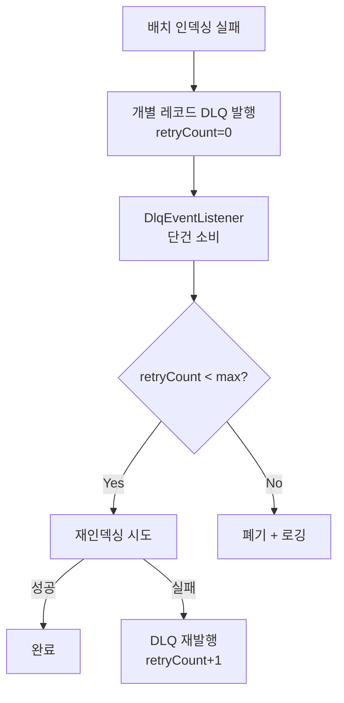
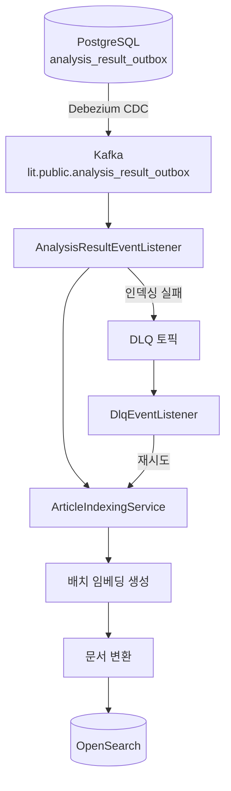

# Indexer Service

Kafka를 통해 수신한 분석 결과 CDC 이벤트를 소비하여, `AnalysisResult`를 `ArticleIndexDocument`로 변환하고 OpenSearch에 색인하는 서비스.

## 핵심 컨셉

### 배치 인덱싱 파이프라인

Kafka polling 배치 단위로 임베딩 생성과 OpenSearch 색인을 일괄 처리하여 API 호출 오버헤드를 최소화한다.



```kotlin
// ArticleIndexingService
suspend fun indexAll(results: List<AnalysisResult>) {
    if (results.isEmpty()) return

    // 1. 배치 임베딩 생성 (한 번의 API 호출)
    val contents = results.map { it.refinedArticle.content }
    val embeddings = embedder.embedAll(contents)

    // 2. 결과와 임베딩을 zip하여 문서 조립
    val documents = results.zip(embeddings) { result, embedding ->
        IndexDocumentAssembler.assemble(result, embedding)
    }

    // 3. OpenSearch bulk API로 일괄 색인
    articleIndexer.indexAll(documents)
}
```

**이점**:
- 단건 API 호출 대비 네트워크 오버헤드 감소
- OpenSearch bulk API가 단건 index 대비 처리량 높음
- OpenAI Embedding API가 List<String> 기본 지원

### 이중 역직렬화

Debezium이 JSONB 컬럼을 문자열로 전달하므로, CDC Envelope 파싱 후 `payload` 필드를 2차 역직렬화한다.



```kotlin
// DebeziumOutboxEvent
@JsonIgnoreProperties(ignoreUnknown = true)
data class DebeziumOutboxEnvelope(
    val before: OutboxPayload?,
    val after: OutboxPayload?,
    val op: String  // "c" (create) 또는 "r" (read/snapshot)
)

@JsonIgnoreProperties(ignoreUnknown = true)
data class OutboxPayload(
    @param:JsonProperty("article_id")
    val articleId: String,
    val payload: String  // AnalysisResult JSON 문자열 (2차 역직렬화 대상)
)

// 확장 함수로 변환
fun OutboxPayload.toAnalysisResult(objectMapper: ObjectMapper): AnalysisResult =
    objectMapper.readValue(payload, AnalysisResult::class.java)
```

**이점**:
- Debezium의 JSONB 직렬화 방식에 안전하게 대응
- CDC 페이로드에 모든 분석 데이터 포함 → 별도 DB 조회 불필요
- `op` 필드로 CREATE 이벤트만 선택적 처리

### 임베딩 Graceful Degradation

임베딩 생성 실패 시 `contentEmbedding = null`로 색인을 계속 진행하여 전체 파이프라인 중단을 방지한다.



```kotlin
// EmbeddingAdapter
override suspend fun embedAll(texts: List<String>): List<ByteArray?> {
    return try {
        embeddingExecutor.embedAll(texts, model, dimensions)
            .map { it.toByteArray() }
    } catch (e: Exception) {
        log.warn("Batch embedding failed, returning nulls", e)
        List(texts.size) { null }  // graceful degradation
    }
}

// IndexDocumentAssembler - contentEmbedding은 nullable
fun assemble(result: AnalysisResult, embedding: ByteArray?): ArticleIndexDocument =
    ArticleIndexDocument(
        // ...
        contentEmbedding = embedding  // null 허용
    )
```

**이점**:
- 임베딩은 의미 검색(semantic search)을 위한 부가 기능
- 전문 검색(full-text search)은 title, content, keywords 필드로 동작
- OpenAI API 장애 시 전체 인덱싱 파이프라인 중단 방지

### DLQ 전략

인덱싱 실패 시 Dead Letter Queue로 발행하여 재처리하고, 최대 재시도 초과 시 폐기한다.



```kotlin
// DlqEventListener
@KafkaListener(topics = ["\${kafka.dlq.topic}"])
suspend fun onDlqEvent(record: ConsumerRecord<String, ByteArray>) {
    val retryCount = record.headers().lastHeader("dlq-retry-count")?.toInt() ?: 0

    if (retryCount >= maxRetries) {
        log.warn("Max retries exceeded, discarding: ${record.key()}")
        return
    }

    try {
        val result = parseAnalysisResult(record)
        articleIndexingService.index(result)
    } catch (e: Exception) {
        dlqPublisher.publish(record, retryCount + 1)
    }
}
```

**이점**:
- 일시적 장애(OpenSearch 연결 오류 등)로 인한 실패 자동 재처리
- OpenSearch upsert로 멱등성 보장 (동일 articleId 재색인 시 갱신)
- 최대 재시도 초과 시 명시적 폐기로 무한 루프 방지

## 모듈 구조

```
indexer/
├── src/main/kotlin/com/vonkernel/lit/indexer/
│   ├── adapter/
│   │   ├── inbound/consumer/
│   │   │   ├── AnalysisResultEventListener.kt  # Kafka 배치 Consumer
│   │   │   ├── DlqEventListener.kt             # DLQ 단건 Consumer
│   │   │   └── model/DebeziumOutboxEvent.kt    # CDC 이벤트 모델
│   │   └── outbound/
│   │       ├── dlq/KafkaDlqPublisher.kt        # DLQ Publisher
│   │       ├── embedding/EmbeddingAdapter.kt   # Embedder 구현체
│   │       └── opensearch/
│   │           └── OpenSearchArticleIndexer.kt # ArticleIndexer 구현체
│   └── domain/
│       ├── assembler/IndexDocumentAssembler.kt # 문서 변환 순수 함수
│       ├── port/
│       │   ├── ArticleIndexer.kt               # OpenSearch 색인 포트
│       │   ├── Embedder.kt                     # 임베딩 생성 포트
│       │   └── DlqPublisher.kt                 # DLQ 발행 포트
│       └── service/ArticleIndexingService.kt   # 파이프라인 오케스트레이션
└── src/test/kotlin/...
```

## 데이터 흐름



**인덱싱 파이프라인 단계**:
1. **이벤트 수신**: Kafka에서 분석 결과 CDC 이벤트 배치 소비
2. **역직렬화**: Debezium Envelope → OutboxPayload → AnalysisResult (이중 역직렬화)
3. **임베딩 생성**: 배치 내 모든 content에 대해 한 번의 API 호출로 임베딩 생성
4. **문서 변환**: AnalysisResult + embedding → ArticleIndexDocument
5. **색인**: OpenSearch bulk API로 일괄 색인

## 핵심 컴포넌트

### Port Interfaces

| 인터페이스 | 역할 |
|-----------|------|
| `ArticleIndexer` | OpenSearch 색인 계약. articleId를 문서 ID로 upsert 수행 |
| `Embedder` | 텍스트 임베딩 계약. ai-core의 EmbeddingExecutor 위임 후 ByteArray 변환 |
| `DlqPublisher` | DLQ 발행 계약. 인덱싱 실패 시 원본 메시지 발행 |

### Domain Service

| 컴포넌트 | 역할 |
|---------|------|
| `ArticleIndexingService` | 인덱싱 파이프라인 오케스트레이션. 배치 임베딩 → 문서 조립 → bulk 색인 |
| `IndexDocumentAssembler` | AnalysisResult → ArticleIndexDocument 변환 순수 함수 |

### Adapter Layer

| 컴포넌트 | 역할 |
|---------|------|
| `AnalysisResultEventListener` | Kafka 배치 Consumer. CDC 이벤트 역직렬화 → indexAll 호출 |
| `DlqEventListener` | DLQ 단건 Consumer. 재시도 로직 처리 |
| `OpenSearchArticleIndexer` | OpenSearch Java Client 기반 색인 구현체 |
| `EmbeddingAdapter` | ai-core EmbeddingExecutor 위임. FloatArray → ByteArray 변환 |
| `KafkaDlqPublisher` | DLQ Kafka 발행 구현체 |

## 환경 설정

### 필수 환경변수

| 변수 | 필수 | 기본값 | 설명 |
|------|:----:|--------|------|
| `SPRING_AI_OPENAI_API_KEY` | O | - | OpenAI Embedding API 인증 키 |
| `KAFKA_BOOTSTRAP_SERVERS` | - | `localhost:9092` | Kafka 브로커 |
| `OPENSEARCH_HOST` | - | `localhost` | OpenSearch 호스트 |
| `OPENSEARCH_PORT` | - | `9200` | OpenSearch 포트 |
| `OPENSEARCH_INDEX_NAME` | - | `articles` | 인덱스명 |
| `DLQ_MAX_RETRIES` | - | `3` | 최대 재시도 횟수 |

### 설정 파일

```bash
cp .env.local.example .env.local
# SPRING_AI_OPENAI_API_KEY=sk-... 설정
```

## 빌드 및 실행

```bash
# 사전 요구사항: Kafka, OpenSearch 실행
cd infrastructure && docker-compose up -d

# 빌드
./gradlew indexer:build

# 실행
./gradlew indexer:bootRun

# 또는 환경변수 로드 후 실행
set -a && source indexer/.env.local && set +a
./gradlew indexer:bootRun
```

## 테스트

```bash
# 전체 단위 테스트
./gradlew indexer:test

# 통합 테스트 (실제 OpenSearch/OpenAI 호출)
./gradlew indexer:integrationTest

# 특정 테스트 클래스
./gradlew indexer:test --tests IndexDocumentAssemblerTest
```

테스트 상세 내용은 [TEST.md](./TEST.md) 참조.

## 관련 문서

- [ARCHITECTURE.md](../ARCHITECTURE.md) - 시스템 아키텍처
- [TEST.md](./TEST.md) - 테스트 가이드
