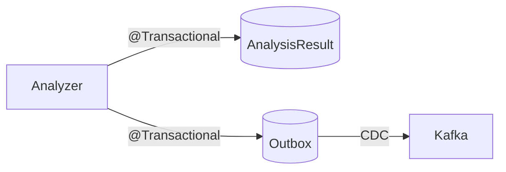

# Persistence Module

`shared` 모듈에 정의된 Repository 포트의 JPA 구현체를 제공하는 영속성 계층 모듈.

## 핵심 컨셉

### 도메인-엔티티 분리

`shared` 모듈의 불변 도메인 모델과 JPA의 mutable 엔티티를 분리한다. Mapper 객체가 양방향 변환을 담당하며, 도메인 로직이 JPA에 의존하지 않도록 보장한다.

```
shared (도메인 모델)              persistence (JPA 엔티티)
┌──────────────────┐            ┌──────────────────┐
│ Article          │  ←Mapper→  │ ArticleEntity    │
│ (data class)     │            │ (@Entity)        │
└──────────────────┘            └──────────────────┘
```

- **도메인 모델**: 불변, 비즈니스 의미 중심, Instant 타입
- **JPA 엔티티**: mutable, 영속성 관심사, ZonedDateTime 타입

### Outbox 패턴

Analyzer가 분석 결과를 저장할 때, `AnalysisResultEntity`와 `AnalysisResultOutboxEntity`를 동일 트랜잭션에서 저장한다. Debezium CDC가 outbox 테이블 변경을 감지하여 Kafka에 이벤트를 발행한다.



이 패턴으로 **At-least-once delivery**를 보장하며, 분석 결과 저장과 이벤트 발행의 원자성을 확보한다.

### 연관관계 편의 메서드

JPA의 양방향 관계에서 발생하는 일관성 문제를 해결하기 위해, 엔티티에 연관관계 편의 메서드(`setup*()`)를 정의한다. 이 메서드가 부모-자식 관계를 일괄 설정하여 관계 누락을 방지한다.

## 모듈 구조

```
persistence/
├── src/main/kotlin/com/vonkernel/lit/persistence/
│   ├── adapter/                 # 포트 구현 (Hexagonal Adapter)
│   └── jpa/
│       ├── config/              # JPA 설정
│       ├── entity/              # JPA 엔티티
│       │   ├── article/         # 기사 및 마스터 데이터
│       │   ├── analysis/        # 분석 결과 관련
│       │   └── outbox/          # CDC용 아웃박스
│       ├── mapper/              # 도메인 ↔ 엔티티 매퍼
│       └── Jpa*Repository.kt    # Spring Data JPA 인터페이스
├── src/main/resources/db/migration/  # Flyway 마이그레이션
└── src/test/kotlin/
```

## 데이터베이스 스키마

### 핵심 테이블

| 테이블 | 역할 | 주요 관계 |
|--------|------|----------|
| `article` | 원본 기사 | 독립 |
| `analysis_result` | 분석 결과 중심 | → article (FK) |
| `analysis_result_outbox` | CDC 이벤트 발행용 | → article (FK) |

### 분석 결과 매핑 테이블

| 테이블 | 관계 | 설명 |
|--------|------|------|
| `urgency_mapping` | 1:1 | 분석 결과 ↔ 긴급도 |
| `incident_type_mapping` | M:N | 분석 결과 ↔ 사건 유형 |
| `address_mapping` | M:N | 분석 결과 ↔ 주소 |
| `article_keywords` | 1:N | 분석 결과 → 키워드 |
| `refined_article` | 1:1 | 분석 결과 → 정제된 기사 |
| `topic_analysis` | 1:1 | 분석 결과 → 주제 |

### 마스터 데이터 테이블

| 테이블 | 용도 | 초기 데이터 |
|--------|------|------------|
| `urgency_type` | 긴급도 정의 | 5개 (정보, 주의, 경계, 심각, 긴급) |
| `incident_type` | 사건 유형 정의 | 35개+ (산불, 태풍, 지진 등) |
| `address` | 주소 캐시 (재사용) | 동적 생성 |

## 핵심 컴포넌트

### Adapter (포트 구현)

| Adapter | 포트 | 역할 |
|---------|------|------|
| `ArticleRepositoryAdapter` | `ArticleRepository` | 기사 CRUD, 중복 필터링 |
| `AnalysisResultRepositoryAdapter` | `AnalysisResultRepository` | 분석 결과 저장 + Outbox |
| `IncidentTypeRepositoryAdapter` | `IncidentTypeRepository` | 사건 유형 마스터 조회 |
| `UrgencyRepositoryAdapter` | `UrgencyRepository` | 긴급도 마스터 조회 |
| `AddressCacheRepositoryAdapter` | `AddressCacheRepository` | 주소 캐시 조회 |

### Mapper (도메인 ↔ 엔티티)

| Mapper | 변환 대상 | 특이사항 |
|--------|----------|---------|
| `ArticleMapper` | Article ↔ ArticleEntity | Instant ↔ ZonedDateTime |
| `AnalysisResultMapper` | AnalysisResult ↔ AnalysisResultEntity | 복합 관계 조립 |
| `LocationMapper` | Location ↔ AddressEntity | RegionType enum 매핑 |
| `AnalysisResultOutboxMapper` | AnalysisResult → OutboxEntity | JSON 직렬화 |

## Flyway 마이그레이션

| 버전 | 파일 | 내용 |
|------|------|------|
| V1 | `create_article.sql` | article 테이블 |
| V2 | `create_analysis.sql` | 분석 결과 및 매핑 테이블 |
| V3 | `create_outbox.sql` | CDC용 outbox 테이블 |
| V4 | `insert_master_data.sql` | 긴급도, 사건 유형 초기 데이터 |
| V5 | `create_refined_article_and_topic.sql` | 정제된 기사, 주제 테이블 |
| V6 | `add_article_updated_at.sql` | 기사 업데이트 추적 필드 |

## 빌드 및 실행

```bash
# 빌드
./gradlew persistence:build

# 마이그레이션 실행 (Spring Boot 앱 시작 시 자동)
./gradlew analyzer:bootRun  # 또는 다른 서비스
```

이 모듈은 독립 실행이 불가능하며, 다른 서비스 모듈(collector, analyzer 등)의 의존성으로 사용된다.

## 테스트

```bash
# 단위 테스트 (Mapper)
./gradlew persistence:test

# 통합 테스트 (Adapter + DB)
./gradlew persistence:test --tests "*AdapterTest"
```

테스트 상세 내용은 [TEST.md](./TEST.md) 참조.

## 관련 문서

- [ARCHITECTURE.md](../ARCHITECTURE.md) - 시스템 아키텍처
- [TEST.md](./TEST.md) - 테스트 가이드
