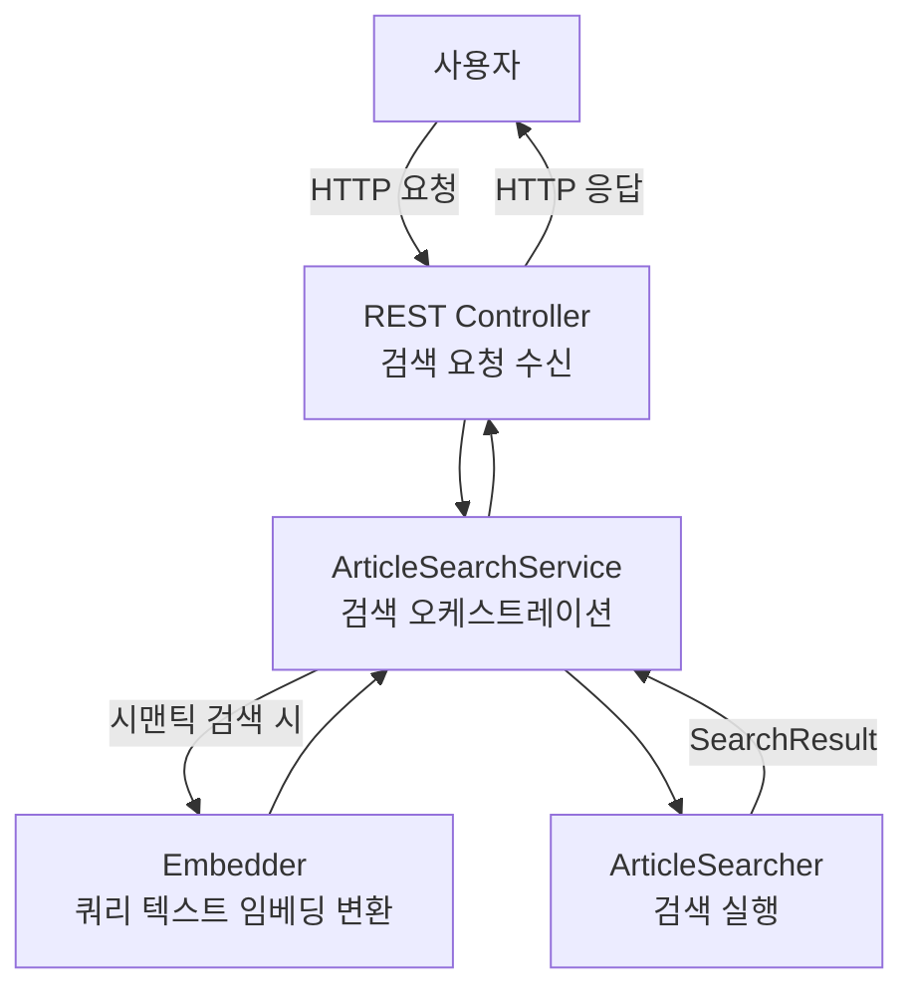
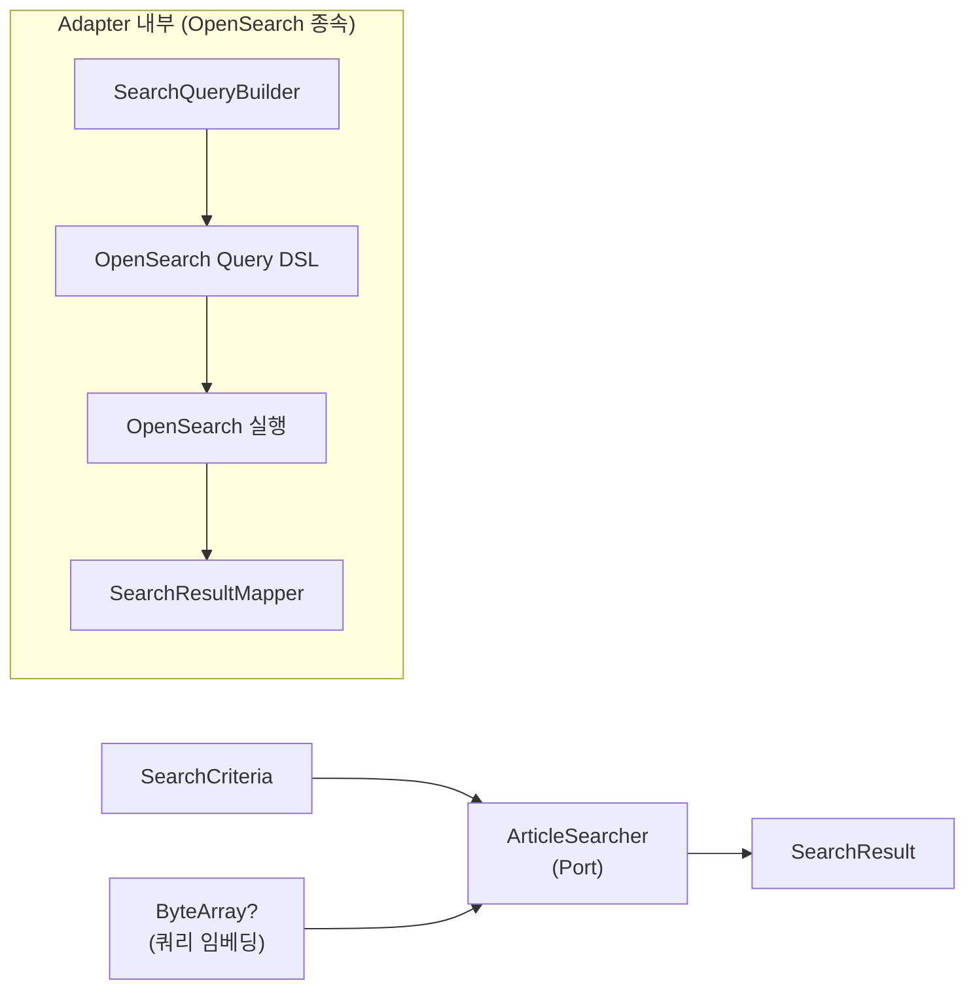
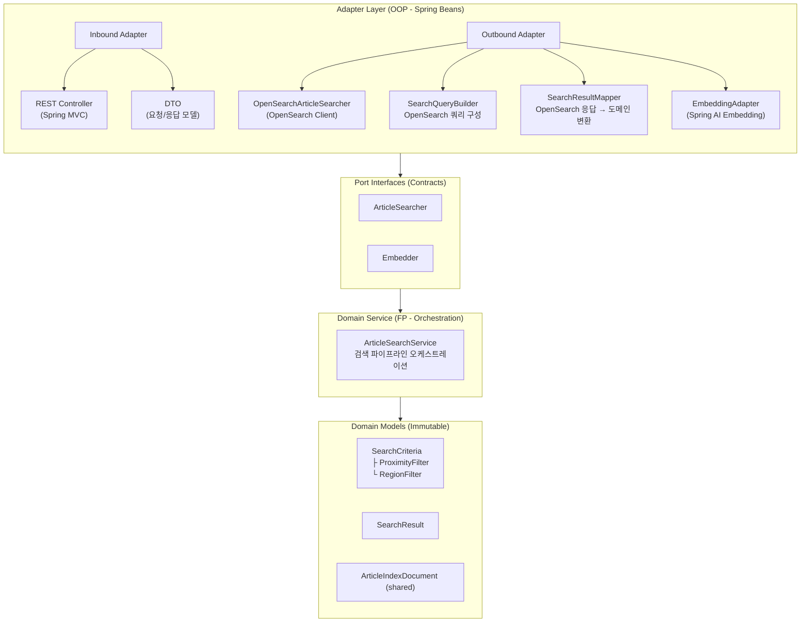

# Searcher Service - Architecture

사용자의 사건사고 검색 요청을 처리하는 REST API 서비스입니다. OpenSearch에 색인된 `ArticleIndexDocument`를 대상으로 전문 검색, 지리 검색, 카테고리 필터링, 시맨틱 검색 등 다층적 검색 기능을 제공합니다.

---

## 목차

- [역할 및 책임](#역할-및-책임)
- [데이터 흐름](#데이터-흐름)
- [검색 파이프라인](#검색-파이프라인)
- [아키텍처](#아키텍처)
- [주요 컴포넌트](#주요-컴포넌트)
- [검색 기능 설계](#검색-기능-설계)
- [OpenSearch 쿼리 전략](#opensearch-쿼리-전략)
- [프로젝트 구조](#프로젝트-구조)
- [환경 설정](#환경-설정)
- [테스트](#테스트)
- [주요 설계 결정](#주요-설계-결정)
- [의존성](#의존성)

---

## 역할 및 책임

searcher는 사용자 대면 검색 서비스로, OpenSearch에 색인된 사건사고 데이터를 검색하고 결과를 반환하는 읽기 전용 서비스입니다.

### 핵심 책임
- REST API를 통해 사용자의 검색 요청 수신
- 검색 조건(텍스트, 위치, 카테고리, 날짜, 시맨틱)을 OpenSearch 쿼리로 변환
- OpenSearch에서 검색 실행 및 결과 매핑
- 3가지 정렬 기준 제공 (관련성, 날짜, 거리)
- 시맨틱 검색을 위한 사용자 쿼리 텍스트 임베딩 변환

### 설계 제약
- **읽기 전용**: 어떤 영속 저장소에도 쓰기 작업을 수행하지 않음
- **OpenSearch 전용**: PostgreSQL에 직접 접근하지 않음 (CQRS Read Model만 사용)
- **무상태**: 세션이나 캐시 없이 매 요청을 독립적으로 처리

---

## 데이터 흐름



---

## 검색 파이프라인

searcher의 검색 파이프라인은 3단계 구조로 동작합니다.

### 1단계: 요청 수신 및 검증

REST Controller가 HTTP 요청을 수신하여 검색 조건 객체로 변환하고, 유효성을 검증합니다.

| 단계 | 입력 | 출력 |
|------|------|------|
| REST Controller | HTTP Request (query params / request body) | `SearchCriteria` |

### 2단계: 쿼리 텍스트 임베딩 변환 (시맨틱 검색 시)

시맨틱 검색이 요청된 경우, 사용자 쿼리 텍스트를 OpenAI `text-embedding-3-small` (128차원) 모델을 통해 벡터 임베딩으로 변환합니다.

| 단계 | 입력 | 출력 | 조건 |
|------|------|------|------|
| Embedder | `String` (쿼리 텍스트) | `ByteArray` (128차원 벡터) | 시맨틱 검색 요청 시에만 |

### 3단계: 검색 실행 및 결과 반환

`ArticleSearcher` 포트를 통해 검색을 실행합니다. OpenSearch 쿼리 구성(`SearchQueryBuilder`)과 응답 매핑(`SearchResultMapper`)은 Adapter 내부에서 처리되며, 도메인 서비스는 OpenSearch DSL을 알지 못합니다.



| 작업 | 입력 | 출력 | 설명 |
|------|------|------|------|
| ArticleSearcher | `SearchCriteria` + `ByteArray?` | `SearchResult` | 도메인 모델 기반 검색 계약. Adapter 내부에서 쿼리 구성 → 실행 → 응답 매핑을 캡슐화 |

---

## 아키텍처

searcher는 **Hexagonal Architecture (Ports & Adapters)** 패턴을 따르며, 프로젝트 전체의 **OOP + FP Hybrid** 전략을 사용합니다.

### 계층 구조



**계층별 책임**:
- **Adapter Layer**: HTTP 요청 수신, OpenSearch 쿼리 구성/실행/응답 매핑, OpenAI Embedding API 호출
- **Port Interfaces**: 외부 의존성 계약 (검색 실행, 임베딩 생성)
- **Domain Service**: 검색 파이프라인 오케스트레이션, 조건부 임베딩 호출
- **Domain Models**: 검색 입출력 데이터 클래스 (불변)

---

## 주요 컴포넌트

### Port Interfaces

| 인터페이스 | 역할 | 시그니처 |
|-----------|------|----------|
| `ArticleSearcher` | 검색 실행 계약. 도메인 모델(`SearchCriteria`)을 받아 도메인 모델(`SearchResult`)을 반환. OpenSearch Query DSL 구성 및 응답 매핑은 Adapter 내부 책임 | `search(criteria, queryEmbedding?): SearchResult` |
| `Embedder` | 텍스트 임베딩 생성 계약. 시맨틱 검색을 위한 쿼리 텍스트 벡터 변환. indexer와 동일한 Port 인터페이스 | `embed(text): ByteArray` |

### Domain Service

| 컴포넌트 | 역할 |
|---------|------|
| `ArticleSearchService` | 검색 파이프라인 오케스트레이터. `SearchCriteria`를 받아 조건부 임베딩 → 검색 실행 파이프라인을 함수형 스타일로 수행. 시맨틱 검색 요청 시에만 Embedder를 호출하고, 임베딩 실패 시 전문 검색으로 fallback하는 graceful degradation 전략 적용 |

### Adapter Layer

**Inbound**:

| 컴포넌트 | 역할 |
|---------|------|
| `ArticleSearchController` | REST Controller. 검색 요청 파라미터를 `SearchCriteria`로 변환하여 `ArticleSearchService`에 위임. 페이지네이션, 정렬 파라미터 처리 |
| `DTO` | 요청/응답 직렬화 모델. API 계약을 도메인 모델과 분리하여 API 버전 안정성 확보 |

**Outbound**:

| 컴포넌트 | 구현 Port | 역할 |
|---------|-----------|------|
| `OpenSearchArticleSearcher` | `ArticleSearcher` | OpenSearch Java Client를 사용하여 검색 실행. 내부적으로 `SearchQueryBuilder`와 `SearchResultMapper`를 사용하여 도메인 모델 ↔ OpenSearch DSL 변환을 캡슐화. 커넥션 풀 관리, 타임아웃 설정 |
| `SearchQueryBuilder` | (내부 헬퍼) | `SearchCriteria` + 선택적 쿼리 임베딩 → OpenSearch Query DSL 변환. Bool query 내 must/filter/should 절을 조건별로 구성하고, SortType에 따라 정렬 전략 결정. OpenSearch DSL에 종속된 기술 구현이므로 adapter 계층에 위치 |
| `SearchResultMapper` | (내부 헬퍼) | OpenSearch `SearchResponse` → `SearchResult` 변환. Hit 문서를 도메인 모델로 역직렬화하고 점수, 페이지네이션 메타데이터를 포함. OpenSearch 응답 구조에 종속된 기술 구현이므로 adapter 계층에 위치 |
| `EmbeddingAdapter` | `Embedder` | ai-core의 `EmbeddingExecutor`에 위임하여 OpenAI `text-embedding-3-small` (128차원) 호출 후, `FloatArray`를 `ByteArray`로 변환. indexer의 `EmbeddingAdapter`와 동일한 변환 로직 |

---

## 검색 기능 설계

### 검색 조건 모델

```kotlin
data class SearchCriteria(
    // 텍스트 검색
    val query: String? = null,              // 전문 검색 키워드
    val semanticSearch: Boolean = false,    // 시맨틱 검색 활성화 여부

    // 위치 기반 필터
    val jurisdictionCode: String? = null,   // 법정동코드 prefix 필터
    val addressQuery: String? = null,       // 주소 텍스트 필터 (addressName nori 기반 필터 or depth1-3Name exact match) 
    val region: RegionFilter? = null,       // 행정구역명 조합 필터 (depth1~3)
    val proximity: ProximityFilter? = null, // 거리 기반 필터 (좌표 + 반경)

    // 필터
    val incidentTypes: Set<String>? = null, // 재난유형 코드 필터
    val urgencyLevel: Int? = null,          // 최소 긴급도 레벨 필터
    val dateFrom: ZonedDateTime? = null,    // 시작 날짜
    val dateTo: ZonedDateTime? = null,      // 종료 날짜

    // 정렬
    val sortBy: SortType = SortType.DATE,

    // 페이지네이션
    val page: Int = 0,
    val size: Int = 20
)

enum class SortType {
    RELEVANCE,  // 텍스트 쿼리 관련성 기반 (BM25 + 시맨틱)
    DATE,       // 날짜 기반 (최신순)
    DISTANCE    // 거리 기반 (가까운 순, proximity 필수)
}

data class ProximityFilter(
    val latitude: Double,
    val longitude: Double,
    val distanceKm: Double
)

data class RegionFilter(
    val depth1Name: String? = null,         // 시/도 (예: "경북")
    val depth2Name: String? = null,         // 시/군/구 (예: "청도군")
    val depth3Name: String? = null          // 읍/면/동 (예: "추풍령면")
)
```

### 1. 전문 검색 (Full-text Search)

`title`, `content`, `keywords` 필드에 대해 Nori 분석기 기반 전문 검색을 수행합니다.

| 대상 필드 | 쿼리 타입 | 설명 |
|-----------|----------|------|
| `title` | `match` | 제목 검색 (높은 부스트) |
| `content` | `match` | 본문 검색 |
| `keywords` | `match` | 키워드 검색 (높은 부스트) |

**쿼리 구성**: `multi_match` 쿼리로 세 필드를 동시에 검색하되, `title`과 `keywords`에 부스트를 적용하여 더 높은 관련성을 부여합니다.

### 2. 시맨틱 검색 (Semantic Search)

사용자 쿼리 텍스트를 OpenAI `text-embedding-3-small` (128차원)으로 변환하여 `contentEmbedding` 필드에 대해 kNN 벡터 검색을 수행합니다.

| 항목 | 값 |
|------|------|
| 벡터 필드 | `contentEmbedding` |
| 차원 | 128 |
| 유사도 메트릭 | cosine similarity |
| k | 검색 결과 수 (size 파라미터) |

**하이브리드 검색**: 시맨틱 검색과 전문 검색을 결합하여 사용할 수 있습니다. 전문 검색 점수와 벡터 유사도 점수를 가중 합산하여 최종 순위를 결정합니다.

### 3. 위치 기반 필터 - 법정구역 코드

법정동코드를 기반으로 행정구역 단위의 필터링을 수행합니다.

| 검색 수준 | 법정동코드 형태 | 예시 |
|-----------|----------------|------|
| 광역시/도 | 앞 2자리 | `11` (서울특별시) |
| 시/군/구 | 앞 5자리 | `11680` (서울 강남구) |
| 읍/면/동 | 전체 10자리 | `1168010100` (서울 강남구 역삼1동) |

**쿼리 구성**: `jurisdictionCodes` 필드에 대해 `prefix` 쿼리를 사용하여 계층적 행정구역 필터링을 지원합니다.

### 4. 위치 기반 필터 - 주소 텍스트 검색

주소 텍스트를 자유롭게 입력하여 `addressName` 필드에서 Nori 형태소 분석 기반으로 필터링 하거나 `depth1-3Name` 필드에서 필터링합니다.

| 항목 | 설명                                                                            |
|------|-------------------------------------------------------------------------------|
| 대상 필드 | `addresses.addressName` (nested, Nori 분석기), `addresses.depth1-3Name` (nested) |
| 쿼리 타입 | `nested` + `match` or `term`                                                   |
| 예시 | `"경부선"`, `"서울 강남"`, `"경상북도 청도군"`                                              |

**쿼리 구성**: `addresses` nested 필드의 `addressName`에 대해 `match` 쿼리 혹은 `depth1-3Name`에 대해 `term` 쿼리를 사용합니다. 
Nori 분석기가 한국어 형태소 분석을 수행하므로 부분 주소 입력으로도 매칭됩니다.

### 5. 위치 기반 필터 - 행정구역명 조합 필터

`depth1Name`, `depth2Name`, `depth3Name` 필드를 조합하여 정확한 행정구역 계층 필터링을 수행합니다.

| 필드 | 타입 | 설명 | 예시 |
|------|------|------|------|
| `depth1Name` | keyword (정확 일치) | 시/도 | `"경북"`, `"서울"` |
| `depth2Name` | keyword (정확 일치) | 시/군/구 | `"청도군"`, `"강남구"` |
| `depth3Name` | keyword (정확 일치) | 읍/면/동 | `"추풍령면"`, `"역삼1동"` |

**쿼리 구성**: `addresses` nested 필드 내 `depth1Name`, `depth2Name`, `depth3Name`에 대해 `term` 쿼리를 `bool.must`로 조합합니다. 지정된 필드만 필터에 포함되어, 
`depth1Name`만 지정하면 해당 시/도의 모든 사건사고를, `depth1Name` + `depth2Name`을 지정하면 해당 시/군/구로 좁혀 검색합니다.

### 6. 위치 기반 필터 - 거리 기반 필터

`ProximityFilter`의 좌표(위도/경도)를 중심으로 지정된 반경 내의 사건사고를 검색합니다.

| 항목 | 설명 |
|------|------|
| 필터링 | `geo_distance` 쿼리로 반경 내 문서 필터 |
| 거리 범위 | ~10km, ~25km, ~50km 등 사용자 지정 |

**쿼리 구성**: `geoPoints` nested 필드의 `location`(geo_point)에 대해 `geo_distance` 필터를 적용합니다.

### 7. 카테고리 필터 (재난유형)

35개 이상의 재난 카테고리로 사건사고를 필터링합니다.

**쿼리 구성**: `incidentTypes` nested 필드의 `code`에 대해 `terms` 쿼리를 사용합니다.

### 8. 긴급도 필터

최소 긴급도 레벨 이상의 사건사고만 필터링합니다.

**쿼리 구성**: `urgency.level` 필드에 대해 `range` 쿼리(`gte`)를 사용합니다.

### 9. 날짜 범위 필터

발생 날짜 기반으로 사건사고를 필터링합니다.

**쿼리 구성**: `incidentDate` 필드에 대해 `range` 쿼리를 사용합니다. `dateFrom`, `dateTo` 중 하나만 지정하여 단방향 범위 검색도 가능합니다.

### 10. 정렬 기준

3가지 정렬 모드를 제공하며, `SortType`으로 선택합니다. 모든 필터 조건(위치, 카테고리, 긴급도, 날짜 등)은 정렬 모드와 무관하게 동일하게 적용됩니다.

| SortType | 정렬 기준 | 적용 방식 | 전제 조건 |
|----------|----------|----------|----------|
| `RELEVANCE` | 텍스트 쿼리 관련성 | BM25 점수순 (+ 시맨틱 검색 시 kNN score 가중 합산) | `query` 필수 |
| `DATE` | 날짜 최신순 | `incidentDate` 내림차순 정렬 | 없음 |
| `DISTANCE` | 거리 가까운순 | `geoPoints.location` 기준 거리 오름차순 정렬 | `proximity` 필수 |

#### RELEVANCE 정렬

`query`에 대한 BM25 기반 텍스트 관련성 점수로 정렬합니다. `semanticSearch = true`일 경우 kNN 벡터 유사도 점수를 가중 합산하여 하이브리드 검색을 수행합니다.

```
정렬 = _score DESC (BM25 + optional kNN)
```

#### DATE 정렬

`incidentDate` 필드 기준 최신순으로 정렬합니다. 텍스트 쿼리가 있으면 필터로만 사용하고, 점수 기반 정렬은 하지 않습니다.

```
정렬 = incidentDate DESC
```

#### DISTANCE 정렬

`proximity` 좌표 기준 가까운 거리순으로 정렬합니다. `proximity` 필터가 반드시 지정되어야 합니다.

```
정렬 = geo_distance(geoPoints.location, proximity 좌표) ASC
```

---

## OpenSearch 쿼리 전략

### 기본 쿼리 구조

```json
{
  "query": {
    "bool": {
      "must": [],
      "filter": [],
      "should": []
    }
  },
  "from": 0,
  "size": 20,
  "sort": [],
  "highlight": {}
}
```

### 조건별 쿼리 구성

| 검색 조건 | Bool 절 | OpenSearch 쿼리 타입 |
|-----------|---------|---------------------|
| 텍스트 검색 (`query`) | `must` | `multi_match` (title^3, keywords^2, content) |
| 시맨틱 검색 (`semanticSearch`) | `should` | `knn` (contentEmbedding) |
| 법정구역 코드 (`jurisdictionCode`) | `filter` | `prefix` (jurisdictionCodes) |
| 주소 텍스트 (`addressQuery`) | `filter` (nested) | `match` (addresses.addressName) 또는 `bool.should` → `term` (addresses.depth1\|2\|3Name) |
| 행정구역명 조합 (`region`) | `filter` (nested) | `bool.must` → `term` (addresses.depth1~3Name, 지정된 필드만) |
| 거리 필터 (`proximity`) | `filter` (nested) | `geo_distance` (geoPoints.location) |
| 카테고리 (`incidentTypes`) | `filter` (nested) | `terms` (incidentTypes.code) |
| 긴급도 (`urgencyLevel`) | `filter` | `range` (urgency.level, gte) |
| 날짜 범위 (`dateFrom`, `dateTo`) | `filter` | `range` (incidentDate) |

### addressQuery 쿼리 전략

`addressQuery`는 입력 텍스트의 특성에 따라 두 가지 경로로 분기합니다:

```
addressQuery 입력
    ├─ Nori match 경로: addresses.addressName에 match 쿼리
    │   → 형태소 분석 기반 유연한 매칭 ("경부선", "서울 강남")
    │
    └─ depth exact match 경로: addresses.depth1~3Name에 term 쿼리 (bool.should)
        → keyword 필드 정확 일치, 어느 depth든 매칭되면 hit ("경북", "청도군")
```

두 경로를 `bool.should`로 결합하여, addressName의 Nori 분석 매칭 **또는** depth1~3Name 중 하나라도 정확 일치하면 결과에 포함됩니다.

```json
{
  "nested": {
    "path": "addresses",
    "query": {
      "bool": {
        "should": [
          { "match": { "addresses.addressName": "경북 청도군" } },
          { "term": { "addresses.depth1Name": "경북 청도군" } },
          { "term": { "addresses.depth2Name": "경북 청도군" } },
          { "term": { "addresses.depth3Name": "경북 청도군" } }
        ],
        "minimum_should_match": 1
      }
    }
  }
}
```

### region 쿼리 전략

`RegionFilter`는 지정된 필드만 `bool.must`로 조합하여 계층적 좁히기를 수행합니다:

```json
// region = RegionFilter(depth1Name="경북", depth2Name="청도군")
{
  "nested": {
    "path": "addresses",
    "query": {
      "bool": {
        "must": [
          { "term": { "addresses.depth1Name": "경북" } },
          { "term": { "addresses.depth2Name": "청도군" } }
        ]
      }
    }
  }
}
```

### SortType별 정렬 전략

#### RELEVANCE

```json
{
  "sort": [{ "_score": "desc" }]
}
```

- `query`가 `must`의 `multi_match`로 들어가 BM25 점수 산출
- `semanticSearch = true`이면 `should`에 `knn` 쿼리 추가하여 점수 합산

#### DATE

```json
{
  "sort": [{ "incidentDate": "desc" }]
}
```

- `query`가 있으면 `filter`로 처리 (점수 산출 안 함)
- 텍스트 쿼리 없이 필터 조건만으로도 사용 가능

#### DISTANCE

```json
{
  "sort": [
    {
      "_geo_distance": {
        "geoPoints.location": { "lat": 35.647, "lon": 128.734 },
        "order": "asc",
        "unit": "km",
        "nested": { "path": "geoPoints" }
      }
    }
  ]
}
```

- `proximity` 필터의 좌표를 `_geo_distance` 정렬 기준으로 사용
- `proximity`가 없으면 유효성 검증에서 거부

### SortType에 따른 query 절 변화

`query` 파라미터(텍스트 검색)가 있을 때, `SortType`에 따라 Bool query 내 배치가 달라집니다:

| SortType | `query` 텍스트 배치 | 이유 |
|----------|-------------------|------|
| `RELEVANCE` | `must` (multi_match) | BM25 점수가 정렬 기준이므로 점수 산출 필요 |
| `DATE` | `filter` (multi_match) | 날짜순 정렬이므로 텍스트는 필터링만, 점수 산출 불필요 |
| `DISTANCE` | `filter` (multi_match) | 거리순 정렬이므로 텍스트는 필터링만, 점수 산출 불필요 |

---

## 프로젝트 구조

```
searcher/src/main/kotlin/com/vonkernel/lit/searcher/
├── SearcherApplication.kt
├── adapter/
│   ├── inbound/
│   │   └── http/
│   │       ├── ArticleSearchController.kt          # REST Controller
│   │       ├── dto/
│   │       │   ├── SearchRequest.kt                 # 검색 요청 DTO
│   │       │   └── SearchResponse.kt                # 검색 응답 DTO
│   └── outbound/
│       ├── embedding/
│       │   └── EmbeddingAdapter.kt                  # Embedder 구현체
│       └── opensearch/
│           ├── OpenSearchArticleSearcher.kt         # ArticleSearcher 구현체
│           ├── SearchQueryBuilder.kt                # OpenSearch 쿼리 구성 (기술 종속)
│           ├── SearchResultMapper.kt                # OpenSearch 응답 → 도메인 변환 (기술 종속)
│           └── config/
│               └── OpenSearchClientConfig.kt        # OpenSearch 클라이언트 설정
├── domain/
│   ├── model/
│   │   ├── SearchCriteria.kt                        # 검색 조건 도메인 모델
│   │   └── SearchResult.kt                          # 검색 결과 도메인 모델
│   ├── port/
│   │   ├── ArticleSearcher.kt                       # OpenSearch 검색 계약
│   │   └── Embedder.kt                              # 임베딩 생성 계약
│   ├── service/
│   │   └── ArticleSearchService.kt                  # 검색 오케스트레이션
│   └── exception/
│       └── ArticleSearchException.kt                # 검색 예외

searcher/src/main/resources/
└── application.yml

searcher/src/test/kotlin/com/vonkernel/lit/searcher/
├── adapter/
│   ├── inbound/
│   │   └── http/
│   │       └── ArticleSearchControllerTest.kt       # REST 엔드포인트 테스트
│   └── outbound/
│       └── opensearch/
│           ├── OpenSearchArticleSearcherTest.kt     # OpenSearch 클라이언트 테스트
│           ├── SearchQueryBuilderTest.kt            # 쿼리 구성 테스트
│           └── SearchResultMapperTest.kt            # 응답 매핑 테스트
└── domain/
    └── service/
        └── ArticleSearchServiceTest.kt              # 검색 오케스트레이션 테스트
```

---

## 환경 설정

### 1. 필수 환경변수

```bash
# OpenAI API Key (시맨틱 검색용 쿼리 임베딩)
SPRING_AI_OPENAI_API_KEY=sk-your-api-key-here

# OpenSearch 설정
OPENSEARCH_HOST=localhost
OPENSEARCH_PORT=9200
OPENSEARCH_INDEX_NAME=articles
```

### 2. 설정 확인

| 환경변수 | 기본값 | 필수 여부 | 용도 |
|----------|--------|-----------|------|
| `SPRING_AI_OPENAI_API_KEY` | (없음) | **예** | 시맨틱 검색 쿼리 임베딩 (OpenAI text-embedding-3-small) |
| `OPENSEARCH_HOST` | `localhost` | 아니오 | OpenSearch 호스트 |
| `OPENSEARCH_PORT` | `9200` | 아니오 | OpenSearch 포트 |
| `OPENSEARCH_INDEX_NAME` | `articles` | 아니오 | OpenSearch 인덱스명 |

### 3. application.yml 구조

```yaml
spring:
  application:
    name: searcher

server:
  port: 8080

opensearch:
  host: ${OPENSEARCH_HOST:localhost}
  port: ${OPENSEARCH_PORT:9200}
  index-name: ${OPENSEARCH_INDEX_NAME:articles}
```

---

## 테스트

### 테스트 구조

```
searcher/src/test/kotlin/com/vonkernel/lit/searcher/
├── adapter/
│   ├── inbound/
│   │   └── http/
│   │       └── ArticleSearchControllerTest.kt
│   └── outbound/
│       └── opensearch/
│           ├── OpenSearchArticleSearcherTest.kt
│           ├── SearchQueryBuilderTest.kt
│           └── SearchResultMapperTest.kt
└── domain/
    └── service/
        └── ArticleSearchServiceTest.kt
```

### 테스트 종류

#### 단위 테스트

외부 의존성을 MockK로 모킹하여 비즈니스 로직만 검증합니다.

- `SearchQueryBuilderTest`: 검색 조건 → OpenSearch 쿼리 변환 검증
  - RELEVANCE 정렬: query를 must multi_match로 배치, _score desc 정렬
  - DATE 정렬: query를 filter multi_match로 배치, incidentDate desc 정렬
  - DISTANCE 정렬: query를 filter multi_match로 배치, _geo_distance asc 정렬
  - DISTANCE 정렬 시 proximity 미지정이면 유효성 검증 실패
  - 시맨틱 검색 시 kNN 쿼리 should 절 구성
  - 법정구역 코드 필터 시 prefix 쿼리 구성
  - 주소 텍스트 검색 시 nested bool.should (match addressName + term depth1~3Name)
  - 행정구역명 조합 필터 시 nested bool.must term 쿼리 구성 (depth1~3Name)
  - 행정구역명 부분 지정 시 지정된 필드만 필터에 포함
  - 거리 검색 시 (ProximityFilter) nested geo_distance 필터 구성
  - 카테고리 필터 시 nested terms 쿼리 구성
  - 긴급도 필터 시 range 쿼리 구성 (urgency.level gte)
  - 날짜 범위 필터 시 range 쿼리 구성
  - 복합 조건 결합 (텍스트 + 위치 + 필터 + 정렬)
  - 빈 조건 시 match_all 기본 쿼리
- `SearchResultMapperTest`: OpenSearch 응답 → 도메인 모델 변환 검증
  - Hit 문서 역직렬화 정확성
  - 페이지네이션 메타데이터 (totalHits, page, size)
  - 빈 결과 처리
  - highlight 필드 매핑
- `ArticleSearchServiceTest`: 검색 파이프라인 오케스트레이션 검증
  - 전문 검색 정상 흐름: 검색 실행 → 결과 반환
  - 시맨틱 검색 정상 흐름: 임베딩 생성 → 검색 실행 → 결과 반환
  - 시맨틱 검색 임베딩 실패 시 전문 검색 fallback (graceful degradation)
  - DISTANCE 정렬 시 proximity 미지정이면 예외
  - 검색 실행 실패 시 예외 전파
- `ArticleSearchControllerTest`: REST 엔드포인트 검증
  - 쿼리 파라미터 → SearchCriteria 매핑
  - 유효하지 않은 파라미터 시 400 응답
  - 정상 검색 결과 JSON 직렬화
- `OpenSearchArticleSearcherTest`: OpenSearch 클라이언트 상호작용 검증
  - 검색 요청 파라미터 전달 정확성
  - 타임아웃 및 에러 처리

#### 통합 테스트

- `@Tag("integration")` 태그로 구분
- OpenSearch 통합 테스트: 로컬 OpenSearch 인스턴스에 실제 검색 실행
- Embedding 통합 테스트: OpenAI API Key 필요

### 테스트 실행

```bash
# 전체 단위 테스트
./gradlew searcher:test

# 통합 테스트 포함
./gradlew searcher:integrationTest

# 특정 테스트 클래스
./gradlew searcher:test --tests SearchQueryBuilderTest
```

---

## 주요 설계 결정

### 1. 읽기 전용 서비스

**방식**: searcher는 OpenSearch에서만 읽기를 수행하며, 어떤 저장소에도 쓰기를 수행하지 않음

**이유**:
- CQRS 패턴에서 Read Model 전용 서비스로 설계
- PostgreSQL(Write Model)에 직접 접근하지 않아 서비스 간 결합도 최소화
- 무상태 서비스로 수평 확장 용이

### 2. 시맨틱 검색 임베딩 실패 시 Graceful Degradation

**방식**: 쿼리 임베딩 생성 실패 시 시맨틱 검색을 제외하고 전문 검색으로 fallback

**이유**:
- 시맨틱 검색은 검색 품질 향상을 위한 보조 기능
- Nori 기반 전문 검색만으로도 기본 검색 기능 제공 가능
- OpenAI API 장애 시 전체 검색 서비스가 중단되는 것을 방지

### 3. Embedder Port 인터페이스 재사용

**방식**: indexer와 동일한 `Embedder` Port 인터페이스 및 `EmbeddingAdapter` 패턴 사용

**이유**:
- 쿼리 임베딩과 인덱싱 임베딩에 동일한 모델/차원을 사용해야 벡터 유사도 검색이 정확
- indexer와 동일한 `text-embedding-3-small` (128차원) 모델 사용
- `FloatArray` → `ByteArray` 변환 로직 동일하게 적용
- ai-core의 `EmbeddingExecutor`를 통해 Provider 독립적 추상화 유지

### 4. 쿼리 구성/응답 매핑을 Adapter 계층에 배치

**방식**: `SearchQueryBuilder`와 `SearchResultMapper`를 Domain Core가 아닌 Outbound Adapter(`adapter/outbound/opensearch/`)에 배치

**이유**:
- `SearchQueryBuilder`는 OpenSearch Query DSL (`bool`, `geo_distance`, `knn`, `_geo_distance` sort 등)에 직접 종속되는 기술 구현체
- `SearchResultMapper`는 OpenSearch `SearchResponse` 구조에 종속되는 기술 구현체
- Hexagonal Architecture에서 domain은 기술에 독립적이어야 함. OpenSearch를 다른 검색 엔진으로 교체하면 이 컴포넌트들은 전부 다시 작성해야 하므로 domain이 아닌 adapter에 속함
- 순수 함수라는 특성은 테스트 용이성의 장점이지, 계층 분류 기준이 아님
- `ArticleSearcher` 포트가 도메인 모델(`SearchCriteria` → `SearchResult`)만 주고받으므로, 도메인 서비스는 OpenSearch DSL을 전혀 알지 못함

### 5. DTO와 도메인 모델 분리

**방식**: REST API의 요청/응답 DTO와 내부 도메인 모델(SearchCriteria, SearchResult)을 분리

**이유**:
- API 계약 변경이 도메인 로직에 영향을 주지 않음
- API 버전 관리 시 DTO만 변경하여 하위 호환성 유지
- 도메인 모델은 비즈니스 로직에 최적화, DTO는 직렬화/검증에 최적화

### 6. Nested 쿼리 사용

**방식**: `incidentTypes`, `geoPoints` 등 nested 타입 필드에 대해 nested 쿼리 사용

**이유**:
- OpenSearch의 nested 타입은 개별 객체 단위로 쿼리/필터링 가능
- `incidentTypes` nested 쿼리로 특정 재난유형 코드에 정확히 매칭
- `geoPoints` nested 쿼리로 각 좌표에 대해 독립적인 거리 계산

### 7. 3가지 독립 정렬 모드

**방식**: `function_score` 복합 점수 대신 RELEVANCE / DATE / DISTANCE 3가지 독립 정렬 모드를 제공

**이유**:
- 사용자의 검색 의도에 따라 최적의 정렬이 다름 (키워드 검색 시 관련성, 모니터링 시 최신순, 현장 파악 시 거리순)
- 복합 점수 방식은 각 요인의 가중치 튜닝이 어렵고 결과 예측이 불투명
- 독립 정렬은 SortType에 따라 query 절 배치(must vs filter)가 명확하게 결정되어 구현이 단순
- 필터 조건(위치, 카테고리, 긴급도, 날짜)은 정렬 모드와 무관하게 동일하게 적용

---

## 의존성

### 모듈 의존성

| 모듈 | 제공 |
|------|------|
| `shared` | 도메인 모델 (`ArticleIndexDocument`, `Address`, `Coordinate`, `IncidentType`, `Urgency` 등) |
| `ai-core` | `EmbeddingExecutor` (OpenAI Embedding API 실행), Spring AI OpenAI 통합 |

### 외부 API

| API | 용도 | 인증 |
|-----|------|------|
| OpenAI Embedding API | 쿼리 텍스트 벡터 임베딩 생성 (`text-embedding-3-small`, 128차원) | `SPRING_AI_OPENAI_API_KEY` 환경변수 |

### 주요 라이브러리

| 라이브러리 | 용도 |
|----------|------|
| Spring Boot 4.0 | 프레임워크 |
| Spring Boot Starter Web | REST API (Spring MVC) |
| OpenSearch Java Client 3.4 | OpenSearch 검색 실행 |
| Spring AI 2.0 (OpenAI) | OpenAI Embedding API 호출 (ai-core 모듈 통해) |
| Kotlin Coroutines | 비동기 처리 (임베딩 호출) |
| Jackson | JSON 직렬화/역직렬화 |
| MockK | 테스트 모킹 |

---

**Tech Stack**: Kotlin 2.21 | Spring Boot 4.0 | Spring MVC | OpenSearch 3.3 | Spring AI 2.0 | OpenAI text-embedding-3-small