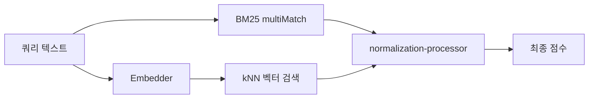
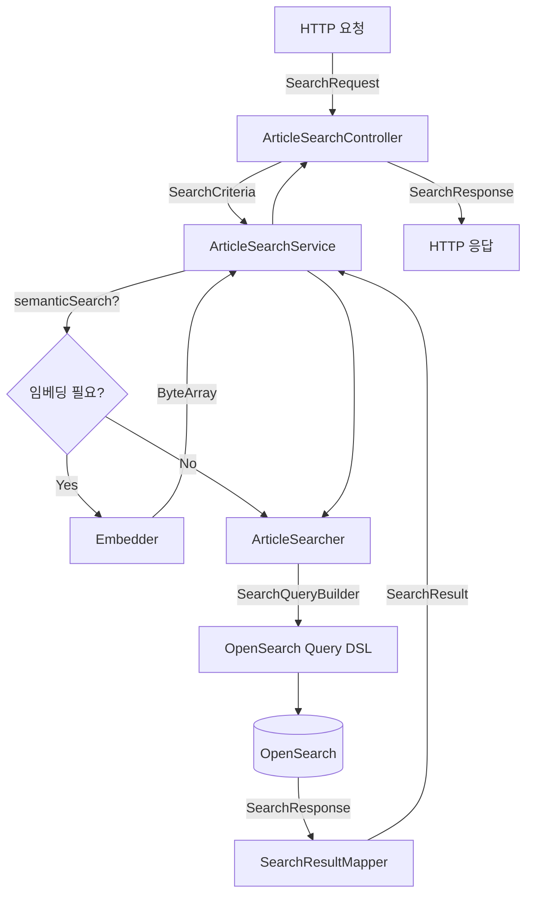

# Searcher Service

사용자의 사건사고 검색 요청을 처리하는 REST API 서비스. OpenSearch의 `ArticleIndexDocument`를 대상으로 전문 검색, 시맨틱 검색, 지리 검색, 카테고리 필터링을 제공한다.

## 핵심 컨셉

### 하이브리드 검색 (BM25 + kNN)

단순 키워드 매칭(BM25)만으로는 사용자의 검색 의도를 충분히 파악하기 어렵다. 시맨틱 검색을 활성화하면 OpenSearch `hybrid` 쿼리를 사용하여 BM25와 kNN 벡터 검색을 결합한다.



**점수 결합 방식**:
- `normalization-processor` search pipeline 사용
- min_max 정규화 → arithmetic_mean (BM25 30% : kNN 70%)

### Pre-filter 전략

시맨틱 검색 시 필터 조건을 어디에 적용할지가 성능과 정확도에 영향을 미친다. 필터를 hybrid 쿼리의 각 sub-query 내부에 **pre-filter**로 적용하여 필터 범위 내에서만 검색을 수행한다.

```kotlin
// SearchQueryBuilder
// BM25 sub-query: bool { must: [multiMatch], filter: [...] }
// kNN sub-query: knn { filter: {...} }
```

**이점**:
- 필터 조건에 해당하는 문서만 대상으로 검색
- 불필요한 후처리 제거로 성능 향상

### Graceful Degradation

외부 API(OpenAI Embedding) 장애 시에도 기본 검색 기능은 유지해야 한다. 쿼리 임베딩 생성 실패 시 시맨틱 검색을 제외하고 전문 검색으로 fallback한다.

```kotlin
// ArticleSearchService
suspend fun search(criteria: SearchCriteria): SearchResult {
    val embedding = if (criteria.semanticSearch && criteria.query.isNotBlank()) {
        try {
            embedder.embed(criteria.query)
        } catch (e: Exception) {
            logger.warn("Embedding failed, falling back to full-text search", e)
            null  // 전문 검색으로 fallback
        }
    } else null

    return articleSearcher.search(criteria, embedding)
}
```

## 모듈 구조

```
searcher/
├── src/main/kotlin/com/vonkernel/lit/searcher/
│   ├── adapter/
│   │   ├── inbound/
│   │   │   └── http/                      # REST Controller + DTO
│   │   └── outbound/
│   │       ├── embedding/                 # OpenAI Embedding Adapter
│   │       └── opensearch/                # OpenSearch 검색 Adapter
│   │           ├── OpenSearchArticleSearcher.kt
│   │           ├── SearchQueryBuilder.kt  # 쿼리 DSL 구성
│   │           └── SearchResultMapper.kt  # 응답 매핑
│   └── domain/
│       ├── model/                         # SearchCriteria, SearchResult
│       ├── port/                          # ArticleSearcher, Embedder
│       └── service/                       # ArticleSearchService
└── src/test/kotlin/...
```

## 데이터 흐름



## 검색 기능

### 검색 조건

| 기능 | 검색 대상 | 쿼리 방식 |
|------|----------|----------|
| 전문 검색 | title, content, keywords | `multi_match` (Nori 분석기, AND, BestFields) |
| 시맨틱 검색 | contentEmbedding (128차원) | `hybrid` (BM25 + kNN), min_score 0.8 |
| 법정구역 코드 | jurisdictionCodes | `prefix` (계층적 필터) |
| 주소 텍스트 | addresses (nested) | `match` (addressName) |
| 행정구역명 조합 | addresses (nested) | `bool.must` → `term` (depth1~3Name) |
| 거리 기반 | geoPoints.location | `geo_distance` (nested) |
| 카테고리 | incidentTypes.code | `terms` (nested) |
| 긴급도 | urgency.level | `range` (gte) |
| 날짜 범위 | incidentDate | `range` |

### 정렬

| SortType | 정렬 기준 | 전제 조건 |
|----------|----------|----------|
| `RELEVANCE` | BM25 점수순 (+ 시맨틱 시 하이브리드 점수) | `query` 필수 |
| `DATE` | `incidentDate` 내림차순 | 없음 |
| `DISTANCE` | 좌표 기준 거리 오름차순 | `proximity` 필수 |

## 핵심 컴포넌트

### Port Interfaces

| 인터페이스 | 역할 |
|-----------|------|
| `ArticleSearcher` | 검색 실행 계약. `SearchCriteria` + `ByteArray?` → `SearchResult` |
| `Embedder` | 텍스트 임베딩 생성 계약. `String` → `ByteArray` |

### Domain Service

| 컴포넌트 | 역할 |
|---------|------|
| `ArticleSearchService` | 검색 파이프라인 오케스트레이터. 조건부 임베딩 생성 → 검색 실행 → 에러 핸들링 |

### Adapter Layer

| 컴포넌트 | 역할 |
|---------|------|
| `ArticleSearchController` | REST Controller. `SearchRequest` → `SearchCriteria` 변환 |
| `OpenSearchArticleSearcher` | `ArticleSearcher` 구현체. OpenSearch 클라이언트 호출 |
| `SearchQueryBuilder` | `SearchCriteria` → OpenSearch Query DSL 변환 |
| `SearchResultMapper` | OpenSearch `SearchResponse` → `SearchResult` 변환 |
| `EmbeddingAdapter` | ai-core의 `EmbeddingExecutor`에 위임 |

## REST API

### 검색 엔드포인트

```http
GET /api/articles/search
```

| 파라미터 | 타입 | 필수 | 설명 |
|---------|------|:----:|------|
| `query` | string | - | 검색 텍스트 |
| `semanticSearch` | boolean | - | 시맨틱 검색 활성화 (기본: false) |
| `jurisdictionCode` | string | - | 법정구역 코드 (prefix 매칭) |
| `addressQuery` | string | - | 주소 텍스트 검색 |
| `depth1Name` | string | - | 시/도 |
| `depth2Name` | string | - | 시/군/구 |
| `depth3Name` | string | - | 읍/면/동 |
| `latitude` | number | - | 위도 (proximity 검색) |
| `longitude` | number | - | 경도 (proximity 검색) |
| `distanceKm` | number | - | 반경 km (proximity 검색) |
| `incidentTypes` | array | - | 사건 유형 코드 목록 |
| `urgencyLevel` | integer | - | 최소 긴급도 레벨 |
| `dateFrom` | string | - | 시작 날짜 (ISO 8601) |
| `dateTo` | string | - | 종료 날짜 (ISO 8601) |
| `sortBy` | string | - | 정렬 기준 (RELEVANCE, DATE, DISTANCE) |
| `page` | integer | - | 페이지 번호 (0부터 시작) |
| `size` | integer | - | 페이지 크기 (최대 100) |

## 환경 설정

### 필수 환경변수

| 변수 | 필수 | 기본값 | 설명 |
|------|:----:|--------|------|
| `SPRING_AI_OPENAI_API_KEY` | O | - | 시맨틱 검색 쿼리 임베딩용 |
| `OPENSEARCH_HOST` | - | `localhost` | OpenSearch 호스트 |
| `OPENSEARCH_PORT` | - | `9200` | OpenSearch 포트 |
| `OPENSEARCH_INDEX_NAME` | - | `articles` | OpenSearch 인덱스명 |

## 빌드 및 실행

```bash
# 빌드
./gradlew searcher:build

# 실행
./gradlew searcher:bootRun
```

**사전 요구사항**:
1. OpenSearch 실행 (`cd infrastructure && docker-compose up -d opensearch`)
2. 인덱스 및 파이프라인 생성 (`./infrastructure/scripts/opensearch/create-index.sh`)

## 테스트

```bash
# 전체 테스트
./gradlew searcher:test

# 특정 테스트 클래스
./gradlew searcher:test --tests SearchQueryBuilderTest
```

테스트 상세 내용은 [TEST.md](./TEST.md) 참조.

## 관련 문서

- [ARCHITECTURE.md](../ARCHITECTURE.md) - 시스템 아키텍처
- [TEST.md](./TEST.md) - 테스트 가이드
