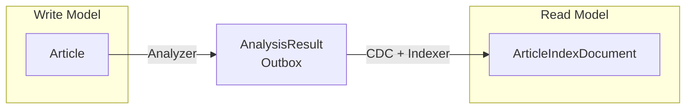

# Shared Module

모든 서비스가 공유하는 도메인 모델과 Repository 포트를 정의하는 기반 모듈.

## 핵심 컨셉

### 불변 데이터 모델

모든 도메인 모델은 Kotlin `data class`로 정의되어 불변성을 보장한다. 이 모델들은 서비스 간 계약(Contract) 역할을 하며, 각 서비스는 이 모델을 통해 데이터를 주고받는다.

- **Article**: Collector가 수집한 원본 기사
- **AnalysisResult**: Analyzer가 생성한 분석 결과 집계체
- **ArticleIndexDocument**: OpenSearch 색인용 문서

CQRS 패턴에서 Write Model(Article)과 Read Model(ArticleIndexDocument)을 명확히 분리한다. AnalysisResult는 Analyzer의 분석 집계체로, Outbox 테이블을 통해 Read Model로 변환된다.

### Repository 포트

Hexagonal Architecture의 출력 포트(Output Port)로, 저장소에 대한 인터페이스만 정의한다. 실제 구현은 `persistence` 모듈에서 담당하며, 이를 통해 도메인 로직과 인프라를 분리한다.

```
shared (포트 정의)          persistence (구현)
┌──────────────────┐       ┌──────────────────┐
│ ArticleRepository│ ←───  │ JpaArticleAdapter│
│ (interface)      │       │ (@Repository)    │
└──────────────────┘       └──────────────────┘
```

### 재시도 유틸리티

외부 API 호출 시 일시적 오류를 처리하기 위한 지수 백오프(Exponential Backoff) 재시도 로직을 제공한다. Kotlin Coroutines 기반으로 구현되어 비동기 컨텍스트에서 사용 가능하다.

## 모듈 구조

```
shared/
├── src/main/kotlin/com/vonkernel/lit/core/
│   ├── entity/              # 도메인 엔티티 (data class)
│   ├── port/repository/     # Repository 포트 (interface)
│   ├── exception/           # 공유 예외
│   └── util/                # 유틸리티 함수
└── src/test/kotlin/
    └── com/vonkernel/lit/core/util/  # 유틸리티 테스트
```

## 핵심 컴포넌트

### 도메인 엔티티

| 엔티티 | 역할 | 사용처 |
|--------|------|--------|
| `Article` | 수집된 원본 기사 | collector → analyzer |
| `RefinedArticle` | 정제된 기사 (title, content, summary) | analyzer 내부 |
| `AnalysisResult` | 분석 결과 집계체 | analyzer → indexer (via CDC) |
| `ArticleIndexDocument` | OpenSearch 색인 문서 | indexer → searcher |
| `Location` | 위치 정보 (좌표 + 주소) | analyzer, indexer |
| `IncidentType` | 사건 유형 (code, name) | analyzer, indexer, searcher |
| `Urgency` | 긴급도 (name, level) | analyzer, indexer, searcher |
| `Keyword` | 추출된 키워드 | analyzer, indexer |
| `Topic` | 주제 | analyzer, indexer |

### Repository 포트

| 포트 | 역할 | 구현 모듈 |
|------|------|----------|
| `ArticleRepository` | 기사 저장/조회, 중복 체크 | persistence |
| `AnalysisResultRepository` | 분석 결과 저장 (Outbox) | persistence |
| `IncidentTypeRepository` | 사건 유형 Reference Data 조회 | persistence |
| `UrgencyRepository` | 긴급도 Reference Data 조회 | persistence |
| `AddressCacheRepository` | 주소 캐시 조회 | persistence |

### 유틸리티

| 컴포넌트 | 역할 |
|----------|------|
| `executeWithRetry` | 지수 백오프 재시도 (suspend 함수) |
| `MaxRetriesExceededException` | 재시도 초과 예외 |

## 데이터 흐름



- **Article**: Collector가 외부 API에서 수집하여 PostgreSQL에 저장 (Write Model)
- **AnalysisResult**: Analyzer가 Article을 분석하여 생성한 집계체, Outbox 테이블로 CDC 이벤트 발행
- **ArticleIndexDocument**: Indexer가 AnalysisResult CDC 이벤트를 받아 OpenSearch에 색인 (Read Model)

## 빌드

```bash
# 빌드
./gradlew shared:build

# JAR 생성 (일반 라이브러리, bootJar 아님)
./gradlew shared:jar
```

이 모듈은 독립 실행이 불가능한 라이브러리이다. Spring Boot 스타터가 제외되어 있으며, 다른 모듈의 의존성으로만 사용된다.

## 테스트

```bash
./gradlew shared:test
```

테스트 상세 내용은 [TEST.md](./TEST.md) 참조.

## 관련 문서

- [ARCHITECTURE.md](../ARCHITECTURE.md) - 시스템 아키텍처
- [TEST.md](./TEST.md) - 테스트 가이드
